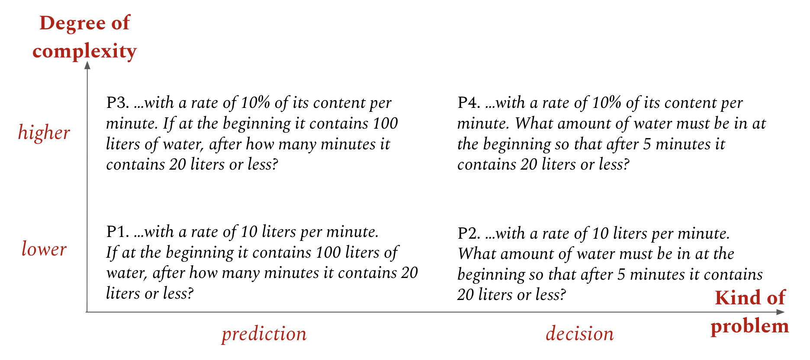
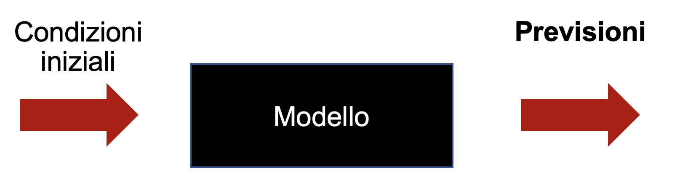
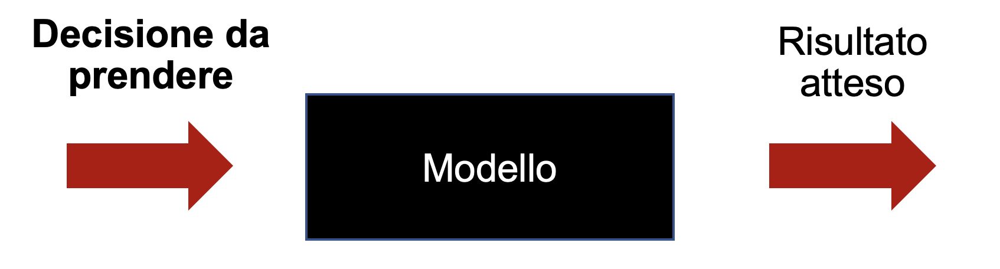
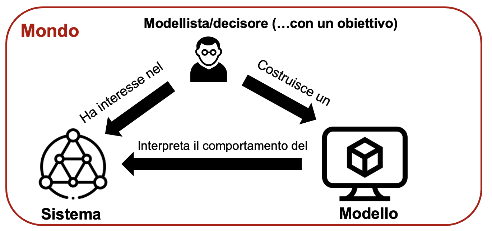

# Capitolo 1: Introduzione del corso {#capitolo-1-introduzione-del-corso}

## Progettazione per sistemi dinamici e decisioni {#progettazione-per-sistemi-dinamici-e-decisioni}

Questo libro tratta del decision-making applicato tramite la matematica, con l\'obiettivo di insegnare a ingegneri, ma non solo, come prendere decisioni in contesti complessi. Questo è rilevante in quanto ogni entità prende decisioni. I batteri prendono decisioni (e sono avversi al rischio[^cap1-1]), gli uccelli tropicali prendono decisioni (ed esiste un'intera teoria che esplora la loro propensione al rischio mentre recuperano del cibo[^cap1-2]), i giocatori di calcio prendono decisioni[^cap1-3], e anche l'impero romano, inteso come singola entità, da un certo punto di vista prendeva decisioni[^cap1-4]. La capacità di prendere decisioni in tali situazioni è una competenza fondamentale per un ingegnere[^cap1-5]. Un buon ingegnere è un decisore efficace, o almeno qualcuno in grado di suggerire decisioni valide. Ad esempio, un consulente ispira decisioni strategiche. Al contrario, un cattivo ingegnere è colui che decide male[^cap1-6], allontanando a parità di condizione dallo stato desiderato.

Come si affronta una decisione di fronte a un problema? Consideriamo esempi di persone che devono risolvere problemi diversi:

-   L\'ingegnere capo della Ferrari deve raccomandare al pilota il punto ottimale di frenata alla curva del Tamburello a Monza[^cap1-7].

-   Il capo di stato maggiore di un paese deve decidere come distribuire le proprie truppe sul fronte[^cap1-8].

-   Il docente di un corso deve selezionare quali libri includere, e quali escludere, nella bibliografia.

-   Un uomo vuole preparare una cena per degli amici, ma non conosce ancora il numero di ospiti né le loro preferenze alimentari[^cap1-9].

-   Una ragazza può rilanciare o meno su un attaccante durante l\'asta del fantacalcio.

-   L\'amministratore delegato di una nota casa automobilistica tedesca deve decidere se e quando avviare la produzione di veicoli a combustione non termica[^cap1-10].

In tutti questi casi, la capacità di prendere decisioni efficaci in condizioni di incertezza è centrale. Esiste la possibilità che una persona possa comportarsi senza dover prendere decisioni. Il caso più semplice è quello del soldato semplice, che non deve prendere decisioni ma solo obbedire agli ordini del proprio sergente. Ma se stai leggendo questo libro, ragionevolmente hai l'ambizione diventare un "generale" (nella metafora, un decisore) o almeno imparare a pensare come esso, soprattutto se sei giovane e hai voglia di farti strada nel mondo[^cap1-11].

Per prendere una decisione, il buon senso suggerisce che sia necessaria l\'esperienza, e questo è in parte vero. Un atleta che disputa la centesima gara è generalmente più abile rispetto agli esordi, a parità di capacità fisiche, così come un manager impara nel tempo, e una persona partecipa meglio ad un'asta del fantacalcio se ha già avuto esperienze precedenti[^cap1-12]. Tuttavia, se l\'esperienza fosse l\'unico fattore, i migliori decisori sarebbero solo individui anziani, poiché avrebbero accumulato più esperienza[^cap1-13]. In tal caso, potremmo considerarli artigiani piuttosto che ingegneri, indipendentemente dal loro titolo di studio.

La differenza tra un artigiano e un ingegnere non risiede nella qualità dell\'output o nel tipo di lavoro svolto, ma nel modo in cui lavorano, seguendo o meno un metodo. Un ingegnere segue un processo sistematico, è in grado di spiegare i passaggi che portano a un determinato risultato, permettendo così di giustificare un errore, ripetere il processo in modo identico o insegnarlo a qualcun altro. Al contrario, un artigiano può realizzare oggetti o attività eccellenti, ma non è in grado di esplicitare il suo metodo. Per trasmettere le proprie competenze, un artigiano si affida all\'apprendimento per imitazione e pratica, piuttosto che a spiegazioni teoriche, per esempio portando i propri allievi "a bottega".

+------------------------------------------------------------------------------------------------------------------------------------------------------------------------------------------------------------------+
| **Approfondimento 1.1: imparare a bottega nel Rinascimento: il caso di Leonardo da Vinci**                                                                                               |
                                                                                                                                                  ||
| L'esempio più famoso di apprendimento a bottega nel rinascimento ciò è quello di Leonardo da Vinci, nato nel 1452 da Ser Piero di Antonio da Vinci, un notaio proveniente da quella che oggi chiameremmo borghesia toscana, e da Caterina, una donna con cui non era sposato; Leonardo crebbe nella famiglia paterna senza però essere considerato legittimo. Impedito quindi a seguire la professione notarile del padre, fu da esso indirizzato nella bottega di Andrea del Verrocchio[^cap1-14], un artista di grido che -- secondo la tradizione storica -- accettò alla sua bottega il giovane Leonardo dopo aver visto alcuni suoi disegni mostratigli proprio dal padre. |
|                                                                                                                                                  |
| Nella Firenze rinascimentale la bottega era insieme luogo di lavoro, scuola e laboratorio: gli allievi imparavano osservando, preparando materiali, copiando modelli e collaborando alle commissioni del maestro. La bottega del Verrocchio era di esse forse la più prestigiosa. L'esempio più famoso di questo fenomeno di apprendimento esperienziale a contatto con il maestro è quello della *Madonna col Bambino e una melagrana*[^cap1-15], oggi esposta alla National Gallery of Art, e del suo angelo di sinistra, di eccezionale bellezza. Oggi attribuita a Lorenzo di Credi, per lungo tempo fosse stata realizzata da Leonardo o presentata come Leonardo/di Credi. L'incertezza non è solo una questione di firma, o di filologia artistica: ricorda che nella bottega idee, disegni, materiali e interventi potevano essere condivisi, e mostra la forma più fine di apprendimento per imitazione, quella per cui l'allievo collabora al lavoro del proprio maestro. |
+------------------------------------------------------------------------------------------------------------------------------------------------------------------------------------------------------------------+

La domanda che emerge è: si può diventare "ingegneri delle decisioni"[^cap1-16]? Almeno in parte, sì[^cap1-17]. Quindi, si può imparare a prendere decisioni migliori utilizzando un metodo ripetibile e spiegabile. Per esempio, è possibile apprendere come eseguire delle "what-if analysis"[^cap1-18], cioè utilizzare strumenti che permettono di chiedersi: "Cosa succederebbe se prendessi questa decisione?". Questo libro fornisce tali strumenti sia in senso pratico che culturale, contribuendo chi avesse voglia di leggerlo con sufficiente attenzione a migliorare le proprie capacità decisionali. Per condurre queste analisi, è necessario uno strumento che simuli il comportamento dell\'oggetto di studio, altrimenti ci si baserebbe solo su ipotesi non verificabili.

In questo contesto, noi utilizziamo simulazioni basate su modelli. Ad esempio, cosa accadrebbe se si frenasse con 50 metri di ritardo alla Variante Ascari del circuito di Monza[^cap1-19]? Potrei testarlo direttamente con un\'auto, ma non sarebbe una buona idea. Non solo per motivi morali -- nessuno suggerirebbe a un pilota di rischiare la propria vita -- ma anche per ragioni economiche. Costruire una vettura di F1 è estremamente costoso, e distruggerne molteplici in test continui sarebbe irrazionale[^cap1-20]. Lo stesso vale, amplificato di diversi ordini di grandezza a seconda che si consideri la dimensione economica o etica, per la costruzione di uno space shuttle.

Ci sono però casi in cui non è proprio possibile effettuare un test fisico, poiché la decisione da prendere ha effetti irreversibili. In questi contesti, dove si osserva il secondo principio della termodinamica e la decisione è quindi irreversibile[^cap1-21], abbiamo una sola opportunità per prendere la decisione corretta. Tipicamente, una decisione strategica presa da un manager non è reversibile in senso fisico, perché per cambiare idea è necessario investire risorse che non consentono di ripartire dallo stato iniziale. Pertanto, è fondamentale trovare metodi per condurre queste "what-if analysis". Ad esempio, è possibile costruire un modello software che riproduca con sufficiente accuratezza la realtà, fornendo indicazioni utili, come suggerire al pilota di frenare in anticipo.

+----------------------------------------------------------------------------------------------------------------------------------------------------------------------------------------------------------------------------------------------------------------------------------------------------------------------------------------------------------------------------------------------------------------------------------------------------------------------------------------------------------------------------------------------------------------------------------------------------------------------------------------------------------------------------------------------------------------------------------------------------------------------------------------------------------------------------------------------------------------------------------------------------------------------------------------+
| **Approfondimento 1.2: management e irreversibilità delle decisioni**                                                                                                                                                                                                                                                                                                                                                                                                                                                                                                                                                                                                                                                                                                                                                                                                                                                                  |
|                                                                                                                                                                                                                                                                                                                                                                                                                                                                                                                                                                                                                                                                                                                                                                                                                                                                                                                                        |
| Si assuma la presenza di un amministratore delegato che debba decidere fra due decisioni $A$ e $B$, che porteranno rispettivamente il sistema azienda-ambiente dallo stato $x_{0}$ allo stato $x_{A}$ e $x_{B}$, e che le due decisioni costino rispettivamente $c_{A}$ e $c_{B}$, e che ci sia un costo $c_{r}$ (con ogni per invertire queste decisioni. Qualunque decisione sia presa a $t_{0}$, il livello del conto in banca dell'azienda diventerà $C(t_{1})\  \neq \ C(t_{0})$. Tornare indietro per avere la possibilità di riprendere a decisione richiederebbe di passare da $C(t_{1})$ a $C(t_{2})$, con un valore di $C(t_{2}) \neq \ C(t_{0})$. In questo senso, la decisione nel sistema non è osservabilmente reversibile, poiché non c'è un modo di tornare allo stato in cui il sistema è definito dalla coppia $(x_{0},C(t_{0}))$, con qualche eccezione (per esempio, nel caso in cui $c_{A} = c_{B} = c_{r} = 0$). |
+----------------------------------------------------------------------------------------------------------------------------------------------------------------------------------------------------------------------------------------------------------------------------------------------------------------------------------------------------------------------------------------------------------------------------------------------------------------------------------------------------------------------------------------------------------------------------------------------------------------------------------------------------------------------------------------------------------------------------------------------------------------------------------------------------------------------------------------------------------------------------------------------------------------------------------------+

## Decisioni e previsioni {#decisioni-e-previsioni}

Prendiamo ora il caso di un catering chiamato a servire della birra a una festa, e che si può porre quattro problemi diversi, che chiameremo rispettivamente $P1$, $P2$, $P3$ e $P4$.

-   $P1$. Se all\'inizio un fusto al bancone di un bar contiene 100 litri di birra, dopo quanti minuti contiene 20 litri o meno di birra (con una velocità di svuotamento di 10 litri di birra al minuto)?

-   $P2$. Quanti litri di birra devono esserci all'inizio in una fusto al bancone del bar affinché dopo 5 minuti contenga 20 litri o meno (con una velocità di svuotamento di 10 litri al minuto)?

-   $P3$: Se all\'inizio un fusto al bancone di un bar contiene 100 litri di birra, dopo quanti minuti contiene 20 litri o meno di birra (con una velocità di svuotamento di 10% del suo contenuto al minuto)?

-   $P4$: Quanti litri di birra devono esserci all'inizio in una fusto al bancone del bar affinché dopo 5 minuti contenga 20 litri o meno (con una velocità di svuotamento di 10% del suo contenuto al minuto)?

Quali differenze esistono fra questi quattro problemi?[^cap1-22] Ci sono differenze di due tipi diversi: complessità della dinamica e tipologia di problema.

{width="6.5in" height="2.9027777777777777in"}

*Posizionamento dei quattro problemi in un\'ipotetica matrice tipo di problema - complessità. L'esempio è su vasche d'acqua*

{{dsgraph-player models/1.1.json}}

$P4$ presenta una dinamica più complessa rispetto a $P2$ perché il tasso di svuotamento è proporzionale al volume attuale della birra nel fusto (10% al minuto), introducendo una relazione esponenziale nel sistema, perché ciascun valore deve essere ricalcolato. Questo comporta la necessità di risolvere un\'equazione differenziale del primo ordine, tipica dei processi di decadimento esponenziale[^cap1-23]. Al contrario, in $P2$ il tasso di svuotamento è costante (10 litri al minuto), risultando in un modello lineare che può essere risolto con equazioni algebriche elementari, o anche più semplicemente calcolandolo a mente. Quindi, intuitivamente[^cap1-24], si capisce che gestire un problema diventa man mano più difficile al crescere della sua complessità, e che potrebbe essere un livello oltre cui diventa impossibile da gestire, indipendentemente dal metodo applicato.

La differenza tra $P1$ e $P2$ risiede invece nel fatto che il primo è un metodo "diretto" mentre il secondo è un metodo "inverso", leggermente più complesso rispetto a $P1$.

{width="4.138888888888889in" height="1.1607458442694663in"}

*Esempio di utilizzo di un modello per un problema diretto*

Un problema è detto diretto quando si crea un modello con un output ignoto e lo si utilizza per stimare tale output. Un problema è invece inverso quando, avendo un output desiderato, si variano i parametri del sistema per capire come raggiungere tale output. I problemi di what-if analysis rientrano tra i problemi inversi. Ad esempio, una volta costruito e validato[^cap1-25] un modello di un\'azienda e del mercato in cui opera, è possibile sperimentare con le diverse azioni possibili per individuare la combinazione che porti a un incremento del 10% sia del fatturato che dell\'utile[^cap1-26]. Questo ci permette di capirne meglio il comportamento.

{width="4.092014435695538in" height="1.0966196412948381in"}

*Esempio di utilizzo di un modello per un problema inverso*

È necessario però a questo punto introdurre una definizione sufficientemente formale di comportamento. Nel contesto della teoria generale dei sistemi[^cap1-27], con il termine "comportamento" si riferisce alla relazione tra input e output di un sistema. In altre parole, si considera solo il risultato ottenuto, senza preoccuparsi di come esso venga generato. Questo approccio, detto "comportamentista", si concentra sugli effetti osservabili[^cap1-28]. La "dinamica", invece, si riferisce ai meccanismi interni del sistema. Nei modelli dinamici, l\'obiettivo è comprendere e costruire la struttura interna per poter prevedere il comportamento esterno. Nel corso di questo libro, impareremo[^cap1-29] a costruire questi modelli dinamici per fare previsioni, affrontando così problemi diretti e studiandone il comportamento. Successivamente, utilizzerai tali modelli per risolvere problemi inversi e supportare decisioni.

+------------------------------------------------------------------------------------------------------------------------------------------------------------------------------------------------------------------------------------------------------------------------------------------------------------------------------------------------------------------------------------------------------------------------------------------------------------------------------------------------------------------------------------------------------------------------------------------------------------------------------------------------------------------------------------------------------------------------------------------------------------------------------------------------------------------------------------------------------------------------------------------------------------------------------------------------------------------------------------------------------------------------------------------------------------------------------------------------------------------------------------------------------------------------------------------+
| **Approfondimento 1.3: comportamentismo e calci di rigore**                                                                                                                                                                                                                                                                                                                                                                                                                                                                                                                                                                                                                                                                                                                                                                                                                                                                                                                                                                                                                                                                                                                              |
|                                                                                                                                                                                                                                                                                                                                                                                                                                                                                                                                                                                                                                                                                                                                                                                                                                                                                                                                                                                                                                                                                                                                                                                          |
| Una volta deciso che il comportamento di un sistema può essere definito come la relazione tra l\'input e l\'output, questo fenomeno inizia ad essere osservabile in molti contesti. Un esempio concreto è quello di un calciatore che deve eseguire un calcio di rigore[^cap1-30]. Mentre possiamo osservare la direzione e la forza del tiro, non abbiamo accesso diretto al processo decisionale interno del calciatore. Pertanto, per valutare il risultato e tentare di formulare una contro-strategia, adottiamo un approccio basato sul comportamento osservabile, concentrandoci esclusivamente su ciò che è esterno e visibile, senza prendere in considerazione la complessità interna del ragionamento del giocatore.                                                                                                                                                                                                                                                                                                                                                                                                                                                                                                   |
|                                                                                                                                                                                                                                                                                                                                                                                                                                                                                                                                                                                                                                                                                                                                                                                                                                                                                                                                                                                                                                                                                                                                                                                          |
| Per chi ha l\'obiettivo di prevedere il comportamento dell\'attaccante, come ad esempio il portiere (supportato oggi da analisti e data scientist a livello professionistico), esistono due approcci principali per prevedere il comportamento di un sistema di cui si può osservare solo l\'output. Il primo metodo consiste nello studio dei comportamenti precedenti, ovvero l\'analisi delle serie storiche dei rigori. Se un calciatore ha tirato $M$ rigori su $N$ in una specifica direzione, la probabilità che tiri nuovamente in quella direzione può essere stimata a $\frac{M}{N}$. Questo approccio, spesso utilizzato dai data scientist, è noto come metodo "black box". Il secondo metodo mira a comprendere o rappresentare in modo approssimato il processo decisionale interno del calciatore. Poiché non è possibile accedere direttamente agli stati cognitivi del giocatore, si può costruire un modello strutturato che rappresenti tali decisioni[^cap1-31]. Ad esempio, il pensiero "il portiere sa che io tendo a tirare a destra, quindi tirerò a sinistra" costituisce un modello qualitativo del ragionamento del tiratore. |
|                                                                                                                                                                                                                                                                                                                                                                                                                                                                                                                                                                                                                                                                                                                                                                                                                                                                                                                                                                                                                                                                                                                                                                                          |
| Va inoltre considerato che la presenza di un portiere, il quale tenta di prevedere la decisione del calciatore, può influenzare il processo decisionale stesso dell\'attaccante.                                                                                                                                                                                                                                                                                                                                                                                                                                                                                                                                                                                                                                                                                                                                                                                                                                                                                                                                                                                                         |
+------------------------------------------------------------------------------------------------------------------------------------------------------------------------------------------------------------------------------------------------------------------------------------------------------------------------------------------------------------------------------------------------------------------------------------------------------------------------------------------------------------------------------------------------------------------------------------------------------------------------------------------------------------------------------------------------------------------------------------------------------------------------------------------------------------------------------------------------------------------------------------------------------------------------------------------------------------------------------------------------------------------------------------------------------------------------------------------------------------------------------------------------------------------------------------------+

Se i problemi diretti riguardano la previsione e i problemi inversi la decisione, il motto di questo corso può essere sintetizzato così: "Impara a costruire modelli per fare previsioni, e poi utilizzali per prendere decisioni."

## Un framework concettuale  {#un-framework-concettuale}

{width="5.4375in" height="2.5706135170603677in"}

*Il framework concettuale su cui si basa il libro*

Come ingegneri, noi assumiamo che il mondo esista indipendentemente dalle nostre idee, contrariamente a posizioni filosofiche come il solipsismo[^cap1-32], che qui non consideriamo. Come modellisti, assumiamo che il mondo esista e che le nostre azioni abbiano uno scopo. Questo aspetto è cruciale per l\'ingegnere, il cui lavoro è sempre orientato a un fine pratico, a differenza di altre figure, come per esempio un fisico. Ogni attività ingegneristica, in teoria[^cap1-33], è guidata da un obiettivo concreto.

Con uno scopo definito, ci focalizziamo su una porzione del mondo che chiamiamo sistema. Nella teoria dei sistemi, un sistema è un insieme di entità interagenti che fanno parte della realtà fisica, sociale o simbolica[^cap1-34]. Il modellista costruisce un modello del sistema, nei casi di nostro interesse solitamente tramite equazioni o software (o entrambe le cose). **Un modello è quindi una rappresentazione strutturata del sistema**, progettata per interpretare il comportamento e prendere decisioni[^cap1-35]. Poiché il **modellista ha interesse nello studio di un sistema**, costruisce un modello del sistema stesso, tipicamente mediante l\'utilizzo di sistemi di equazioni o strumenti software, con l\'obiettivo di prendere decisioni e comprendere il comportamento del sistema. 

Un modellista ingegnere, inoltre, non si limita alla costruzione di modelli, ma può anche progettare e realizzare il sistema stesso. Ad esempio, un ingegnere civile può progettare e costruire un ponte. Tuttavia, per un ingegnere gestionale, il supporto alle decisioni attraverso la modellizzazione risulta particolarmente rilevante. Quando costruiamo modelli di sistemi, lo facciamo in modi molto diversi a seconda dell'obiettivo. Ad esempio, creando uno schema per un database, si costruisce un modello che organizza i dati in una struttura tabellare, dove per ogni colonna si definisce il tipo di dati che conterrà. Un database rappresenta un modello di sistema statico, che cattura una "fotografia" della situazione in un dato momento. Un esempio di utilizzo potrebbe essere un sistema gestionale come SAP, che in alcuni casi è o contiene un modello delle relazioni del sistema ma non rappresenta il comportamento dinamico del sistema. Nell'ambito dei sistemi complessi, ciò vale anche con i network. 

Il corso si occupa invece di progettare modelli di sistemi dinamici, e quindi è rilevante, se non fondamentale, analizzare la dinamica del sistema. Non tutti i modelli che includono il tempo come variabile indipendente sono dinamici. Analizzeremo più avanti il concetto di "dinamica", ma per ora basti sapere che in questo corso, quando si parla di "modello" senza specificare altri, si intende sempre "modello del comportamento di un sistema dinamico".

[^cap1-1]: Beaumont, Hubertus JE, et al. "Experimental evolution of bet hedging." Nature 462.7269 (2009): 90-93.

[^cap1-2]: https://en.wikipedia.org/wiki/Risk-sensitive_foraging_models

[^cap1-3]: La qualità di un calciatore dipende più da come prende decisioni che dalla sua tecnica di base o dalle sue caratteristiche tecniche. Per esempio, un giocatore dai grandi mezzi fisici e tecnici come Antonio Candreva avrebbe potuto avere una carriera di più alto profilo se avesse imparato presto a limitare il numero di cross e tiri da fuori area, statistiche in cui è stato fra i peggiori d'Europa per anni.

[^cap1-4]: È l'assunzione alla base dei libri "La grande strategia dell\'impero romano" e "La grande strategia dell\'impero bizantino" di Edward Luttwak, affascinante al netto del contenuto dei lavori, talvolta controverso e su cui non c'è un\'opinione dominante.

[^cap1-5]: Assieme all'assumere sempre di avere torto e comportarsi di conseguenza. Gli ingegneri che a un certo punto iniziano a credersi infallibili sono quelli che fanno cadere i ponti.

[^cap1-6]: Decidere male è molto più grave che sbagliare. Data la stocasticità e la ricchezza di informazione dei sistemi in cui ogni decisore interagisce, è impossibile garantire che una decisione sarà corretta, nel senso che porterà all'output desiderato. Un esempio è quello di una partita a scacchi: il sistema su cui si gioca è deterministico, e quindi prevedibile, ma l'avversario che si ha di fronte non lo è. Inoltre, qualunque mossa si giochi, esiste sempre, per quanto remota, la possibilità che entri un piccione dalla finestra e metta in subbuglio i pezzi sulla scacchiera.

[^cap1-7]: Visti i recenti risultati della scuderia, sarebbe interessante scoprire se seguono un metodo, e nel caso quale.

[^cap1-8]: Tecnicamente, il De Bello Gallico non è altro che una celebrazione di quanto bene e rapidamente l'autore, Caio Giulio Cesare, fosse in grado di decidere in contesti militari molto complessi e incerti, e di quanto efficacemente declinasse queste decisioni in azioni.

[^cap1-9]: Tendenzialmente scoprendo a spesa fatta di avere almeno un ospite vegetariano e uno celiaco, ma l'incertezza e l'imprevedibilità fanno parte dei sistemi complessi in cui stiamo imparando a operare.

[^cap1-10]: Nel 2026 possiamo serenamente affermare che l'amministratore delegato in questione abbia sbagliato questa specifica decisione che, a sua parziale discolpa, era effettivamente molto difficile.

[^cap1-11]: Nel mondo di ChatGPT e degli altri sistemi di intelligenza artificiale generativa, dove il costo dell'intelligenza sta progressivamente diminuendo e la capacità di compiere attività anche cognitivamente complesse, prendere decisioni e assumersene la responsabilità potrebbe essere il miglior modo per generare ancora valore per la società, e quindi di avere un lavoro ben remunerato.

[^cap1-12]: A parte il mio amico Giorgio, che dopo 10 anni non è mai riuscito ad arrivare a podio se non la singola volta che ho partecipato assieme a lui. 

[^cap1-13]: Alcune organizzazioni, come per esempio la Curia romana, il consiglio degli anziani Masai e il comitato degli otto immortali nella Cina degli anni '80, effettivamente selezionavano dei decisori capaci in base anche all'anzianità, che garantiva un sufficiente livello di esperienza.

[^cap1-14]: Andrea del Verrocchio (1435–1488) fu uno dei più importanti artisti della Firenze del Quattrocento. Pittore, scultore e orafo, diresse una delle botteghe artistiche più prestigiose della città. Tra i suoi allievi e collaboratori vi furono Leonardo da Vinci, Pietro Perugino e probabilmente Sandro Botticelli. Fu particolarmente celebre come scultore, realizzando opere come il David e il monumento equestre a Bartolomeo Colleoni.

[^cap1-15]: Per chi fosse curioso, l'opera in questione è visualizzabile [a questo link](https://it.wikipedia.org/wiki/Madonna_della_Melagrana#/media/File:Madonna_della_Melagrana_\(Botticelli\)).

[^cap1-16]: In un universo parallelo, un ingegnere gestionale potrebbe in effetti chiamarsi in quel modo.

[^cap1-17]: Altrimenti, questo libro non avrebbe senso nel modo in cui è stato progettato. Perlomeno, visto che lo sto distribuendo gratuitamente online, non dovreste volere un rimborso. 

[^cap1-18]: Per un\'introduzione culturale soft al concetto di "what-if" analysis, si legga il racconto "E se..." ("What if..." nella stesura originaria) di Isaac Asimov, o si veda il film "About Time" di Richard Curtis.

[^cap1-19]: Chiedere per informazioni a Mika Hakkinen

[^cap1-20]: Si noti che in alcuni casi non ci sono alternative, come per l'invenzione dell'aeroplano da parte dei fratelli Wilbur e Orville Wright.

[^cap1-21]: Non in tutti i sistemi l'effetto del secondo principio della termodinamica è osservabile, anche se significa che non sia valido. Per esempio, l'azione di entrare e uscire di casa è, almeno a un livello macroscopico, osservabilmente completamente reversibile, poiché posso entrare e uscire di casa più volte senza necessariamente cambiare lo stato di ciò che mi circonda, anche se poi ovviamente a livello macroscopico l'entropia del sistema sarà aumentata. Al contrario, rompere un uovo è un'azione irreversibile anche a livello macroscopico, poiché, una volta rotto, l'uovo non può essere riportato allo stato osservabile precedentemente.

[^cap1-22]: Questo problema è stato inizialmente formulato con una vasca da bagno, con dell'acqua che vi usciva. Ma è ragionevole pensare che l'ingegnere gestionale standard non sia appassionato di vasche da bagno. All'epoca suggerivo di sostituire la parola "vasca" con la parola "magazzino", e la parola "litri d'acqua" con la parola "colli". In questo caso, si vedrà che la struttura della dinamica è la stessa. Ciò si chiama isomorfismo, ovvero la possibilità di studiare problemi diversi usando la stessa struttura dinamica. L'esistenza degli isomorfismi, chiamati in questo modo per la prima volta da Ludwig Von Bertalanffy negli anni '20 del XX secolo, è una delle ragioni per cui questo corso è rilevante per un ingegnere gestionale: ti fa allenare all'utilizzo degli strumenti mentali per problemi diversi con la stessa struttura, e capire quali problemi potrebbero avere una struttura uguale o almeno sufficientemente simile.

[^cap1-23]: Se ogni anno perdo il 10% del mio patrimonio non diventerò mai nullatenente (anche se evidentemente dovrei farmi delle domande), ma avrò sempre in banca almeno una parte infinitesimale del mio denaro. Questo andamento progressivamente decrescente si chiama decadimento esponenziale. Modellizza una varietà di fenomeni, dal numero di nuclei radioattivi che decadono per unità di tempo, alla svalutazione di beni fino alla [[perdita di memoria]{.underline}](https://www.sciencedirect.com/topics/agricultural-and-biological-sciences/forgetting-curve?utm_source=chatgpt.com).

[^cap1-24]: Esiste un'intera branca della matematica che si occupa di ciò, ma ciò va ampiamente al di là del perimetro tematico del corso. In questo caso, quindi, decidiamo di fidarci dell'intuito.

[^cap1-25]: La validazione dei modelli è un argomento che sarà affrontato, brevemente, più avanti.

[^cap1-26]: Questa è peraltro la classica competenza che permette di essere assunti rapidamente in una società di consulenza strategica, dove queste competenze sono estremamente apprezzate.

[^cap1-27]: Questa teoria verrà introdotta più avanti

[^cap1-28]: Ad esempio, quando comunichiamo con qualcuno, non analizziamo il funzionamento interno del loro cervello e guardando lo specifico stato di attivazione delle sinapsi in diverse aree, ma ci limitiamo a interpretare ciò che viene detto.

[^cap1-29]: O, per lo meno, dovremmo: ho insegnato abbastanza a lungo da aver capito che non tutto ciò che si prova ad insegnare risulta effettivamente appreso, e che viceversa è talvolta ciò che non proviamo ad insegnare che rimane più impresso ai nostri discenti. 

[^cap1-30]: A chi interessasse l'argomento "calcio" trattato in modo analitico, suggerisco "Tutti i numeri del calcio" di Chris Anderson e David Sally ed edito in Italia da Mondadori (Strade Blu). È un po' datato -- la pubblicazione risale al 2016 -- ma è un'eccellente introduzione allo studio analitico del calcio utilizzando modelli di dati.

[^cap1-31]: Un esempio di come queste dimensioni si possono incrociare è il rigore parato dal portiere del Chievo Sorrentino a Cristiano Ronaldo nel 2020, il cui processo decisionale è raccontato in questo breve [[video]{.underline}](https://www.youtube.com/shorts/2ffmR3yAWFk).

[^cap1-32]: Il solipsismo è una teoria filosofica che sostiene che solo la propria mente esiste realmente e che il mondo esterno, compresi gli altri individui, potrebbe essere un\'illusione o una proiezione della propria coscienza. In effetti, è raro che un ingegnere adotti una posizione soliptistica.

[^cap1-33]: I grandi ingegneri sono più spesso quelli che imparano cose applicando il metodo ingegneristico ai propri problemi privati, imparando nel frattempo.

[^cap1-34]: La relazione fra il concetto di "Feyenoord" e il comportamento di un gruppo di ultras nederlandesi che distrugge una fontana a Roma è un possibile esempio dell'effetto che entità simboliche possono avere su entità sociali e di conseguenza su entità fisiche.

[^cap1-35]: In senso più ampio si possono usare modelli anche per altre ragioni, ma per quelli che sono gli obiettivi didattici del corso diciamo così.
