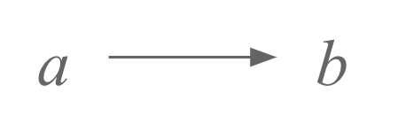
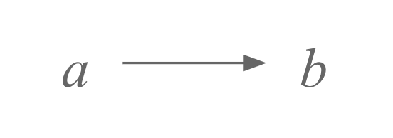
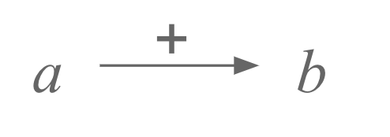
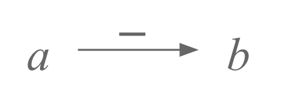
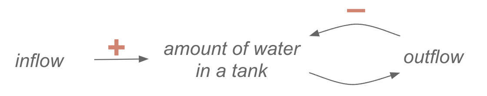
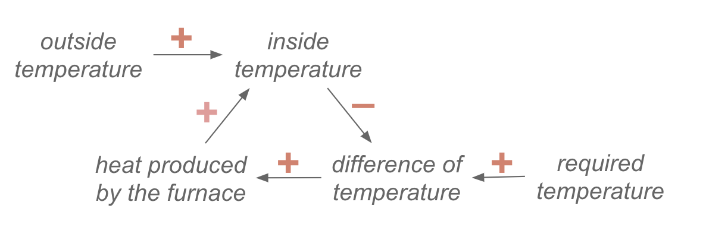
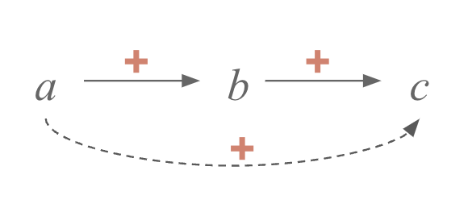
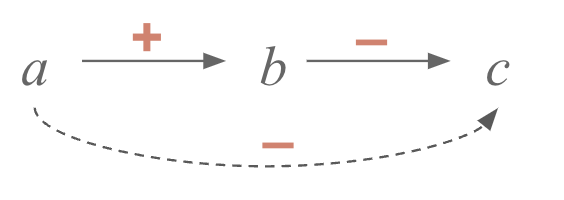
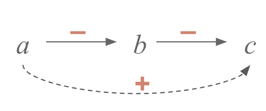
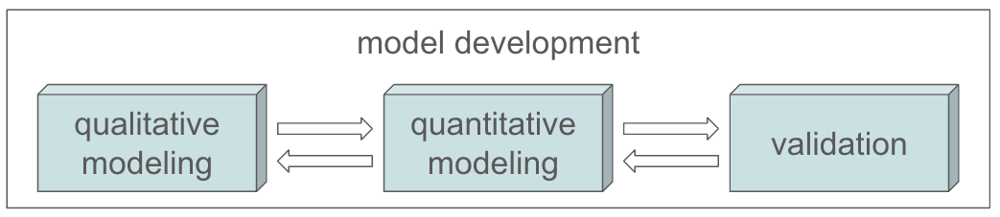

# Capitolo 2: modellizzare qualitativamente il comportamento di un sistema {#capitolo-2-modellizzare-qualitativamente-il-comportamento-di-un-sistema}

Iniziare un corso di modellizzazione parlando di modellizzazione qualitativa potrebbe sembrare un controsenso in un corso di ingegneria. Una delle classiche posizione da ingegnere è che ciò che non è definito in termini numerici sia poco rilevante. Ma se un studioso di management potrebbe invece dire il contrario, cioè che un ingegnere non sappia generare informazione utile a prendere decisione se non ha di fronte dei numeri[^cap2-1]. Ragionevolmente, un buon ingegnere non si accontenta di avere una sola componente, ma vuole avere sia i numeri e l'analisi che la loro interpretazione[^cap2-2].

## Dalla complessità alla decisione ai modelli qualitativi {#dalla-complessità-alla-decisione-ai-modelli-qualitativi}

### Introduzione a"l concetto di complessità {#introduzione-al-concetto-di-complessità}

Quando creiamo un modello, è importante distinguere tra **complicazione e complessità**. Intanto, la complicazione è differente dalla complessità, e questa è una cosa da ricordarsi. Non esiste una teoria matematica della complicazione, perché è legata alla nostra percezione del sistema. Un buon decisore deve ridurre la complicazione, che può essere eliminata. La complessità invece è una proprietà del sistema, e non può essere rimossa.

+-----------------------------------------------------------------------------------------------------------------------------------------------------------------------------------------------------------------------------------------------------------------------------------------------------------------------------------------------------------------------------------------------------------------------------------------------------------------------------------------------------------------------------------------------------------------------------------------------------------------------------------------------------------------------------------------------------------------------------------------------------------------------------------------------------------------------------------------------------------------------------------+
| **Approfondimento 2.1: complicato e complesso**                                                                                                                                                                                                                                                                                                                                                                                                                                                                                                                                                                                                                                                                                                                                                                                                                                   |
|                                                                                                                                                                                                                                                                                                                                                                                                                                                                                                                                                                                                                                                                                                                                                                                                                                                                                   |
| Complicazione: Il termine "complicazione" deriva dal latino complicare, che significa "piegare insieme" (com- = insieme, plicare = piegare). Etimologicamente, indica qualcosa che è intrecciato o aggrovigliato[^cap2-3], implicando la presenza di numerosi elementi o fattori che rendono difficile la comprensione o la gestione. La complicazione, quindi, rappresenta un aumento di difficoltà dovuto alla sovrapposizione di dettagli o fattori che possono essere disgiunti e semplificati. Un nodo difficile da sciogliere, per esempio, è molto complicato, così come lo è l'azione di uscire da un labirinto. In ingegneria, la complicazione può essere ridotta o eliminata mediante la riorganizzazione o l'ottimizzazione dei processi, poiché non è una caratteristica intrinseca del sistema ma piuttosto un effetto della sua rappresentazione o implementazione. |
|                                                                                                                                                                                                                                                                                                                                                                                                                                                                                                                                                                                                                                                                                                                                                                                                                                                                                   |
| Complessità: Il termine "complessità" deriva dal latino complexus, che significa "intrecciato" (com- = insieme, plectere = intrecciare). A differenza della complicazione, la complessità si riferisce alla struttura intrinseca di un sistema, che è caratterizzata da molteplici elementi interconnessi che interagiscono tra loro (in modi spesso anche non lineari). La psiche dei nostri partner, quando impariamo a conoscerli, è complessa, così come un mercato altamente innovativo con supply chain molto interconnesse. In ingegneria, la complessità è una proprietà dei sistemi e non può essere eliminata senza cambiare le proprietà del sistema, ma solo essere modellata, compresa, e quindi gestita.                                                                                                                                                        |
+-----------------------------------------------------------------------------------------------------------------------------------------------------------------------------------------------------------------------------------------------------------------------------------------------------------------------------------------------------------------------------------------------------------------------------------------------------------------------------------------------------------------------------------------------------------------------------------------------------------------------------------------------------------------------------------------------------------------------------------------------------------------------------------------------------------------------------------------------------------------------------------+

Esiste una teoria matematica della complessità[^cap2-4] che distingue[^cap2-5] tra sistemi semplici e complessi. In questo contesto, ci occupiamo di complessità e delle difficoltà legate alla presa di decisioni. Tali decisioni sono difficili non perché manchi comprensione[^cap2-6], ma perché il problema da risolvere e la decisione da prendere sono intrinsecamente complessi.

Un metodo efficace per affrontare la complessità è costruire un modello. Inizialmente, è utile concentrarsi sugli aspetti qualitativi del sistema piuttosto che partire dalle equazioni matematiche. Questo approccio permette di gestire meglio la complessità del problema.

### Il paradosso del decision-making {#il-paradosso-del-decision-making}

Esiste un dilemma noto[^cap2-7] che potrebbe essere definito "paradosso del decisore" se solo questo termine non esistesse in altri molteplici ambiti[^cap2-8]. Se una decisione è semplice, non è necessario applicare un metodo strutturato: ad esempio, attraversare la strada non richiede istruzione universitaria o particolari competenze[^cap2-9]. Tuttavia, quando una decisione è estremamente complessa, i metodi tradizionali non sono sufficienti. Un caso estremo è quello della risoluzione di conflitti internazionali, come la guerra in Ucraina o il conflitto israeliano-palestinese, dove la complessità va oltre le capacità di una semplice formazione accademica[^cap2-10]. L\'essere umano si trova quindi in un paradosso: i problemi più interessanti si collocano a metà strada tra semplicità e complessità estrema. Ci sono problemi così complessi per cui non basta essere buoni ingegneri per risolverli.

Tuttavia, esiste una vasta gamma di problemi "intermedi" che possono essere affrontati con successo. L\'obiettivo è passare dal ruolo di artigiano a quello di ingegnere[^cap2-11]. L\'artigiano lavora principalmente tramite esperienza diretta e pratica, mentre l\'ingegnere utilizza metodi strutturati per spiegare e risolvere problemi. L\'ingegneria non si basa solo sull\'esperienza, ma richiede anche conoscenze teoriche e metodologiche per affrontare la complessità.

Acquisire competenze di decision-making è quindi fondamentale. Un metodo strutturato permette di identificare le cause della complessità, analogamente a quanto accade nella diagnostica medica. Un medico non si limita a osservare i sintomi, ma cerca di capire le cause sottostanti, anche quando la relazione tra sintomo e causa non è immediatamente evidente. Infine, è cruciale giustificare le decisioni prese e documentarle in modo rigoroso[^cap2-12][^cap2-13]. Un ingegnere opera in modo simile: nel corso di questo corso, per esempio vi sarà proposto di affrontare problemi con una tecnica "dividi et impera", appunto separando le componenti dei problemi, risolvendole in modo individuale, e infine provando a mettere assieme le soluzioni.

### Quando usare modelli per fare decision-making {#quando-usare-modelli-per-fare-decision-making}

Alcune considerazioni di carattere realistico sono necessarie. Questo tema è diventato sempre più rilevante negli ultimi anni, se non addirittura centrale in molti contesti. Tuttavia, non è sempre possibile utilizzare modelli per supportare il processo decisionale. In alcuni casi, l\'applicabilità dei modelli è limitata o inesistente, e pertanto si rende necessario rinunciare al loro impiego. Proviamo a vedere quali condizioni ne limitano l'utilizzo.

**Tempo**. Esiste sempre tempo sufficiente per sviluppare un processo di decision-making strutturato, anche in ambito aziendale. Spesso si sente dire che nelle aziende non c'è tempo per prevedere e pianificare decisioni, a differenza del contesto accademico. Tuttavia, se un\'azienda è così male organizzata da dover prendere decisioni complesse con scadenze troppo strette --- ad esempio, dover prendere in un giorno una decisione che richiederebbe un mese di analisi --- è inevitabile che si operi in modo inefficiente[^cap2-14]. In questi casi, la qualità del lavoro ne risente gravemente. Se davvero non ci fosse tempo per una decisione ponderata, si potrebbe arrivare al punto di estrarre a sorte le opzioni, il che chiaramente non è un metodo adeguato[^cap2-15]. Bisogna poi chiedersi: siamo davvero sicuri che non ci sia tempo? Una buona organizzazione e un buon stratega creano le condizioni per avere il tempo necessario a prendere decisioni in modo coerente e ragionato[^cap2-16].

**Rilevanza**. La rilevanza della decisione è un fattore cruciale. Se la decisione non è significativa, non è giustificabile richiedere tempi prolungati per il processo decisionale. Non avrebbe senso, ad esempio, investire 20 o 30 ore di lavoro, equivalenti a un costo di 400-500€ per l\'azienda, per una decisione il cui impatto economico è limitato a 100€[^cap2-17]. Per questo motivo, è più comune che le grandi aziende adottino approcci strutturati nel processo decisionale[^cap2-18], mentre nelle piccole imprese ci si affida più spesso all\'intuizione e all\'esperienza diretta di manager e imprenditori.

**Fattibilità**. Nel processo decisionale basato su modelli, è necessario che un modello esista o che si sia in grado di costruirne uno. In assenza di una di queste due condizioni, il problema non è applicabile al contesto modellistico. Nel caso in cui il problema sia eccessivamente complesso (ad esempio, il controllo in tempo reale di un sistema non lineare con variabili fortemente interdipendenti), potrebbe risultare impossibile risolverlo efficacemente, perlomeno attraverso i metodi trattati in questa sede.

+--------------------------------------------------------------------------------------------------------------------------------------------------------------------------------------------------------------------------------------------------------------------------------------------------------------------------------------------------------------------------------------------------------------------------------------------------------------------------------------------------------------------------------------------------------------------------------------------------------------------------------------------------------------------------------------------------------------------------------------------------------------------------+
| **Approfondimento 2.2: fattibilità e usabilità di modelli di sistemi diversi**                                                                                                                                                                                                                                                                                                                                                                                                                                                                                                                                                                                                                                                                                           |
|                                                                                                                                                                                                                                                                                                                                                                                                                                                                                                                                                                                                                                                                                                                                                                          |
| [Modelli metereologic]{.underline}i                                                                                                                                                                                                                                                                                                                                                                                                                                                                                                                                                                                                                                                                                                                                      |
|                                                                                                                                                                                                                                                                                                                                                                                                                                                                                                                                                                                                                                                                                                                                                                          |
| La realizzazione di modelli meteorologici è fattibile grazie alla disponibilità di dati storici, modelli fisici complessi e potenti capacità di calcolo. Utilizzando equazioni che descrivono il comportamento dell\'atmosfera, i modelli numerici possono fornire previsioni accurate nel breve termine, sebbene l\'incertezza aumenti significativamente a lungo termine. Questa fattibilità è legata però alla presenza dei tre elementi sopra menzionati: la disponibilità dei dati, la conoscenza pregressa dei modelli fisici sottostanti, e la capacità di calcolo. Se uno di questi tre elementi non è presente, un modello meteorologico smette di essere rispettivamente calibrabile, costruibile o implementabile.                                            |
|                                                                                                                                                                                                                                                                                                                                                                                                                                                                                                                                                                                                                                                                                                                                                                          |
| [Fantacalcio]{.underline}                                                                                                                                                                                                                                                                                                                                                                                                                                                                                                                                                                                                                                                                                                                                                |
|                                                                                                                                                                                                                                                                                                                                                                                                                                                                                                                                                                                                                                                                                                                                                                          |
| La previsione del successo di un singolo giocatore in una stagione di fantacalcio è più complessa e incerta, poiché coinvolge variabili difficili da modellare, come la forma fisica, gli infortuni e le scelte tattiche dell\'allenatore. Non è neanche possibile assumere che tutti i dati siano disponibili[^cap2-19], e sicuramente le relazioni di causa ed effetto fra gli elementi di un sistema possono essere ignote (es: la relazione personale fra due giocatori, o fra un giocatore e un allenatore, o fra un giocatore e membri della sua famiglia[^cap2-20], tutte cose che ne possono influenzare le prestazioni). Tuttavia, analizzando dati storici e statistiche di rendimento, è possibile costruire modelli predittivi, seppure con margini d\'errore elevati. |
|                                                                                                                                                                                                                                                                                                                                                                                                                                                                                                                                                                                                                                                                                                                                                                          |
| [Prevedere il vincitore del Festival di Sanremo]{.underline}                                                                                                                                                                                                                                                                                                                                                                                                                                                                                                                                                                                                                                                                                                             |
|                                                                                                                                                                                                                                                                                                                                                                                                                                                                                                                                                                                                                                                                                                                                                                          |
| Prevedere il vincitore del Festival di Sanremo è similmente complesso, poiché il risultato dipende da fattori soggettivi come il gusto del pubblico, la giuria e l\'andamento mediatico. In ogni caso, la struttura del sistema sottostante è più facilmente interpretabile, almeno a livello qualitativo, per cui è chiaro il modo in cui la giuria influenza il risultato, o certe proprietà di una canzoni influenzino la giuria. La complessità, in questo caso, è interpretare lo stato mentale di giuria e pubblico[^cap2-21], non le loro relazioni (che sono invece più semplici). In ogni caso, esistono modelli di dati[^cap2-22] basati su serie storiche, tendenze sociali e sentiment analysis che possono fornire indicazioni.                                       |
+--------------------------------------------------------------------------------------------------------------------------------------------------------------------------------------------------------------------------------------------------------------------------------------------------------------------------------------------------------------------------------------------------------------------------------------------------------------------------------------------------------------------------------------------------------------------------------------------------------------------------------------------------------------------------------------------------------------------------------------------------------------------------+

**Futuro**. L\'attenzione è rivolta principalmente allo studio del futuro[^cap2-23], nel senso che possono essere realizzate delle previsioni che sono anche utili. Sebbene sia possibile costruire modelli per analizzare eventi storici, l\'obiettivo dell\'ingegneria gestionale è focalizzato sulla previsione e pianificazione futura. Esistono modelli che analizzano, ad esempio, il collasso della civiltà dell\'Isola di Pasqua[^cap2-24], che studiano come le risorse abbiano influenzato lo sviluppo delle società[^cap2-25], o branche della teoria dei sistemi che studiano fenomeni storici in termini generali[^cap2-26]. Tuttavia, tali argomenti non rientrano nell\'ambito di questo corso.

## La struttura di modelli qualitativi {#la-struttura-di-modelli-qualitativi}

### Relazioni funzionali e grafi {#relazioni-funzionali-e-grafi}

In questo corso, nella costruzione di un modello viene utilizzato un grafo[^cap2-27], in cui ogni nodo rappresenta una variabile del sistema. Queste variabili non devono necessariamente essere scalari; ad esempio, una variabile potrebbe rappresentare un vettore. Le frecce del grafo indicano relazioni di dipendenza funzionale tra le variabili. In questo contesto, se una variabile $b$ dipende da un'altra variabile $a$, si descrive il comportamento del sistema dinamico. Formalmente, si esprime tale relazione indicando che $b$ è funzione di $a$. Qualche volta -- non sempre, ma spesso -- questa relazione di tipo funzionale è anche di tipo causale. Quindi, non solo il valore dipende ma il valore è causato.

{width="2.9895833333333335in" height="0.972594050743657in"}

Facciamo un esempio: $F\  = \ ma$[^cap2-28]. Nel contesto della costruzione di un modello meccanico newtoniano, le frecce del grafo rappresentano le relazioni tra le variabili. In questo caso, si fa riferimento a un oggetto dotato di massa, su cui viene applicata una forza che produce un'accelerazione. Le relazioni non sono solo di dipendenza funzionale[^cap2-29], ma anche causali[^cap2-30]: la forza determina l\'accelerazione, mentre la massa concorre a determinare l\'accelerazione. In termini formali, la relazione può essere espressa come $a\  = \ F/m$, dove l'accelerazione $a$ è funzione della forza $F$ e della massa $m$.

Considerando lo stesso problema, la relazione tra $F$ e $a$ è di tipo causale, non solo di dipendenza funzionale. La relazione tra $m$ e $a$ è di dipendenza funzionale, ma se essa sia anche una relazione causale è una questione di natura filosofica. Dal nostro punto di vista, tale distinzione non è rilevante per l'applicazione pratica dei modelli, ma non è una visione condivisa. Nell'ambito della System Dynamics, una metodologia specifica di modellazione che sarà trattata più avanti nel corso, i modelli si costruiscono assumendo che ogni relazione sia una relazione causale.

In questo corso, si lavora tenendo in considerazione tre mondi paralleli:

-   il mondo grafico, dove nodi e frecce rappresentano variabili e relazioni;

-   il mondo matematico, dove i nodi sono variabili e le frecce funzioni;

-   il mondo fisico, dove i nodi rappresentano proprietà e grandezze fisiche, e le frecce modellano le dipendenze funzionali, che in alcuni casi riflettono relazioni causali.

### Strutture elementari di relazioni funzionali {#strutture-elementari-di-relazioni-funzionali}

Una delle caratteristiche fondamentali dei grafi è la presenza di soli quattro "building blocks", ovvero strutture di base; combinandole, è possibile rappresentare una vasta gamma di sistemi e costruire modelli complessi. Queste combinazioni permettono di modellare diversi tipi di interazioni e dipendenze all\'interno del sistema. Vediamoli qui di seguito.

**Catena**. La struttura a catena si verifica quando una variabile $a$ influenza una variabile $b$, e a sua volta la variabile $b$ influenza una terza variabile $c$. Un esempio è l\'aumento delle vendite che porta a un incremento del fatturato, il quale a sua volta determina un aumento del profitto. Matematicamente, questa relazione può essere espressa come $c\  = \ g(f(a))$, dove $f(a)$ e $g(b)$ rappresentano le funzioni che descrivono le dipendenze tra le variabili.

{{dsgraph-player models/chain.json}}

Altri esempi di sistemi modellabili con una struttura a catena sono:

-   Fondo d'investimento\
    *a = Ricavi → b = Utili → c = Investimenti*

-   Crescita cellulare\
    *a = Disponibilità di nutrienti → b = Tasso di crescita cellulare → c = Dimensione del tessuto*

-   Azienda manifatturiera\
    *a = Qualità delle materie prime → b = Qualità del prodotto finito → c = Prezzo del prodotto finito*

+------------------------------------------------------------------------------------------------------------------------------------------------------------------------------------------------------------------------------------------------------------------------------------------------------------------------------------------------------------------------------------------------------------------------------------------------------------------------------------------------------------------------------------------------------------------------------------------------------------------------------------------------------------------------------------------------------------------------------------------------------------------------------------------------------------------------------------------------------------------------------------------------------------------------------------------------------+
| **Approfondimento 2.3: l'effetto degli endorsement nelle elezioni americane**[^cap2-31]                                                                                                                                                                                                                                                                                                                                                                                                                                                                                                                                                                                                                                                                                                                                                                                                                                                                   |
|                                                                                                                                                                                                                                                                                                                                                                                                                                                                                                                                                                                                                                                                                                                                                                                                                                                                                                                                                      |
| Durante la campagna elettorale del 2024, poche ore dopo un dibattito presidenziale, una delle principali artiste musicali statunitensi ha espresso supporto esplicito per uno dei due candidati[^cap2-32]. Nei media statunitensi è sorto un dibattito sull\'impatto potenziale di tale azione. Già durante le elezioni del 2020, la prestigiosa rivista scientifica *Nature* aveva offerto un endorsement simile[^cap2-33], conducendo successivamente uno studio sugli effetti di tale supporto. La ricerca aveva concluso che non vi erano stati effetti significativi, e anzi che l'effetto era stato negativo sulla fiducia nella scienza di coloro che sostenevano l'altro candidato[^cap2-34], pur mantenendo la validità dell\'endorsement in termini morali, ma non causali. Pertanto, se non esiste una relazione tra la variabile "presenza di endorsement" e il "numero di voti", è razionale per i partiti politici cercare endorsement espliciti? |
|                                                                                                                                                                                                                                                                                                                                                                                                                                                                                                                                                                                                                                                                                                                                                                                                                                                                                                                                                      |
| È possibile utilizzare la modellizzazione qualitativa, e in particolare la struttura a catena, per descrivere questo fenomeno. Da un lato, si può ipotizzare che non esista una relazione diretta tra la "presenza di endorsement" e il "numero di voti". Tuttavia, un aumento degli endorsement comporta un incremento di due fattori: la quantità di copertura mediatica dedicata a un determinato candidato -- poiché lo spazio mediatico è limitato, l\'acquisizione di tempo televisivo o pagine sui giornali diventa un gioco a somma zero[^cap2-35] -- e le donazioni, provenienti da persone che stimano chi ha fatto l\'endorsement e che già voterebbero per quel candidato. Sebbene denaro e copertura mediatica non siano direttamente voti, soprattutto nel contesto statunitense questi fattori influenzano a loro volta il numero di voti.                                                                                             |
+------------------------------------------------------------------------------------------------------------------------------------------------------------------------------------------------------------------------------------------------------------------------------------------------------------------------------------------------------------------------------------------------------------------------------------------------------------------------------------------------------------------------------------------------------------------------------------------------------------------------------------------------------------------------------------------------------------------------------------------------------------------------------------------------------------------------------------------------------------------------------------------------------------------------------------------------------+

**Collider**. La struttura di fusione si verifica quando due variabili, $a$ e $b$, influenzano entrambe una terza variabile $c$, per cui $c\  = \ f(a,b)$. In machine learning, questa configurazione è chiamata tipicamente collider. Un esempio è rappresentato da situazioni con concause, in cui una variabile dipende da più fattori, come nel caso del fatturato influenzato sia dalle vendite che dai costi contemporaneamente, e non in modo sequenziale come nel caso della catena. Nelle relazioni causa-effetto, la presenza di più cause che convergono su uno o più effetti rende complesso distinguere l\'effetto specifico di ciascuna causa. Un esempio concreto è rappresentato dall'analisi dell'efficacia delle misure di contenimento del COVID-19, come l'uso delle mascherine e i lockdown, nella riduzione dei contagi, dove è difficile isolare il contributo di ciascuna misura.

{{dsgraph-player models/merge.json}}

Altri esempi di sistemi modellabili con una struttura a collider sono:

-   Prezzi di mercato\
    *a = Offerta → b = Domanda → c = Prezzo di equilibrio*

-   Gas ideale\
    *a = Volume → b = Pressione → c = Temperatura*

-   Secondo principio della dinamica\
    *a = Forza → b = Massa → c = Accelerazione*

-   Crescita di vegetali[^cap2-36]\
    *a = Luce solare → b = Disponibilità di acqua → c = Tasso di fotosintesi*

+------------------------------------------------------------------------------------------------------------------------------------------------------------------------------------------------------------------------------------------------------------------------------------------------------------------------------------------------------------------------------------------------------------------------------------------------------------------------------------------------------------------------------------------------------------------------------------------+
| **Approfondimento 2.4: Covid e policy making**                                                                                                                                                                                                                                                                                                                                                                                                                                                                                                                                           |
|                                                                                                                                                                                                                                                                                                                                                                                                                                                                                                                                                                                          |
| Tra l\'inizio del 2020 e l\'inizio del 2022, il mondo ha affrontato l'inizio della pandemia di Covid-19. Come spesso accade con i virus che si diffondono tra esseri umani, SARS-CoV-19 ha sfruttato, in termini evolutivi, alcune delle caratteristiche distintive[^cap2-37] degli esseri umani, come la tendenza alla socialità, la cura delle persone in difficoltà e, più recentemente, la curiosità che ci spinge a esplorare e viaggiare, per facilitare la sua diffusione.                                                                                                             |
|                                                                                                                                                                                                                                                                                                                                                                                                                                                                                                                                                                                          |
| Attualmente, esistono tre modalità di protezione per gestire una crisi epidemica. La prima è farmacologica: lo sviluppo di farmaci per trattare la malattia o di vaccini che la prevengano o riducano la probabilità e la gravità dell\'infezione.                                                                                                                                                                                                                                                                                                                                       |
|                                                                                                                                                                                                                                                                                                                                                                                                                                                                                                                                                                                          |
| La seconda è legata al comportamento individuale, e consiste nell\'adottare comportamenti che riducono il rischio di infezione, come indossare mascherine in ambienti chiusi, preferire spazi aperti, mantenere il distanziamento sociale e garantire una buona ventilazione in spazi interni.                                                                                                                                                                                                                                                                                           |
|                                                                                                                                                                                                                                                                                                                                                                                                                                                                                                                                                                                          |
| Infine, la terza si collega al comportamento collettivo e in particolari alle sue restrizioni, di cui il lockdown è l\'esempio più noto: un insieme di regole eccezionali su attività normalmente consentite per limitare la diffusione del virus.                                                                                                                                                                                                                                                                                                                                       |
|                                                                                                                                                                                                                                                                                                                                                                                                                                                                                                                                                                                          |
| Un dibattito rilevante riguarda l\'efficacia delle diverse forme di protezione, in particolare il rapporto tra protezione collettiva e individuale nella riduzione dei contagi[^cap2-38]. Osservando una diminuzione della variabile dipendente (il nodo $c$ nello schema precedente, e il numero di nuovi contagi nel nostro esempio), ci si chiede se tale calo sia dovuto a comportamenti individuali più prudenti o a misure collettive. Inoltre, in che misura le singole misure collettive, come la chiusura di scuole e locali pubblici, hanno contribuito alla riduzione dei contagi? |
|                                                                                                                                                                                                                                                                                                                                                                                                                                                                                                                                                                                          |
| Questo è un esempio della complessità gestionale che comportano sistemi modellabili con uno o più collider: è essenziale perlomeno identificarli, poiché la loro presenza richiede un\'analisi approfondita per distinguere le diverse concause oppure la consapevolezza che ciò non sia possibile, e sapere di non poter capire è un livello di ignoranza[^cap2-39] che in ogni caso permette di prendere decisioni migliori.                                                                                                                                                                |
+------------------------------------------------------------------------------------------------------------------------------------------------------------------------------------------------------------------------------------------------------------------------------------------------------------------------------------------------------------------------------------------------------------------------------------------------------------------------------------------------------------------------------------------------------------------------------------------+

**Fork**. La struttura a "forchetta" si verifica quando una singola variabile $a$ causa più effetti distinti, rappresentati dalle relazioni verso le variabili $b$ e $c$. Matematicamente, questa relazione è espressa attraverso due funzioni separate, come $b\  = \ f(a)$ e $c\  = \ g(a)$. Questo schema consente il calcolo parallelo, poiché non è rilevante quale delle due funzioni venga calcolata per prima. Un esempio di tale struttura si osserva nel caso delle misure di lockdown durante la pandemia di COVID-19, che hanno avuto effetti sia sul livello dei contagi giornalieri che sull'output prodotto dall'economia.

{{dsgraph-player models/fork.json}}

Altri esempi di sistemi modellabili con una struttura a fork sono:

-   Budget familiare\
    *a = Reddito familiare → b = Spese per beni di consumo → c = Risparmio*

-   Rete di calcolo\
    *a = Velocità della CPU → b = Tempo di elaborazione dei dati → c = Consumo energetico*

-   Stress fisiologico\
    *a = Livello di stress → b = Frequenza cardiaca → c = Livello di cortisolo nel sangue*

**Loop**. Il loop rappresenta una delle strutture più interessanti nei sistemi dinamici. In questa configurazione, è ammesso che la variabile $b$ dipenda da $a$ e, allo stesso tempo, $a$ dipenda da $b$, creando un ciclo di retroazione[^cap2-40]. Questo è possibile solo nei sistemi dinamici, in quanto in una rappresentazione statica tale configurazione non sarebbe risolvibile matematicamente: non è possibile scrivere $b\  = \ f(a)$ e $a\  = \ g(b)$ simultaneamente senza conoscere uno dei due valori a priori[^cap2-41]. Questo schema è noto anche come feedback (o feedback loop) ed è alla base di applicazioni come i termostati e il cruise control nei sistemi di controllo automatico[^cap2-42].

{{dsgraph-player models/loop.json}}

Altri esempi di sistemi modellabili con una struttura a loop sono:

-   Ciclo di domanda e offerta\
    *a = Prezzo di un bene → b = Quantità offerta*

-   Feedback ormonale\
    *a = Livello di ormoni → b = Attività della ghiandola endocrina.*

-   Effetto serra\
    *a = Temperatura globale → b = Emissioni di gas serra*[^cap2-43]

+--------------------------------------------------------------------------------------------------------------------------------------------------------------------------------------------------------------------------------------------------------------------------------------------------------------------------------------------------------------------------+
| **Approfondimento 2.5: il circo(lo) mediatico**                                                                                                                                                                                                                                                                                                                          |
|                                                                                                                                                                                                                                                                                                                                                                          |
| Con il termine "circo mediatico" ci si riferisce generalmente a una situazione in cui i media amplificano eccessivamente un evento o una notizia, spesso fornendo una copertura sproporzionata e sensazionalistica rispetto alla reale importanza dell\'argomento. Il fenomeno, di solito, è generato dal comportamento di due entità distinte ma in relazione fra loro: |
|                                                                                                                                                                                                                                                                                                                                                                          |
| -   uno o più media, ritenendo che la notizia possa essere di interesse per il proprio pubblico, ne aumentano la copertura mediatica;                                                                                                                                                                                                                                    |
|                                                                                                                                                                                                                                                                                                                                                                          |
| -   il pubblico conosce e si appassiona alla vicenda man mano che ne sente parlare e la segue con maggiore attenzione, aspettandosi di leggere costantemente nuovi aggiornamenti.                                                                                                                                                                                        |
|                                                                                                                                                                                                                                                                                                                                                                          |
| Il combinato disposto di queste due entità, concettualmente, si dispone come un ciclo di retroazione, il primo elemento influenza il secondo, e il secondo influenza il primo (almeno per un certo periodo di tempo[^cap2-44]). In una certa misura, l'assonanza fra il termine "circo" e "circolo" appare quindi adeguata.                                                   |
+--------------------------------------------------------------------------------------------------------------------------------------------------------------------------------------------------------------------------------------------------------------------------------------------------------------------------------------------------------------------------+

## Relazioni qualitativamente definite {#relazioni-qualitativamente-definite}

### Introduzione alle relazioni monotone {#introduzione-alle-relazioni-monotone}

Abbiamo visto che i modelli qualitativi sono basati su due elementi fondamentali: variabili e relazioni di dipendenza tra le variabili. Una delle possibili implicazioni è che una variabile $b$ possa essere un effetto di una variabile $a$, nel senso che per determinare il valore di $b$ è necessario conoscere il valore di $a$. Tuttavia, è possibile migliorare l\'analisi qualitativa delle relazioni anche senza introdurre numeri.

{width="3.5989588801399823in" height="1.2625645231846019in"}

Consideriamo per esempio un decisore che opera in un contesto collaborativo[^cap2-45]. In alcuni casi, può essere necessario raffinare le decisioni per comprendere meglio le relazioni tra le variabili. Ad esempio, è utile determinare se tali relazioni siano monotone o non monotone. Una relazione è monotona quando un aumento di $a$ comporta un aumento (o una diminuzione) di $b$. Per esempio, in un conto bancario se aumenta il tasso di interesse, aumenta il capitale. Se aumenta il capitale, aumenta il tasso di interesse. In questo caso, le relazioni sono di monotonicità diretta.

{width="3.307292213473316in" height="1.1649168853893264in"}

Quindi, prima di formalizzare il modello attraverso equazioni -- ovvero iniziare con la modellizzazione quantitativa --, è utile introdurre etichette qualitative per descrivere le relazioni. Ad esempio, possiamo formulare una relazione del tipo "se $a$ aumenta, cosa accade alla variabile $b$?". Le etichette + e -- indicano rispettivamente una relazione di aumento o diminuzione e costituiscono strumenti semplici ma potenti per descrivere e comprendere le interazioni tra variabili. Una volta inserite delle etichette, la mancanza di etichette indica relazioni non monotone.

{width="3.4843755468066493in" height="1.2485673665791777in"}

Questo approccio è particolarmente utile quando si analizzano loop, dove una variabile influenza ciclicamente se stessa attraverso altre variabili. In tali contesti, l\'uso di segni aiuta a chiarire la natura delle interazioni e a facilitare la comprensione tra i membri di un gruppo di lavoro[^cap2-46].

### Esempi di modelli qualitativi con relazioni monotone {#esempi-di-modelli-qualitativi-con-relazioni-monotone}

#### Magazzino  {#magazzino}

{width="6.5in" height="1.1111111111111112in"}

Consideriamo l\'esempio del magazzino, già identificato come un merge. Per determinare le etichette da assegnare alle frecce nel diagramma, si utilizza una metodologia chiamata ceteris paribus[^cap2-47], ovvero che cosa succederebbe "a parità di condizioni", cioè se il mondo rimanesse uguale[^cap2-48].

Per stabilire il segno di una freccia, si assume che non vi siano variazioni sulle altre frecce. Ad esempio, per analizzare la relazione tra il flusso di carico (loaded) e la giacenza in magazzino (warehouse), si suppone che non vi siano scarichi (unloaded) in quel momento, e si valuta l\'effetto sulla giacenza. Analogamente, si dovrà considerare l\'impatto degli scarichi sulla giacenza, chiedendosi come influenzino la variabile.

Questo tipo di modello tende verso un equilibrio, poiché i due effetti funzionali sulla stessa variabile si bilanciano. Pertanto, anche solo osservando le frecce con le rispettive etichette, è possibile ottenere una comprensione preliminare del comportamento del sistema.

#### Vasca da bagno {#vasca-da-bagno}

{width="6.5in" height="1.2916666666666667in"}

Le relazioni tra inflow e tank e tra outflow e tank sono evidenti e analoghe a quelle del magazzino. Tuttavia, la freccia in basso non ha un segno assegnato. L\'aggiunta di un segno a questa freccia fornirebbe informazioni aggiuntive sul comportamento del modello. Se si assegnasse un segno positivo, significherebbe che "più acqua c\'è nel serbatoio, più acqua esce", suggerendo un sistema dipendente dalla pressione, dove il flusso di uscita è funzione della quantità d\'acqua presente.

Potrebbe essere plausibile anche un segno negativo, implicando che un aumento dell\'acqua nel serbatoio riduca il flusso d\'uscita. L\'assenza di un segno indica che il flusso d\'acqua in uscita non dipende dalla quantità d\'acqua nel serbatoio. In questo caso, non vi è una relazione quantitativa diretta, ma solo una relazione booleana (quindi, non monotona): il flusso esiste solo se c\'è almeno una certa quantità minima d\'acqua nel serbatoio.

#### Termostato {#termostato}

{width="6.5in" height="2.0972222222222223in"}

Il grafico rappresenta un sistema di controllo della temperatura in cui la temperatura esterna influenza positivamente la temperatura interna. La differenza tra la temperatura richiesta e la temperatura interna determina il calore prodotto dalla caldaia. Un aumento del calore generato dalla caldaia incrementa la temperatura interna, mentre la differenza di temperatura diminuisce man mano che ci si avvicina alla temperatura desiderata.

Questo è un modello applicabile, ad esempio, a una casa in montagna, ma non rappresenta l\'unico possibile. Per esempio:

-   Se non c\'è una parete perfettamente adiabatica, un aumento della temperatura esterna comporterà un aumento della temperatura interna[^cap2-49].

-   La relazione tra la differenza di temperatura e la temperatura richiesta è positiva: se la temperatura richiesta aumenta, la differenza tra temperatura interna ed esterna aumenta.

-   Se la temperatura interna aumenta, la differenza tra temperatura interna ed esterna diminuisce, a condizione che la temperatura esterna rimanga costante (applicando ancora il principio ceteris paribus).

-   Un aumento della differenza di temperatura tra interno ed esterno richiede che la caldaia produca più calore, quindi la relazione è positiva.

-   Se la caldaia produce più calore, la temperatura interna aumenterà di conseguenza.

### La logica della catena {#la-logica-della-catena}

La logica della catena[^cap2-50] nella modellizzazione qualitativa permette di analizzare l\'effetto indiretto di una variabile su un\'altra attraverso una catena di relazioni. Se la variabile $a$ influenza $b$, e $b$ influenza $c$, allora $a$ avrà un effetto su $c$. Il segno complessivo della relazione tra $a$ e $c$ si ottiene moltiplicando i segni delle singole relazioni lungo la catena. Vediamo tre esempi notevoli.

{width="3.760158573928259in" height="1.6711811023622047in"}

Nel primo caso, se $a$ aumenta, aumenta anche $b$ e se $b$ aumenta aumenta anche $c$. Quindi, se $a$ aumenta anche $c$ aumenta (più per più è più). Per esempio, i seguenti fenomeni possono essere modellizzati in questo modo:

-   Produzione industriale: Aumento della domanda ($a$) porta a un incremento della produzione ($b$), che a sua volta aumenta il fatturato ($c$). Un aumento della produzione influenza positivamente la capacità di soddisfare la domanda.

-   Economia: un aumento della spesa pubblica ($a$) stimola la domanda aggregata ($b$), che aumenta il PIL ($c$) e, a sua volta, questo può incrementare la spesa pubblica ($c$)[^cap2-51].

-   Inquinamento atmosferico: Maggiori emissioni di CO2 ($a$) portano a un aumento del riscaldamento globale ($b$), che intensifica gli eventi climatici estremi ($c$)[^cap2-52].

{width="4.343986220472441in" height="1.5364588801399826in"}

Nel secondo caso, se $a$ aumenta, aumenta anche $b$ e se $b$ aumenta diminuisce anche $c$. Quindi, se $a$ aumenta anche $c$ aumenta (più per meno è più). Per esempio, i seguenti fenomeni possono essere modellizzati in questo modo:

-   Regolazione della temperatura corporea: Un aumento della temperatura esterna ($a$) provoca un aumento della sudorazione ($b$), che riduce la temperatura corporea ($c$)[^cap2-53]. Una riduzione della temperatura corporea diminuisce la sudorazione.

-   Mercato immobiliare: Un aumento della domanda di case ($a$) porta a un incremento dei prezzi ($b$), il che riduce il numero di acquirenti ($c$). Un minor numero di acquirenti riduce la domanda.

-   Feedback visivo: Un incremento della luce ambientale ($a$) causa la contrazione della pupilla ($b$), riducendo la quantità di luce percepita ($c$). La riduzione della luce percepita porta a un minore bisogno di contrazione della pupilla.

{width="3.6289621609798774in" height="1.5097583114610673in"}

Infine, nel terzo caso se $a$ aumenta $b$ diminuisce e se $b$ diminuisce $c$ diminuisce. Quindi, $a$ aumenta anche $c$ aumenta (meno per meno è più). Questo è il caso più controintuitivo, e quindi quello a cui prestare maggiore attenzione negli scenari reali[^cap2-54]. Un esempio è quello di risparmio e consumi, per cui un calo del reddito disponibile ($a$) riduce i risparmi ($b$), portando a una riduzione della spesa per consumi ($c$). Quindi, una riduzione dei consumi incentiva ulteriori risparmi per far fronte a periodi di crisi[^cap2-55].

## Suggerimenti di progettazione qualitativa {#suggerimenti-di-progettazione-qualitativa}

### Affinamento progressivo {#affinamento-progressivo}

La metodologia proposta in questo corso per sviluppare modelli si articola in tre fasi iterativ: si inizia con la costruzione della componente qualitativa, seguita dall\'elaborazione della parte quantitativa, e si conclude con la fase di validazione, che prevede un\'analisi dei risultati ottenuti. In applicazioni reali, la fase di validazione è essenziale per verificare se le previsioni fornite dal modello siano coerenti e sensate, e quindi se i risultati possano essere utilizzati o meno[^cap2-56]. Questa divisione è iterativa perché in ogni fase posso accorgermi di un problema, un errore, oppure che non sto interpretando il comportamento del sistema nel modo desiderato, oppure possono emergere risultati inaspettati che richiedono ulteriori riflessioni o aggiustamenti al modello. In questo senso, posso sempre tornare indietro alla fase precedente, per esempio aggiungendo un nodo quando le equazioni del resto del grafo sono già state definite oppure tornando a valutare le equazioni quando accorgendosi in validazione che è necessario aggiungere ancora un elemeno per ottenere il comportamento desiderato.

{width="6.5in" height="1.4166666666666667in"}

La metodologia proposta può essere caratterizzata da tre domande fondamentali, che guidano lo sviluppo strutturato del modello:

1.  Quali sono le proprietà che caratterizzano il comportamento del sistema? Rispondendo a questa domanda, si identificano i nodi del grafo[^cap2-57].

2.  Quali di queste proprietà sono costanti o hanno valori che non vengono calcolati dal modello? Rispondendo a questa domanda, si definiscono gli input del sistema.

3.  Per ogni altra proprietà, quali valori sono necessari per calcolare il valore della proprietà in oggetto? Rispondendo a questa domanda, si stabiliscono le relazioni di dipendenza, rappresentate dalle frecce nel grafo.

Durante la fase di progettazione, la definizione delle variabili e delle relazioni può avvenire sia prima che durante lo sviluppo, a seconda del contesto. Nei sistemi fisici, dove le proprietà sono ben conosciute[^cap2-58], tutto può essere definito anticipatamente. Nei sistemi sociali, invece, il passaggio da modelli qualitativi a quantitativi è più complesso[^cap2-59]. Alcuni concetti come l'efficacia, espressa come numero di persone servite o numero di output prodotti per unità di tempo, sono facilmente definibili. Tuttavia, in ambiti come il marketing, concetti più astratti come l\'attrattività risultano difficili da quantificare[^cap2-60]. Il fatto stesso di poter porre queste domande in maniera chiara rappresenta già un importante valore aggiunto[^cap2-61]. In questi casi, può essere necessario sviluppare soluzioni specifiche di volta in volta, cercando di costruire misure relative o assolute, come per esempio definire una quantità "Elena" per misurare la bellezza delle concorrenti di un concorso di bellezza, o "Dumas" per misurare il livello di coinvolgimento della trama di un libro[^cap2-62]. I metodi di valutazione basati su punteggi, frequentemente utilizzati nell\'ingegneria gestionale, sono un caso specifico.

### Compartimentalizzazione {#compartimentalizzazione}

Quando si lavora con grafi di grandi dimensioni, come nel caso di 50, 200 o 1000 nodi, il grafo diventa difficile da interpretare[^cap2-63]. Per renderlo leggibile, si può organizzare attraverso l\'incapsulamento[^cap2-64], creando dei sottografi che chiamiamo sottomodelli. In questo modo, si evita l\'uso di modelli piatti[^cap2-65] e si adotta una struttura gerarchica, simile alla costruzione di un sistema modulare.

Il sottomodello interagisce con il modello principale tramite input e output. Ogni sottomodello deve avere degli output, altrimenti risulterebbe inefficace. Gli input, invece, devono sempre essere specificati: se non sono definiti, vengono assegnati dei valori di default che potranno essere modificati nel modello principale[^cap2-66].

[^cap2-1]: L'interpretazione dei risultati è talvolta più importante dei risultati stessi. Quando Robert May ha scoperto (o per meglio dire capito) il concetto di caos, la cosa interessante non è stato tanto visualizzare i risultati della sua simulazione numerica, quanto dare loro la corretta interpretazione.

[^cap2-2]: Pensate un secondo di essere in grado di costruire tutta la parte analitica di un business plan senza essere in grado di giudicare in base ai numeri se l'attività commerciale che state proponendo abbia o meno possibilità di successo, o al contrario voler iniziare un business senza essere capaci di fare i conti necessari a valutarne la sostenibilità economica. Entrambe le posizioni -- volutamente estreme -- sono da evitare, per un buon ingegnere.

[^cap2-3]: Per gli amanti delle strutture auto-referenziali: la definizione di complessità è complessa, e l'insieme di note che ho inserito parlando della complicazione la rendono complicata.

[^cap2-4]: Giorgio Parisi, fisico teorico italiano, ha vinto il Premio Nobel per la Fisica nel 2021 per i suoi studi pionieristici sui sistemi complessi, iniziando con i cosiddetti "vetri di spin". Questi materiali sono composti da atomi che si comportano in modo disordinato, senza seguire schemi regolari. Parisi ha scoperto come prevedere il comportamento di questi sistemi, nonostante il loro apparente caos. Da queste ricerche, è riuscito a generalizzare le sue scoperte a problemi più ampi, applicando le stesse idee per spiegare fenomeni complessi in campi come la biologia, l\'economia e altri settori, dove molte parti interagiscono in modi difficili da prevedere.

[^cap2-5]: In realtà è un continuum, come praticamente tutto in questo mondo. Dividere il mondo in categorie è utile e chiaro, ma spesso è una semplificazione poco precisa del mondo.

[^cap2-6]: Almeno, non necessariamente.

[^cap2-7]: "Science clearly is a way of solving problems-not all problems, but a large class of important and practical ones. The problems with which science can deal are those in which the predominant factors are subject to the basic laws of logic, and are for the most part measurable. \[\...\] It is soberly true that science has, to date, succeeded in solving a bewildering number of relatively easy problems, whereas the hard problems, and the ones which perhaps promise most for man\'s future, lie ahead. \[\...\] We must, therefore, stop thinking of science in terms of its spectacular successes in solving problems of simplicity." Warren Weaver, "Science and Complexity", American Scientist, 36: 536 (1948)

[^cap2-8]: Il paradosso del decisore viene evocato in diversi ambiti: in economia, indica che un eccesso di informazioni o alternative può rendere la scelta meno razionale o addirittura peggiorarla; in intelligenza artificiale e teoria dei sistemi, rimanda alla difficoltà auto-referenziale di un agente che deve decidere tenendo conto del fatto stesso di decidere; in psicologia, si avvicina al cosiddetto "paradosso della scelta", per cui la moltiplicazione delle opzioni riduce anziché aumentare il benessere del soggetto. Purtroppo gli scienziati di solito sono pigri con i nomi che danno alle cose.

[^cap2-9]: Che poi, noi adottiamo sempre una prospettiva non solo umanocentrica ma anche adultocentrica. Per un bambino piccolo, attraversare indenne una strada è effettivamente un problema complesso.

[^cap2-10]: È evidente che la risoluzione di quel problema non dipende dalle capacità specifiche di una persona, anche imparando un metodo difficilmente voi finirete il corso in grado di risolvere un problema del genere, (peraltro, il semplice fatto che nessuno ha finora trovato un buon modo per risolverlo è una prova della complessità del problema).

[^cap2-11]: Ci sono sistemi in cui le decisioni sono prese strutturalmente senza metodo, e con criteri non legati all'ottimizzazione, come per esempio la politica. In politica, ci si aspetta che un "tecnico" prenda decisioni in modo ingegneristico, con un metodo, mentre da politico è ragionevole aspettarsi che possa considerare anche altri elementi, come la generazione e il mantenimento del consenso, oppure il rispetto dell'opinione pubblica prevalente.

[^cap2-12]: La medicina difensiva è la pratica adottata dai medici per ridurre il rischio di contenziosi legali, attraverso test, trattamenti o procedure non strettamente necessari ma finalizzati a prevenire potenziali cause. Tanto più ci si trova in un contesto professionale in cui un esito negativo delle proprie azioni può portare a risultati negativi, quanto più è rilevante seguire un metodo.

[^cap2-13]: Lavorare in gruppo aiuta ad elicitare le proprie idee e rendere il proprio lavoro più giustificabile.

[^cap2-14]: Un po' come quando uno studente inizia a studiare per un'esame la settimana prima: magari riesce anche a portare a casa il risultato desiderato in termini di voto, ma evidentemente non potrà progettare il proprio percorso di apprendimento in modo che sia fruttuoso come avrebbe potuto essere. Perché l'università non è una serie di numeri e un pezzo di carta che alla fine abilita dei lavori, è un percorso di miglioramento personale e costante apprendimento. Non dovreste mai chiedervi se un esame è andato bene in base al voto che avete preso, ma in base a quello che avete imparato, e a quanto fondo lo avete imparato. Se dopo due settimane vi è scivolato addosso, ne è valsa davvero la pena?

[^cap2-15]: Per esempio, la decisione del presidente statunitense John Fitzgerald Kennedy di mantenere il blocco navale su Cuba durante la crisi dei missili del 1962 evidenzia l\'importanza del tempo nel processo decisionale. Kennedy sfruttò il tempo a disposizione per valutare le opzioni con il suo staff, bilanciando il rischio di escalation nucleare e scegliendo un\'azione che evitasse un conflitto diretto con l\'Unione Sovietica.

[^cap2-16]: Napoleone e Belisario sono stati grandi strateghi nei momenti in cui si sono messi nella situazione di poter pensare con un po' di tempo come decidere. Annibale è stato un grande generale, e forse il più grande tattico dell'antichità, ma non un grande stratega: si è fatto sempre guidare dagli eventi, reagendo poi in modo quasi sempre eccellente (come nel caso della battaglia del Battaglia dell\'Ager Falernus).

[^cap2-17]: Anche in scienza delle decisioni la metriche del ROI (Return On Investment) ha un ruolo.

[^cap2-18]: Non a caso modelli di simulazione strutturati sono spesso erogati da grandi società di consulenza strategica ad altissimo valore aggiunto

[^cap2-19]: Peraltro, quando lo sono non sono spesso neppure facilmente accessibili, anche se utilizzare l'API di Transfermarkt aiuta notevolmente.

[^cap2-20]: Si pensi per esempio alla stagione 2002/2003 di Rivaldo al Milan.

[^cap2-21]: A detta del noto cantante Elio, che a suo dire "arrivò secondo vincendo" nell'edizione del 1996 del Festival di Sanremo, pare poi che esistano anche altre variabili naascoste.

[^cap2-22]: I modelli di dati basati su apprendimento profondo hanno un enorme pregio: sono in grado di cogliere relazioni profonde fra i dati di addestramento che spesso gli esseri umani non riescono ad osservare, o di cui ignorano l'importanza. Il problema, almeno in questo caso, è che per addestrarle in modo fruttuoso è necessario avere molti dati, cosa che per esempio noi non abbiamo a disposizione.

[^cap2-23]: Ma non escusivamente: chi scrive ha organizzato una conferenza di ricercatori che fanno modelli di sistemi dinamici di fenomeni storici non per prevederli ma per capirli meglio.

[^cap2-24]: Roman, Sabin, Seth Bullock, and Markus Brede. "Coupled societies are more robust against collapse: A hypothetical look at Easter Island." Ecological Economics 132 (2017): 264-278.

[^cap2-25]: Roman, Sabin, and Francesco Bertolotti. "Global history, the emergence of chaos and inducing sustainability in networks of socio-ecological systems." Plos one 18.11 (2023): e0293391.

[^cap2-26]: Turchin, Peter. "Arise\'cliodynamics\'." Nature 454.7200 (2008): 34-35.

[^cap2-27]: Il termine "grafico" deriva dal greco \*graphikos\* (γραϕικός), che significa "relativo alla scrittura o al disegno", e si riferisce a rappresentazioni visive di dati o informazioni. "Grafo", invece, deriva da \*graphein\* (γράφειν), che significa "scrivere", ed è usato in matematica per descrivere una struttura composta da nodi e collegamenti. I due termini suonano simili per la comune radice etimologica legata all\'idea di rappresentazione e connessione.

[^cap2-28]: Una delle cose che non dovreste imparare ma potreste iniziare ad apprezzare maggiormente in questo corso è la meccanica newtoniana. Se poi, come da obiettivi didattici, riuscirete anche ad applicarne pezzi a sistemi di vostro interesse, la cosa potrebbe semplificarvi grandemente la vita.

[^cap2-29]: Una dipendenza funzionale esiste quando una variabile o proprietà di un sistema sia determinata dal valore di un'altra. In termini matematici, la variabile dipendente assume valori che sono funzione della variabile indipendente.

[^cap2-30]: La dipendenza causale implica invece un nesso di influenza fra due proprietà del sistema che sono modellate con variabili. Per fare un semplice esempio, esiste una dipendenza causale fra la quantità di set vinti da un tennista altoatesino la sera e lo stato emotivo di colui che sta scrivendo il mattino seguente.

[^cap2-31]: Questo approfondimento è stato scritto nell'autunno del 2024, prima delle elezioni. L'ho lasciato perché mi sembra interessante vedere un esempio di come, durante un fenomeno complesso, si potesse ragionare sulle relazioni di causa ed effetto di specifici eventi (e come, probabilmente, abbiano poi avuto un effetto al massimo molto limitato)

[^cap2-32]: L'artista in questione è la cantautrice Taylor Swift, e l'endorsement si può trovare sulla sua pagina Instagram [[https://www.instagram.com/taylorswift/p/C_wtAOKOW1z/]{.underline}](https://www.instagram.com/taylorswift/p/C_wtAOKOW1z/),

[^cap2-33]: L'articolo si trova al link [[https://www.nature.com/articles/d41586-020-02852-x]{.underline}](https://www.nature.com/articles/d41586-020-02852-x). Nonostante si tratti del sito di una rivista scientifica, si noti che non è un articolo scientifico.

[^cap2-34]: Zhang, F.J. Political endorsement by Nature and trust in scientific expertise during COVID-19. Nat Hum Behav 7, 696--706 (2023). https://doi.org/10.1038/s41562-023-01537-5

[^cap2-35]: Un gioco a somma zero è una situazione in cui il guadagno di una parte corrisponde esattamente alla perdita dell\'altra, risultando in un totale netto invariato. In tali sistemi, le risorse sono limitate, e un vantaggio per un partecipante implica necessariamente uno svantaggio equivalente per gli altri.

[^cap2-36]: Un possibile progetto d'esame -- non necessariamente interessante e sicuramente non complicato in una prospettiva implementativa, ma con una dinamica interessante -- potrebbe essere l'acquisto di una o più piantine di basilico, la misurazione della loro crescita nel tempo (magari in condizioni di luce e acqua diverse) e la costruzione di un modello dinamico di crescita che tenga conto di questi fenomeni -- quando si cresce con una certa quantità di luce o di acqua? Si cresce in altezza o in numero di foglie? Quali leggi regolano questi cambiamenti in modo dipendente dal passato? Vedete, le domande sono moltiplici! -- e che sia pure aderente ai dati.

[^cap2-37]: E, a mio parere, migliori

[^cap2-38]: Si parla di dibattiti scientifici, ovviamente, non discussioni da bar (o da talk show serale)

[^cap2-39]: Da un punto di vista gestionale, fatevi questa domanda (a cui ovviamente non esiste una risposta): se avessimo a un certo punto ammesso la nostra ignoranza di fronte al fenomeno, invece di passare settimane a fare estrapolazioni di contagi e stimare picchi con modelli spesso inadatti al problema, saremmo stati complessivamente in grado di gestirlo meglio? Ricordatevene quando fra qualche anno gestirete un sistema complesso aziendale e verrete chiamati a prendere decisioni difficili.

[^cap2-40]: I cicli di retroazione vengono utilizzati anche in automatica per controllare il comportamento di un sistema dinamico, confrontando l\'output con un valore di riferimento e regolando l\'input in modo da minimizzare l\'errore. Questo approccio è alla base dei sistemi di controllo a feedback, come i regolatori PID.

[^cap2-41]: In un contesto dinamico, la relazione può essere espressa come *b(t+1) = f(a(t))* e *a(t+1) = f(b(t))*, con condizioni iniziali *a(0)* e *b(0)*. *a(0)* e *b(0)* sono le condizioni di Cauchy, ovvero le sono condizioni iniziali imposte a un sistema di equazioni differenziali che specificano il valore delle variabili del sistema e delle loro derivate in un punto iniziale, garantendo l\'unicità e l\'esistenza della soluzione. Questi temi saranno però trattati più avanti, nella sezione dedicata ai modelli quantitativi.

[^cap2-42]: Una curiosità, per gli appassionati di televisione pubblico: il famoso programma "Reazione a Catena" potrebbe essere modellato tramite una struttura a loop (due entità si influenzano reciprocamente e diacronicamente) e non, come suggerirebbe il nome, con una catena.

[^cap2-43]: L\'aumento della temperatura globale potrebbe portare a un incremento delle emissioni di gas serra (ad esempio, a causa del disgelo del permafrost, o per un maggior utilizzo di sistemi di refrigerazione), che a loro volta contribuiscono a ulteriori aumenti della temperatura.

[^cap2-44]: Tipicamente questi fenomeni vanno incontro a saturazione, per cui l'interesse del pubblico cresce fino a un certo punto. Nel capitolo dedicato alla modellizzazione quantitativa questo fenomeno, e il tipo di comportamento che genera, è approfondito.

[^cap2-45]: Per esempio, in organizzazione aziendale la logica Agile si basa su cicli iterativi di sviluppo, con un approccio incrementale e flessibile. Il refinement progressivo dell\'oggetto del lavoro (come per esempio un software, ambito in cui questa metodologia si è sviluppata) permette di adattare costantemente il prodotto alle esigenze del cliente, suddividendo il processo in piccole fasi gestibili. Questo consente un miglior controllo del rischio e un continuo miglioramento del risultato finale.

[^cap2-46]: Entro certi limiti, l'aumentare di simboli condivisi aiuta ogni gruppo di entità che prendono decisioni, umani e animali, a prendere decisioni in modo più informato. Per quello che, per esempio, i gruppi di orche che vivono vicine sufficientemente a lungo iniziano a comunicare con una specie di "dialetto" comune.

[^cap2-47]: Formula ampiamente utilizzata in economia. Per esempio, quando un governo deve decidere se compiere o meno una certa riforma, cerca di valutarne in anticipo gli effetti. Ma essendo l'economia un sistema estremamente complesso, e non potendo quindi valutare in modo ragionevole la co-evoluzione del sistema, quello che succede tipicamente è che si considera l'effetto dell'azione "a parità di condizioni".

[^cap2-48]: Dato che poi il mondo non rimane uguale, tipicamente le previsioni degli economisti sono errate. Questo non dipende dalla qualità della metodologia degli economisti, ma della grandissima complessità del sistema in cui opera.

[^cap2-49]: Chiunque frequenti dei bivacchi sa però che più frequentemente accade il contrario.

[^cap2-50]: O forse sarebbe meglio chiamarla "logica della concatenazione".

[^cap2-51]: Ci sono economisti che su questo semplice modello teorico ci hanno costruito un impero concettuale.

[^cap2-52]: Una delle ragioni per cui i negazionisti del cambiamento climatico hanno un gioco non troppo difficile è che dimostrare in modo causale queste relazioni è effettivamente molto difficile. Banalmente, il modo migliore per mostrare questa relazione è osservare i dati e stimare se e quanto sia verosimile che siano generati in un contesto climatico come quello degli anni '70, che è quello che sentite quando leggete titoli come "l'università XYZ afferma che c'è un 90% di probabilità che questa tempesta sia stata causata dal cambiamento climatico". Se avete capito ciò che avete letto fino ad ora, avrete identificato il problema: quando di parla di cambiamento climatici è difficilissimo creare e soprattutto validare dei buoni modelli causali, e quindi si utilizzano modelli di dati, che però tranne casi rari non implicano causazione.

[^cap2-53]: Nota culturale: gli esseri umani sono gli animali più adatti a gestire sforzi intensi su un lungo o lunghissimo periodo di tempo. Siamo lenti, ma grazie alla nostra abilità di controllare la temperatura con la sudorazione siamo capaci di correre più a lungo di altri animali. Non a caso, una tecnica di caccia al canguro praticata dagli aborigeni era corrergli dietro finché il canguro non aveva un collasso. Come siamo passati da questo alla Stramilano è tutt\'oggi qualcosa che mi provoca stupore.

[^cap2-54]: Anche se gli errori peggiori li si fa sempre sulle cose che diamo per scontate, a cui non prestiamo sufficiente attenzione.

[^cap2-55]: L'economia italiana non si è mai davvero ripresa dall'aumento della propensione al risparmio che le famiglie hanno vissuto dopo la crisi del debito del 2011-2012. Al contrario, una delle ragioni per cui l'economia americana è così vivace è la grandissima propensione alla spesa delle famiglie americane, che risparmiano poco e anzi si indebitano, aumentando così la domanda interna e di consequenza la crescita.

[^cap2-56]: È fuori dall'ambito di applicazione di questo libro, ma per processi di validazione della qualità di modelli si leggano [Epstein, Joshua M. "Why model?." *Journal of artificial societies and social simulation* 11.4 (2008): 12. e Edmonds, Bruce. "Different modelling purposes." Simulating social complexity: A handbook (2017): 39-58.]{.mark}

[^cap2-57]: Si noti che questa è la stessa terminologia adottata per lo studio delle reti, che non a caso sono uno dei paradigmi di modellizzazione non dinamica di sistemi complessi che ha avuto più successo.

[^cap2-58]: Almeno in teoria. Chi si occupa di modelli climatici non è così sicuro di ciò.

[^cap2-59]: Purtroppo o per fortuna, le persone tendono ad essere più complessi degli atomi.

[^cap2-60]: Si pensi a cose come "in quel ristorante la pizza con rucola e pomodorini è da 8": che cosa vuol dire? Anche facendo un questionario a 100 persone che hanno frequentato la pizzeria, raccogliendo diligentemente i dati e calcolandone la media non imparo davvero qualcosa sul piatto quando piuttosto sulle opinioni di coloro che l'hanno mangiata. Senza iniziare col fatto che non tutte le pizze sono uguali, che magari un giorno la mozzarella era di qualità inferiore oppure il pizzaiolo aveva dormito male, ecc.

[^cap2-61]: Non è quindi importante solo quando si utilizza un chatbot.

[^cap2-62]: Anche se sarebbe un interessante esperimento mentale capire quanti "Dumas" valga la trama del Conte di Montecristo o Il Giorno dei Trifidi (in italiano chiamato in alcune edizioni "L'orrenda invasione", peraltro un titolo egualmente fuorviante), per citare due casi di libri che una persona dovrebbe assolutamente leggere una volta nella vita.

[^cap2-63]: Noi Sapiens siamo capaci di gestire solo una quantità limitata di informazione. Per esempio, provate a chiudere gli occhi e immaginare tre pallini bianchi su uno sfondo nero. È facile. Adesso, provate a rifarlo con 13 pallini. Tranne per qualcuno, sarà praticamente impossibile. Ciò nonostante, non consideriamo il concetto di "13" complesso, e gestiamo sistemi in cui ci sono molti numeri molto più grandi (come, spero, il vostro libretto universitario). Per farlo abbiamo trovato strategie per aggirare questo nostro limite.

[^cap2-64]: In informatica, con "incapsulamento" ci si riferisce al principio per cui i dati e le operazioni che li manipolano vengono raggruppati all'interno di un'unica entità (ad esempio una classe). Serve a nascondere i dettagli interni e a controllare l'accesso dall'esterno tramite interfacce ben definite.

[^cap2-65]: Piatto nel senso che ha un solo livello gerarchico. Invece, se ho un sottomodello e il relativo supermodello ho due livello gerarchici (il primo, del supermodello, e il secondo, del sottomodello).

[^cap2-66]: A livello pratico, documentare gli input e gli output dei sottomodelli è essenziale per garantire un\'efficace incapsulazione e assicurare la correttezza del modello nel suo insieme.
