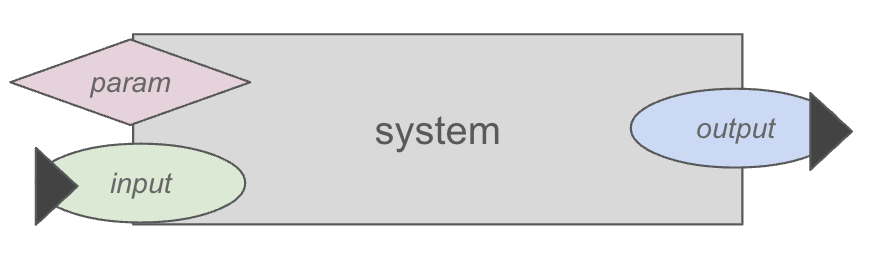
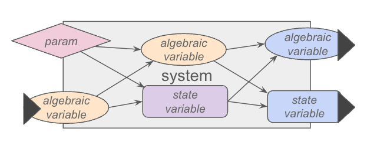
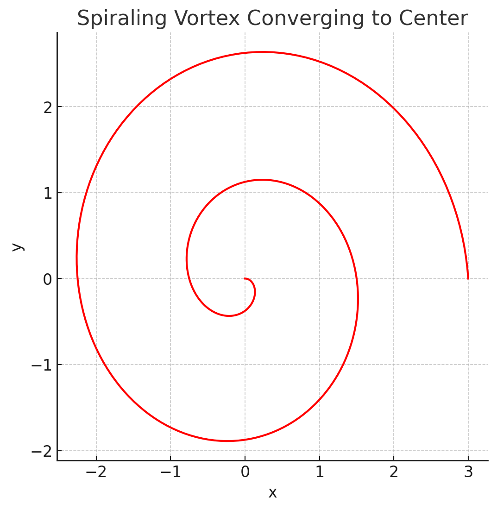
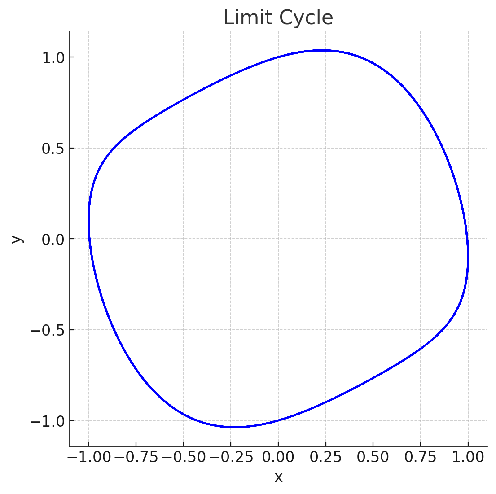

# Capitolo 3: modellizzare quantitativamente il comportamento di un sistema {#capitolo-3-modellizzare-quantitativamente-il-comportamento-di-un-sistema}

In questa sezione ci concentreremo sulla componente matematica del metodo, con l\'obiettivo di acquisire nuovi strumenti utili nella pratica[^cap3-1]. L\'intento del corso è trasformare il processo decisionale da un\'attività artigianale a una più strutturata e ingegneristica. Tuttavia, mantenere un approccio pratico e operativo rimane fondamentale per comprendere e applicare efficacemente le tecniche apprese[^cap3-2].

## Modelli black-box {#modelli-black-box}

Un passaggio ulteriore, di natura qualitativa, ci consente di costruire modelli quantitativi e di comprenderli meglio. Nei grafi dei modelli, i nodi possono essere suddivisi in tre categorie:

-   Variabili con frecce entranti

-   Variabili con frecce uscenti

-   Variabili con frecce sia entranti che uscenti

Per adesso, concentriamoci solo sui primi due casi.

### Variabili di input {#variabili-di-input}

Una variabile che non ha frecce entranti ma solo ha frecce uscenti è una variabile il cui valore non viene calcolato all'interno del modello, e quindi è un ingresso (o **input**) del modello. Per esempio, in un modello di un magazzino di un'azienda, la domanda di mercato sarà considerata un input, perché il modello sarà un'interpretazione strutturata del sistema di interesse (il magazzino) la cui modellazione non implica necessariamente il calcolo della domanda. Al contrario, se si trattasse di realizzare un modello di un'intera azienda, e il decisore/committente avesse interesse a valutare l'effetto degli investimenti di marketing sul modello, allora in quel caso la domanda dovrebbe essere influenzata dalla pubblicità e da altri fattori, e di conseguenza calcolata internamente. In quello scenario, non si tratterebbe di un input[^cap3-3]. Non esiste quindi una regola per definire input e output di modelli di un dato sistema: dipende da quali sono gli obiettivi del modellista e da ciò che vuole ottenere.

Un sistema o un modello privo di input è detto "chiuso"[^cap3-4]. I sistemi di cui si occupano tipicamente un ingegnere gestionali, ovvero sistemi socio-tecnici o socio-economici, è poco frequente che siano chiusi da un punto di vista termodinamico, però lo possono essere in termini modellistici e può essere utile comprenderlo[^cap3-5].

In termini più generali, gli input si dividono in tre categorie:

-   **parametri**: variabili a cui si impone la condizione di non cambiare valore una volta assegnato;

-   **input ambientali**: variabili di input calcolate al di fuori del modello (per esempio, con dati raccolti da serie storiche esterne, o generati in modo casuale);

-   **input decisionali**: variabili di input il cui valore è assegnato dall'utilizzatore del modello. Queste sono tipicamente le variabili utilizzate per fare what-if analysis e utilizzare un modello come uno strumento di supporto alle decisioni.

In una certa misura, si possono considerare quindi le variabili di input come quelle variabili ai confini fra il sistema di interesse e il mondo circostante.

+-----------------------------------------------------------------------------------------------------------------------------------------------------------------------------------------------------------------------------------------------------------------------------------------------------------------------------------------------------------------------------------------------------------------------------------------------------------------------------------------------------------------------------------------------------------------------------------------------------------------------------------------------------------------------------------------------------------------------------------------------------------------------------------------+
| **Approfondimento 3.1 - il modello del ristorante sul lago**                                                                                                                                                                                                                                                                                                                                                                                                                                                                                                                                                                                                                                                                                                                            |
|                                                                                                                                                                                                                                                                                                                                                                                                                                                                                                                                                                                                                                                                                                                                                                                         |
| Immaginiamo di modellare un ristorante situato in un paese sulla riva di un lago, come per esempio il Lago Maggiore[^cap3-6], la cui attività è influenzata da fattori sia ambientali sia decisionali. L\'obiettivo del modello è valutare la capacità del ristorante di servire i clienti nel corso della giornata, ottimizzando le risorse e rispondendo alle variazioni delle condizioni ambientali.                                                                                                                                                                                                                                                                                                                                                                                      |
|                                                                                                                                                                                                                                                                                                                                                                                                                                                                                                                                                                                                                                                                                                                                                                                         |
| *Parametri del modello*                                                                                                                                                                                                                                                                                                                                                                                                                                                                                                                                                                                                                                                                                                                                                                 |
|                                                                                                                                                                                                                                                                                                                                                                                                                                                                                                                                                                                                                                                                                                                                                                                         |
| -   **Capacità massima del ristorante in termini di clienti**: il numero massimo di clienti che il ristorante può ospitare contemporaneamente. Questa non è una variabile che il decisore può cambiare, quindi viene modellata come un parametro..                                                                                                                                                                                                                                                                                                                                                                                                                                                                                                                                      |
|                                                                                                                                                                                                                                                                                                                                                                                                                                                                                                                                                                                                                                                                                                                                                                                         |
| -   **Capacità massima del ristorante in termini di capacità della cucina**: il numero massimo di piatti che il ristorante può produrre in un certo intervallo di tempo. Anche questa potrebbe non essere una variabile che il decisore può cambiare, quindi viene modellata come un parametro, ma qui la questione è più sfumata. Dipende da qual è l'orizzonte temporale della simulazione (cambia profondamente se si modellizza un giorno o un decennio) e dalle decisioni che il modello è scritto per supportare.                                                                                                                                                                                                                                                                 |
|                                                                                                                                                                                                                                                                                                                                                                                                                                                                                                                                                                                                                                                                                                                                                                                         |
| *Input ambientali*                                                                                                                                                                                                                                                                                                                                                                                                                                                                                                                                                                                                                                                                                                                                                                      |
|                                                                                                                                                                                                                                                                                                                                                                                                                                                                                                                                                                                                                                                                                                                                                                                         |
| -   **Precipitazioni**: Le condizioni meteorologiche, come la quantità di pioggia, sono un fattore che il ristorante non può controllare. In un giorno di pioggia, ci aspettiamo che ci siano meno clienti rispetto a una giornata di sole, e il modello tiene conto di questa variabile per stimare la domanda giornaliera. Questo però non fa parte del sistema modellato (il ristorante).                                                                                                                                                                                                                                                                                                                                                                                            |
|                                                                                                                                                                                                                                                                                                                                                                                                                                                                                                                                                                                                                                                                                                                                                                                         |
| -   **Temperatura esterna**: Se la temperatura è troppo alta o troppo bassa, potrebbe influenzare il comportamento dei turisti. Una giornata fresca e soleggiata potrebbe attirare più visitatori rispetto a una calda e afosa. Anche questo non fa parte del sistema modellato.                                                                                                                                                                                                                                                                                                                                                                                                                                                                                                        |
|                                                                                                                                                                                                                                                                                                                                                                                                                                                                                                                                                                                                                                                                                                                                                                                         |
| *Input decisionali*                                                                                                                                                                                                                                                                                                                                                                                                                                                                                                                                                                                                                                                                                                                                                                     |
|                                                                                                                                                                                                                                                                                                                                                                                                                                                                                                                                                                                                                                                                                                                                                                                         |
| -   **Numero di camerieri**: Il gestore del ristorante può decidere quanti camerieri schierare in base alla previsione di affluenza. Un numero maggiore di camerieri permette di servire più clienti rapidamente, ma comporta costi maggiori in termini di stipendi. Questa è una variabile che può essere usata da un ristoratore per fare un'analisi di scenario e prendere una decisione.                                                                                                                                                                                                                                                                                                                                                                                            |
|                                                                                                                                                                                                                                                                                                                                                                                                                                                                                                                                                                                                                                                                                                                                                                                         |
| -   **Promozioni giornaliere**: Il gestore può anche decidere di offrire promozioni speciali per attirare più clienti in giornate particolarmente calme. Anche questa è una variabile che può essere modulata per esplorarne l'effetto e prendere una decisione.                                                                                                                                                                                                                                                                                                                                                                                                                                                                                                                        |
|                                                                                                                                                                                                                                                                                                                                                                                                                                                                                                                                                                                                                                                                                                                                                                                         |
| Esiste qui peraltro anche un'interessante problema riguardo alla **base dei temp**i, che deve essere definita per progettare il modello anche prima di impostare la parte matematica. In questo modello, possiamo considerare come ∆t il giorno oppure l\'ora. Utilizzare il giorno come unità temporale permette di osservare variazioni più ampie nel numero di clienti, considerando le tendenze generali legate al meteo e alle promozioni giornaliere. D\'altro canto, lavorare su base oraria offre una visione più dettagliata del flusso di clienti durante le diverse fasce orarie della giornata, consentendo di adattare le decisioni operative (come l\'allocazione del personale). Non c'è quindi una decisione corretta o errata, ma dipende dall'obiettivo del decisore. |
+-----------------------------------------------------------------------------------------------------------------------------------------------------------------------------------------------------------------------------------------------------------------------------------------------------------------------------------------------------------------------------------------------------------------------------------------------------------------------------------------------------------------------------------------------------------------------------------------------------------------------------------------------------------------------------------------------------------------------------------------------------------------------------------------+

È particolarmente interessante analizzare la natura degli input in un modello, poiché la loro scelta è strettamente legata alla definizione dello scopo del modello stesso. Decidere quali input includere significa, in effetti, determinare quali aspetti del sistema si intende analizzare e con quali finalità. Ad esempio, un input che rappresenta una condizione iniziale, che viene utilizzata all\'inizio del processo di simulazione ed è trattata come una costante. In tal caso, quell'input è un parametro, poiché rimane invariato durante il processo di modellazione. Si osserva che non tutti i parametri sono condizioni iniziali, ma tutte le condizioni iniziali sono una forma di parametro.

Al contrario, un parametro come il tasso di interesse di un modello di economia nazionale può essere trattato diversamente a seconda del contesto del modello. Se il tasso di interesse è considerato una variabile decisionale, potrebbe essere utile esaminare come vari tassi influenzino il comportamento complessivo del sistema. Questo tipo di scelta determina come il modello viene utilizzato per analizzare scenari diversi e prendere decisioni strategiche.

### Variabili di output {#variabili-di-output}

Una variabile che ha solo frecce entranti e nessuna freccia uscente è un'uscita, o **output**. Una variabile di output è una variabile che rappresenta il risultato o l\'effetto misurabile prodotto da un sistema, derivato dalle sue dinamiche interne e influenzato dalle variabili di input. Viene utilizzata per valutare le prestazioni o il comportamento del sistema.

In un modello ingegneristico, la categorizzazione degli input è definita attraverso decisioni strutturali prese dal modellatore. Sono queste decisioni a stabilire quale sia il tipo di input rilevante per il sistema. Al contrario, quando si tratta di un output, qualunque nodo del modello può assumere questa funzione, purché risulti di interesse per l\'osservazione. La condizione fondamentale per un output è che rappresenti un\'informazione utile al raggiungimento dell\'obiettivo del modello.

+----------------------------------------------------------------------------------------------------------------------------------------------------------------------------------------------------------------------------------------------------------------------------------------------------------------------------------------------------------------------------------------------------------------------------------------------------------------------------------------------------------------------------------------------------------------------------------------------------------------------------------------------------------------------------------------------------------------------------------------------------------------------------+
| **Approfondimento 3.2 - studiare i ghiacciai**                                                                                                                                                                                                                                                                                                                                                                                                                                                                                                                                                                                                                                                                                                                             |
|                                                                                                                                                                                                                                                                                                                                                                                                                                                                                                                                                                                                                                                                                                                                                                            |
| Si guardino le due foto. Questo esempio mostra come la definizione degli output in un modello black box non sia una scelta neutrale, ma influenzi l'interpretazione dei risultati e dipenda quindi dalla posizione che si vuole sostenere nel processo decisionale con il modello.                                                                                                                                                                                                                                                                                                                                                                                                                                                                                         |
|                                                                                                                                                                                                                                                                                                                                                                                                                                                                                                                                                                                                                                                                                                                                                                            |
| Le due fotografie, scattate a più di un secolo di distanza (la prima da Vittorio Sella[^cap3-7] nel 1890, la seconda da Fabiano Ventura per il progetto On The Trails of Glaciers[^cap3-8] nel 2020), rappresentano lo stesso paesaggio (la valle e la vetta del Chaalati[^cap3-9], nel caucaso[^cap3-10] georgiano) ma con differenze evidenti. Se l'attenzione si concentra sulla cima della montagna, si nota come nel 1890 fosse presente meno neve rispetto al 2020. Se invece si guarda la parte inferiore della valle, appare chiaro che nel 1890 il ghiacciaio era molto più esteso, mentre oggi è quasi scomparso. Non c'è contraddizione fra questi due elementi: la vetta della montagna tipicamente indica lo stato del meteo, la condizione del ghiacciaio quello del clima[^cap3-11]. |
|                                                                                                                                                                                                                                                                                                                                                                                                                                                                                                                                                                                                                                                                                                                                                                            |
| Lo stesso dato visivo, dunque, può essere letto in modi diversi a seconda della porzione di sistema che si decide di considerare. Nella costruzione qualitativa di modelli black box, la scelta dell'output da osservare e comunicare non è mai un fatto puramente tecnico, ma riflette intenzioni, prospettive e obiettivi. Ciò che il modello restituisce dipende da ciò che viene messo in primo piano, e quindi il messaggio finale è sempre condizionato dalla selezione compiuta dal modellatore.                                                                                                                                                                                                                                                                    |
+----------------------------------------------------------------------------------------------------------------------------------------------------------------------------------------------------------------------------------------------------------------------------------------------------------------------------------------------------------------------------------------------------------------------------------------------------------------------------------------------------------------------------------------------------------------------------------------------------------------------------------------------------------------------------------------------------------------------------------------------------------------------------+

Questo non implica che gli output siano opzionali o irrilevanti: un modello privo di output è un modello incapace di fornire indicazioni utili, ovvero un modello \"muto\". Una regola di coerenza da seguire è che un nodo privo di frecce in uscita, all\'interno di un modello, dovrebbe essere interpretato come un nodo di output. Se un nodo non ha frecce in uscita, esso o è ridondante[^cap3-12] e quindi inutile, oppure è un nodo di cui si osserva il comportamento.

### Ragionare a scatola chiusa {#ragionare-a-scatola-chiusa}

In ambito di progettazione[^cap3-13], è consigliabile iniziare definendo o studiando solo gli input e gli output di un sistema. La ragione alle base di ciò è economica: man mano che lo sviluppo del modello progredisce, i costi di cambiamento aumentano in modo esponenziale. Pertanto, iniziare guardando costantemente gli effetti degli input sugli output, e ignorando ciò che c'è sotto permette di ottenere una comprensione rapida del sistema[^cap3-14]. Questo tipo di modello è detto modello a scatola chiusa, modello input/output (I/O)[^cap3-15] o più comunemente modello black box. Un **modello black box** rappresenta un sistema in cui sono visibili solo gli input e gli output, mentre il funzionamento interno rimane nascosto o non considerato.

+-------------------------------------------------------------------------------------------------------------------------------------------------------------------------------------------------------------------------------------------------------------------------------------------------------------------------------------------------------------------------------------------------------------------------------------------------------------------------------------------------------------------------------------------------------------------------------------------------------------------------------------------------------------------------------+
| **Approfondimento 3.3 - i modelli black-box e la seconda guerra mondiale**                                                                                                                                                                                                                                                                                                                                                                                                                                                                                                                                                                                                    |
|                                                                                                                                                                                                                                                                                                                                                                                                                                                                                                                                                                                                                                                                               |
| Il termine \"modello black-box\" ha origini storiche, risalenti alla Seconda Guerra Mondiale, quando le comunicazioni criptate erano cruciali per evitare che il nemico potesse intercettare informazioni. La complessità delle tecniche di criptografia richiedeva metodi pratici per l\'analisi del funzionamento dei sistemi, anche senza accedere alla logica interna delle macchine crittografiche[^cap3-16]. Quando era impossibile aprire la macchina e studiarne il meccanismo, si ricorreva a un\'analisi black-box, ovvero si inserivano diversi input e si osservavano gli output corrispondenti per dedurre il funzionamento del sistema.                              |
|                                                                                                                                                                                                                                                                                                                                                                                                                                                                                                                                                                                                                                                                               |
| Un esempio emblematico di questo approccio è rappresentato dalla macchina Enigma, utilizzata dalla Germania durante la Seconda Guerra Mondiale per cifrare le comunicazioni militari. Enigma era un sistema di crittografia estremamente complesso, basato su una serie di rotori intercambiabili che modificavano continuamente il codice, rendendo quasi impossibile per il nemico comprendere il messaggio intercettato senza conoscere l'esatta configurazione della macchina. Gli Alleati, tuttavia, riuscirono a craccare il codice Enigma senza accedere alla logica interna del dispositivo, attraverso un\'analisi black box[^cap3-17].                                   |
|                                                                                                                                                                                                                                                                                                                                                                                                                                                                                                                                                                                                                                                                               |
| Alan Turing[^cap3-18] e il suo team di matematici e crittografi, lavorando a Bletchley Park[^cap3-19], svilupparono un metodo per dedurre le impostazioni dei rotori utilizzando solo gli input (i messaggi cifrati) e gli output (le versioni decifrate dei messaggi). Attraverso una combinazione di analisi statistica, intuizioni matematiche e tentativi iterativi, furono in grado di ricostruire la logica del sistema senza mai dover \"aprire la scatola\" della macchina Enigma. Questo è un esempio classico di come un\'analisi black box possa essere utilizzata per comprendere un sistema complesso, sfruttando solo l\'osservazione dei dati di ingresso e uscita[^cap3-20]. |
+-------------------------------------------------------------------------------------------------------------------------------------------------------------------------------------------------------------------------------------------------------------------------------------------------------------------------------------------------------------------------------------------------------------------------------------------------------------------------------------------------------------------------------------------------------------------------------------------------------------------------------------------------------------------------------+

Nel contesto ingegneristico, questo concetto si applica ai modelli che stiamo costruendo. Sebbene il sistema non esista ancora, l\'analisi black box permette comunque di comprendere il comportamento globale del modello, aiutando a prendere decisioni progettuali senza bisogno di sviluppare subito l\'intera struttura interna del sistema.

{width="6.364583333333333in" height="1.5in"}

Molte persone utilizzano un\'automobile senza conoscerne nel dettaglio il funzionamento interno, ma questo non impedisce loro di utilizzarla efficacemente[^cap3-21]. Questo esempio dimostra come sia possibile gestire la complessità di un sistema anche senza accedere alla sua struttura interna.

## Aprire la scatola: la dinamica {#aprire-la-scatola-la-dinamica}

### Variabili di stato e variabili algebriche {#variabili-di-stato-e-variabili-algebriche}

Aprendo il modello, o comunque iniziando a progettare ciò che c'è dentro, è necessario capire quali tipologie di variabili ci possano essere dentro. Mentre prima si sono distinte le variabili grazie alla posizione delle relazioni di dipendenza funzionale, adesso si può utilizzare il tempo. Nel dettaglio:

-   **variabile algebrica**[^cap3-22]: una variabile il cui valore è determinato istantaneamente da un\'equazione algebrica, e che quindi non dipende dal proprio valore precedente.

-   **variabile di stato**[^cap3-23]: una variabile il cui valore è determinato almeno in parte dal proprio valore precedente.

{width="5.536458880139983in" height="2.0939173228346455in"}

Gli input teoricamente non dovrebbero essere classificati né come variabili algebriche né come variabili di stato, poiché rappresentano le informazioni esterne che influenzano il sistema. Tuttavia, si può considerare che, in pratica, un nodo privo di frecce in entrata all\'interno di un modello possa essere interpretato come un input, poiché riceve dati esterni senza dipendere da altre variabili del sistema.

### Il tempo come meta-ipotesi modellistica {#il-tempo-come-meta-ipotesi-modellistica}

La distinzione tra un nodo algebrico e un nodo di stato si basa quindi sul ruolo del **tempo**. In questo contesto, il tempo è sempre presente e viene trattato come una variabile indipendente. A differenza di un database relazionale, che è statico, i modelli che trattiamo in questo corso considerano il tempo come una dimensione locale, seguendo una visione newtoniana, non relativistica. Ciò implica che fenomeni come il paradosso dei gemelli[^cap3-24] o la trama del film \"Interstellar\"[^cap3-25] non sono applicabili. Sebbene sia tecnicamente possibile implementare queste complessità temporali sia matematicamente che in software per lo sviluppo di modelli di simulazione, ciò risulterebbe controintuitivo rispetto al nostro scopo. Inoltre, il tempo nel nostro modello è concepito come durata misurabile con **cronometri**, non come una data assoluta nel calendario. Questo permette di resettare il tempo a zero in qualsiasi momento, mentre non sarebbe possibile impostare arbitrariamente un \"anno zero\" nel modello.

Il tempo rappresenta quindi una meta-ipotesi nei modelli ingegneristici, e la sua gestione segue alcune convenzioni chiave:

-   Il tempo iniziale viene solitamente impostato a 0, ma non è un vincolo rigido.

-   Il tempo finale può essere scelto liberamente in base alla durata richiesta per il modello.

-   Il ∆t (passo temporale) è un parametro cruciale. Nei modelli fisici non relativistici, il tempo continuo è spesso assunto (per garantire la presenza delle derivate), richiedendo una discretizzazione temporale adeguata. Inoltre, la frequenza di ricalcolo dipende dal tipo di modello e dall\'uso previsto: ad esempio, un ∆t di un minuto è utile per decisioni operative in un magazzino, un ∆t giornaliero per decisioni tattiche, e un ∆t settimanale o mensile per decisioni strategiche a livello dirigenziale. La scelta del ∆t influenza fortemente l\'appropriatezza del modello per il suo scopo specifico.

### Sistemi dinamici {#sistemi-dinamici}

Quindi, quando una variabile è una variabile di stato, entra in gioco il tempo come una variabile indipendente non banale. Una variabile di stato si distingue perché non può essere calcolata istantaneamente; infatti, non può essere determinata allo stesso modo sia \"a sinistra\" che \"a destra\" rispetto al tempo attuale. Questo perché la funzione che determina il valore della variabile di stato non dipende solo dal presente, ma anche dal futuro, ovvero dal tempo t + Δt. Questa struttura riflette la dinamica del sistema. Nel contesto di questo corso, si definirà un modello dinamico come un modello che contiene almeno una variabile di stato. La presenza di una variabile di stato è condizione necessaria e sufficiente affinché si possa considerare un **sistema dinamico**. Un sistema non dinamico è detto **sistema algebrico**[^cap3-26].

Approfondiamo ancora la distinzione fra variabili algebriche e di stato, ora che abbiamo introdotto il tempo come possibile variabile indipendente. Se esiste una funzione $f$ tale che, per ogni istante $t$, $b(t)\  = \ f(a(t))$, allora $b$ è una **variabile algebrica**. Se questa relazione non esiste, la funzione dovrà essere definita diversamente; più precisamente, se per ogni $t$, $b(t\  + \ \mathrm{\Delta}t)\  = \ f(a(t),\ b(t))$, allora $b$ è una variabile dinamica o **variabile di stato**. In questo caso, la funzione che descrive $b$ non dipende solo dal presente, ma anche dal futuro immediato. Ad esempio, se $\mathrm{\Delta}t$ rappresenta un anno, la funzione descrive quanto denaro sarà presente in un conto bancario tra un anno. Comprendere questo concetto è essenziale per sviluppare modelli di sistemi dinamici, fornendo uno strumento universale per analizzarne il comportamento.

+---------------------------------------------------------------------------------------------------------------------------------------------------------------------------------------------------------------------------------------------------------------------------------------------------------------------------------------------------------------------------------------------------------------------------------------------------------------------------------------------------------------------------------------------------------------------------------------------------------------------------------------------------------------------------+
| **Approfondimento 3.4 - il conto in banca come un sistema dinamico**                                                                                                                                                                                                                                                                                                                                                                                                                                                                                                                                                                                                      |
|                                                                                                                                                                                                                                                                                                                                                                                                                                                                                                                                                                                                                                                                           |
| In un modello algebrico, una variabile di output può essere calcolata istantaneamente a partire dagli input, senza bisogno di considerare il passato del sistema. Per esempio, nel caso di un sistema finanziario, possiamo calcolare gli interessi in un dato momento ttt utilizzando una semplice equazione algebrica:                                                                                                                                                                                                                                                                                                                                                  |
|                                                                                                                                                                                                                                                                                                                                                                                                                                                                                                                                                                                                                                                                           |
| $$interests(t) = f(int\_ rate(t),capital(t))interests(t))$$                                                                                                                                                                                                                                                                                                                                                                                                                                                                                                                                                                                                               |
|                                                                                                                                                                                                                                                                                                                                                                                                                                                                                                                                                                                                                                                                           |
| Questa equazione esprime che gli interessi dipendono istantaneamente dal tasso di interesse e dal capitale attuali, senza necessità di conoscere stati precedenti.                                                                                                                                                                                                                                                                                                                                                                                                                                                                                                        |
|                                                                                                                                                                                                                                                                                                                                                                                                                                                                                                                                                                                                                                                                           |
| Tuttavia, quando si considera una variabile come il capitale, il modello non può più essere puramente algebrico. Il capitale accumulato in un certo istante dipende non solo dagli interessi attuali, ma anche dal valore del capitale al momento precedente. Questo implica che il capitale è una variabile di stato, la cui evoluzione è descritta da una relazione differenziale o ricorsiva. La formula corretta per calcolare il capitale è:                                                                                                                                                                                                                         |
|                                                                                                                                                                                                                                                                                                                                                                                                                                                                                                                                                                                                                                                                           |
| $$capital(t + \Delta t) = capital(t) + interests(t)$$                                                                                                                                                                                                                                                                                                                                                                                                                                                                                                                                                                                                                     |
|                                                                                                                                                                                                                                                                                                                                                                                                                                                                                                                                                                                                                                                                           |
| Questa equazione mostra che il capitale al tempo t+Δt + t+Δt dipende dal capitale al tempo t e dagli interessi maturati durante l\'intervallo di tempo Δt. Questo tipo di relazione è tipica dei modelli dinamici, dove lo stato del sistema evolve nel tempo in base a variabili che ne influenzano l\'andamento.                                                                                                                                                                                                                                                                                                                                                        |
|                                                                                                                                                                                                                                                                                                                                                                                                                                                                                                                                                                                                                                                                           |
| Un altro aspetto fondamentale dei modelli dinamici è la necessità di definire una condizione iniziale, spesso chiamata condizione di Cauchy, per poter calcolare l\'evoluzione della variabile di stato. In altre parole, per risolvere l\'equazione differenziale che descrive l\'evoluzione di una variabile dinamica, è necessario conoscere il valore iniziale della variabile. Nel nostro esempio, questo si traduce nel fatto che, per calcolare il capitale in un dato momento t, è indispensabile conoscere il **capitale iniziale** capital(0)capital(0)capital(0). Senza questa informazione, non è possibile determinare l\'evoluzione successiva del sistema. |
+---------------------------------------------------------------------------------------------------------------------------------------------------------------------------------------------------------------------------------------------------------------------------------------------------------------------------------------------------------------------------------------------------------------------------------------------------------------------------------------------------------------------------------------------------------------------------------------------------------------------------------------------------------------------------+

Un'equazione come $b(t\  + \ \mathrm{\Delta}t)\  = \ f(a(t),\ b(t))$ non è più un\'equazione algebrica ma una **equazione alle differenze finite** (FDE). Le equazioni alle differenze finite descrivono l\'evoluzione di un sistema in intervalli di tempo discreti. Man mano che ∆t si riduce e si avvicina a 0, queste equazioni si avvicinano al comportamento delle equazioni differenziali, che variano in modo continuo. Sebbene in questo corso non sia richiesto essere esperti di equazioni differenziali, è importante sapere che queste costituiscono lo strumento principale per descrivere e calcolare la dinamica dei sistemi.

Per chiarire ulteriormente, si può fare una distinzione concettuale tra i due tipi di modelli:

-   Un'equazione **algebrica** è **sincronica**, ossia rappresenta una \"fotografia\" istantanea del sistema in un dato momento. Un sistema algebrico è quindi a sua volta un sistema sincronico.

-   Un'equazione **dinamica** è **diacronica**, rappresentando un \"video\" che descrive l\'evoluzione della variabile nel tempo. Un sistema dinamico è quindi a sua volta un sistema diacronico.

Le equazioni matematiche, specialmente quelle differenziali e alle differenze finite, sono gli strumenti fondamentali per realizzare simulazioni che modellano il comportamento dinamico di un sistema.

+----------------------------------------------------------------------------------------------------------------------------------------------------------------------------------------------------------------------------------------------------------------------------------------------------------------------------------------------------------------------------------------------------------------------------------------------------------------------------------------------------------------------------------------------------------------------------------------------------------------------------------------------------------------------+
| **Approfondimento 3.5 - soluzioni analitiche di equazioni differenziali**                                                                                                                                                                                                                                                                                                                                                                                                                                                                                                                                                                                            |
|                                                                                                                                                                                                                                                                                                                                                                                                                                                                                                                                                                                                                                                                      |
| Esistono casi in cui le equazioni differenziali o alle differenze finite possono essere risolte in modo cinematico, ossia attraverso una soluzione analitica. Tuttavia, queste situazioni richiedono condizioni ideali, come l\'assenza di variazione dei parametri nel tempo e una dinamica strettamente lineare, e di solito anche un'ottima intuizione[^cap3-27].                                                                                                                                                                                                                                                                                                      |
|                                                                                                                                                                                                                                                                                                                                                                                                                                                                                                                                                                                                                                                                      |
| La fisica che si studia nelle scuole superiori è un caso specifico di ciò, ed è anche la ragione per cui ogni prima lezione di un corso di fisica universitario è più difficile e allo stesso tempo più interessante di quelle sostenute al liceo. Nel mondo reale, tali condizioni sono estremamente rare, rendendo le soluzioni analitiche spesso teoricamente interessanti, ma inutilizzabili nella pratica. Un buon ingegnere deve essere in grado di progettare un modello adeguato e, successivamente e poi simularlo numericamente per ottenere una soluzione, poiché questa è l\'unica strada efficace per affrontare la complessità dei sistemi reali[^cap3-28]. |
+----------------------------------------------------------------------------------------------------------------------------------------------------------------------------------------------------------------------------------------------------------------------------------------------------------------------------------------------------------------------------------------------------------------------------------------------------------------------------------------------------------------------------------------------------------------------------------------------------------------------------------------------------------------------+

## Una formalizzazione matematica {#una-formalizzazione-matematica}

### Dal moto browniano alle equazioni differenziali {#dal-moto-browniano-alle-equazioni-differenziali}

+-----------------------------------------------------------------------------------------------------------------------------------------------------------------------------------------------------------------------------------------------------------------------------------------------------------------------------------------------------------------------------------------------------------------------------------------------------------------------------------------------+
| **Approfondimento 3.6 - il moto Browniano fra fisica e finanza**                                                                                                                                                                                                                                                                                                                                                                                                                              |
|                                                                                                                                                                                                                                                                                                                                                                                                                                                                                               |
| Con moto Browniano ci si riferisce al movimento casuale e irregolare di particelle microscopiche sospese in un fluido[^cap3-29] (liquido o gas). Questo fenomeno fu osservato per la prima volta da Robert Brown nel 1827, quando notò che piccoli granelli di polline in acqua sembravano muoversi in modo imprevedibile. Questo moto è causato dagli urti continui delle molecole del fluido contro la particella, che ne determinano un movimento disordinato.                                  |
|                                                                                                                                                                                                                                                                                                                                                                                                                                                                                               |
| Il moto Browniano è interessante perché ha fornito una delle prime evidenze sperimentali della natura discreta della materia (molecole e atomi). Albert Einstein, nel 1905, lo descrisse teoricamente utilizzando concetti di probabilità, collegando il moto casuale delle particelle sospese all\'agitazione termica delle molecole del fluido. Questo lavoro ha contribuito alla conferma dell\'esistenza degli atomi e ha aperto la strada a importanti sviluppi nella fisica statistica. |
|                                                                                                                                                                                                                                                                                                                                                                                                                                                                                               |
| Possiamo modellare questo moto attraverso semplici equazioni alle differenze finite. Se $x(t)$ rappresenta la posizione di una particella al tempo t, il suo spostamento in un breve intervallo di tempo $\mathrm{\Delta}t$ può essere espresso come:                                                                                                                                                                                                                                         |
|                                                                                                                                                                                                                                                                                                                                                                                                                                                                                               |
| $$x(t + \mathrm{\Delta}t)\  = \ x(t)\  + \ r(t)$$                                                                                                                                                                                                                                                                                                                                                                                                                                             |
|                                                                                                                                                                                                                                                                                                                                                                                                                                                                                               |
| dove $r(t)$ è una variabile aleatoria che descrive lo spostamento casuale dovuto agli urti delle molecole. Questo modello discreto ci permette di simulare e studiare il comportamento di particelle soggette a movimenti casuali, con applicazioni che vanno dalla fisica statistica alla finanza (modelli di diffusione dei prezzi)[^cap3-30].                                                                                                                                                   |
+-----------------------------------------------------------------------------------------------------------------------------------------------------------------------------------------------------------------------------------------------------------------------------------------------------------------------------------------------------------------------------------------------------------------------------------------------------------------------------------------------+

Per affrontare la dinamica in modo rigoroso, e quindi applicare la matematica in modo formale, abbiamo bisogno di un solo passaggio aggiuntivo: considerare un tempo di ricalcolo molto piccolo. Partiamo dall'esempio del moto Browniano dell'approfondimento 3.5. Invece di ricalcolare il nostro modello ad ogni unità di tempo, effettueremo il ricalcolo ad ogni frazione di unità di tempo. Questo porta l\'equazione a diventare:

$$x(t + \mathrm{\Delta}t) = x(t)\  + \ r(t)*\mathrm{\Delta}t$$

Nel modello algebrico non cambierebbe nulla, ma è interessante osservare cosa accade al modello dinamico se riduciamo il valore di Δt. Riducendo il passo di calcolo, il moto diventa più granulare. Ad esempio, osservando l\'intervallo di tempo tra 0 e 10 con Δt molto piccolo, si può notare un movimento più fluido, quasi differenziabile. Riducendo ulteriormente il passo, ad esempio a 0,01, si ottiene un movimento ancora più liscio.

La domanda centrale è: **cosa succede se Δt tende a zero?** Questa domanda ci porta a esplorare i concetti introdotti da Newton.

Scriviamo ora le seguenti equazioni:

(1) $x(t + \mathrm{\Delta}t)\  = \ x(t)\  + \ f\mathrm{\Delta}t$

Se riduciamo Δt fino a zero, possiamo riscrivere l\'equazione come:

(2) $\frac{x(t + \mathrm{\Delta}t) - x(t)}{\mathrm{\Delta}t}\  = \ f$

Il termine a sinistra rappresenta il **rapporto incrementale**, e il limite del rapporto incrementale per è la **derivata**. Quindi otteniamo:

(3) $\frac{dx(t))}{dt}\  = \ f$

L\'equazione (3) non è esattamente uguale a (1) e (2), ma viene ottenuta sotto la condizione di ridurre Δt a valori sempre più piccoli. Questo è un concetto teorico, ma possiamo visualizzare tale approccio riducendo il passo di tempo nella simulazione, approssimando così sempre meglio il comportamento del sistema.

Ora fermiamoci un momento a riflettere. L\'entità matematica descritta dall\'equazione (3) è una **ODE** (Ordinary Differential Equation), ovvero un\'equazione differenziale ordinaria. Al contrario, l\'equazione (1) è un\''equazione alle **differenze finite** (FDE).

### Qualche nota sulle equazioni differenziali {#qualche-nota-sulle-equazioni-differenziali}

Una **equazione differenziale** non ha come soluzione un singolo valore, ma una **funzione** che descrive il comportamento dinamico del sistema di interesse. A differenza di un semplice valore numerico, una funzione permette di descrivere un processo dinamico nel tempo. Ad esempio, per descrivere il moto della Terra attorno al Sole, è necessaria una funzione, non un valore singolo. Lo stesso vale per stimare l\'andamento di un investimento finanziario nel tempo, o per determinare quanta acqua ci sarà in una vasca in un dato istante futuro. In tutti questi casi, la soluzione è una funzione.

Tornando all\'equazione (3), essa ci indica come varia una funzione nel tempo. La grande intuizione di Newton è stata quella di descrivere il comportamento dinamico di una funzione tramite la sua variazione. Fino agli anni \'60, questi problemi richiedevano una conoscenza approfondita dell\'analisi matematica. Oggi, grazie ai computer, possiamo risolverli numericamente usando software di simulazione numerica (come, per esempio, STGraph).

Quando eseguiamo un modello dinamico con STGraph, il software sta in effetti integrando approssimativamente un\'equazione differenziale. La teoria generale dei sistemi è, nella sua essenza, la teoria della dinamica. Grazie agli strumenti software disponibili, non è necessario tornare ai calcoli manuali; bastano le operazioni matematiche fondamentali per impostare il problema, mentre il calcolo della soluzione viene effettuato dal computer.

+---------------------------------------------------------------------------------------------------------------------------------------------------------------------------------------------------------------------------------------------------------------------------------------------------------------------------------------------------------------------------------------------------+
| **Approfondimento 3.7 - dinamica e meccanica classica**                                                                                                                                                                                                                                                                                                                                           |
|                                                                                                                                                                                                                                                                                                                                                                                                   |
| Per capire come la dinamica si collega alla meccanica classica, dedichiamo del tempo alla relazione fondamentale della meccanica: $F\  = \ m\ a$ (forza = massa × accelerazione). Riscrivendo l\'equazione in funzione del tempo, otteniamo:                                                                                                                                                      |
|                                                                                                                                                                                                                                                                                                                                                                                                   |
| (1) $F(t)\  = \ m\ a(t)$                                                                                                                                                                                                                                                                                                                                                                          |
|                                                                                                                                                                                                                                                                                                                                                                                                   |
| Sappiamo però che l\'accelerazione è la derivata seconda della posizione, quindi possiamo riscrivere:                                                                                                                                                                                                                                                                                             |
|                                                                                                                                                                                                                                                                                                                                                                                                   |
| (2) $F(t)\  = \ m\ \frac{d^{2}p(t)}{{dt}^{2}}$                                                                                                                                                                                                                                                                                                                                                    |
|                                                                                                                                                                                                                                                                                                                                                                                                   |
| Che, isolando la derivata, diventa:                                                                                                                                                                                                                                                                                                                                                               |
|                                                                                                                                                                                                                                                                                                                                                                                                   |
| (3) $\frac{F(t)}{m} = \frac{d^{2}p(t)}{{dt}^{2}}$                                                                                                                                                                                                                                                                                                                                                 |
|                                                                                                                                                                                                                                                                                                                                                                                                   |
| Per conoscere la posizione in un qualunque momento futuro[^cap3-31], possiamo descrivere il problema come una serie di equazioni differenziali. Per risolverlo numericamente, esplicitiamo la derivata seconda come derivata prima di una derivata prima:                                                                                                                                              |
|                                                                                                                                                                                                                                                                                                                                                                                                   |
| (4) $\frac{F(t)}{m} = \frac{d}{dt}(\frac{dp}{dt})$                                                                                                                                                                                                                                                                                                                                                |
|                                                                                                                                                                                                                                                                                                                                                                                                   |
| Applichiamo ora una sostituzione di variabile, ponendo $\frac{dp}{dt} = v(t)$, da cui otteniamo:                                                                                                                                                                                                                                                                                                  |
|                                                                                                                                                                                                                                                                                                                                                                                                   |
| (5) $\frac{F(t)}{m} = \frac{dv(t)}{dt}$                                                                                                                                                                                                                                                                                                                                                           |
|                                                                                                                                                                                                                                                                                                                                                                                                   |
| Questo approccio permette di scomporre il problema in due equazioni di primo ordine[^cap3-32]:                                                                                                                                                                                                                                                                                                         |
|                                                                                                                                                                                                                                                                                                                                                                                                   |
| (6) $\frac{dp(t)}{dt} = v(t)$                                                                                                                                                                                                                                                                                                                                                                     |
|                                                                                                                                                                                                                                                                                                                                                                                                   |
| (7) $\frac{dv(t)}{dt} = \frac{F(t)}{m}$                                                                                                                                                                                                                                                                                                                                                           |
|                                                                                                                                                                                                                                                                                                                                                                                                   |
| Ora possiamo discretizzare entrambe le equazioni per passare a una formulazione alle differenze finite[^cap3-33]:                                                                                                                                                                                                                                                                                      |
|                                                                                                                                                                                                                                                                                                                                                                                                   |
| (8) $\lim_{\mathrm{\Delta}t \rightarrow 0}\frac{p(t + \mathrm{\Delta}t)\  - \ p(t)}{\mathrm{\Delta}t} = v(t)$                                                                                                                                                                                                                                                                                     |
|                                                                                                                                                                                                                                                                                                                                                                                                   |
| (9) $\lim_{\mathrm{\Delta}t \rightarrow 0}\frac{v(t + \mathrm{\Delta}t)\  - \ v(t)}{\mathrm{\Delta}t} = \frac{F(t)}{m}$                                                                                                                                                                                                                                                                           |
|                                                                                                                                                                                                                                                                                                                                                                                                   |
| Questo non è esattamente **F = ma**, ma rappresenta un\'approssimazione lineare che ci consente di implementare il modello in **STGraph** o in qualunque altro simulatore numerico, a patto di impostare un valore di ∆t sufficientemente piccolo. Questo metodo è universale e si applica in qualsiasi ambito in cui siano presenti equazioni differenziali. Il risultato è il seguente sistema: |
|                                                                                                                                                                                                                                                                                                                                                                                                   |
| (10) $p(t + \mathrm{\Delta}t) = p(t)\  + \ v(t)\mathrm{\Delta}t$                                                                                                                                                                                                                                                                                                                                  |
|                                                                                                                                                                                                                                                                                                                                                                                                   |
| (11) $v(t + \mathrm{\Delta}t) = v(t)\  + \ \ \frac{F(t)}{m}\ \mathrm{\Delta}t$                                                                                                                                                                                                                                                                                                                    |
+---------------------------------------------------------------------------------------------------------------------------------------------------------------------------------------------------------------------------------------------------------------------------------------------------------------------------------------------------------------------------------------------------+

### Spazio degli stati e attrattori {#spazio-degli-stati-e-attrattori}

Introduciamo ora il concetto di spazio degli stati (o spazio delle fasi, termine spesso usato in chimica). Lo spazio degli stati è un ambiente in cui ogni coordinata rappresenta una variabile di stato del sistema[^cap3-34]. Nel nostro esempio, abbiamo due variabili di stato, quindi possiamo costruire uno spazio bidimensionale che le rappresenta.

In questo spazio, il tempo non è direttamente rappresentato, ma è considerato un parametro nascosto che guida l\'evoluzione del sistema. Utilizzando un grafico dello spazio degli stati, possiamo osservare la traiettoria o orbita del sistema, che mostra come le variabili di stato cambiano nel tempo. Questo approccio ci consente di studiare il concetto di attrattore: un punto o un insieme nello spazio degli stati verso cui l\'orbita tende. Nel caso della figura sottostante, il sistema tende verso uno stato di equilibrio, da cui il sistema se non perturbato non si sposta più.

{width="2.218623140857393in" height="2.1406255468066493in"}

+---------------------------------------------------------------------------------------------------------------------------------------------------------------------------------------------------------------------------------------------------------------------------------------------------------------------------------------------------------------------------------------------------------------------------------------------------------------------------------------------------------------------------------------------------------------------------------------------------------+
| **Approfondimento 3.8 - effetto cobweb**                                                                                                                                                                                                                                                                                                                                                                                                                                                                                                                                                                |
|                                                                                                                                                                                                                                                                                                                                                                                                                                                                                                                                                                                                         |
| L\'effetto cobweb (ragnatela) è un fenomeno che si manifesta nei sistemi dinamici economici e è utilizzato per descrivere il comportamento dei prezzi in mercati instabili, dove la domanda e l\'offerta non si equilibrano immediatamente[^cap3-35]. In questo contesto, l\'effetto cobweb rappresenta una sequenza di oscillazioni, in cui la variazione di prezzo si avvicina gradualmente a un punto di equilibrio, creando un pattern che ricorda una ragnatela. Questo avviene quando i produttori reagiscono alle variazioni di prezzo con ritardo, basando la propria produzione sui prezzi passati. |
|                                                                                                                                                                                                                                                                                                                                                                                                                                                                                                                                                                                                         |
| Matematicamente, si può modellare con una relazione di ricorrenza in cui i punti successivi si avvicinano progressivamente all\'attrattore puntuale, cioè il punto di equilibrio stabile. In altre parole, l\'effetto cobweb è un caso di attrattore puntuale poiché, con il passare del tempo, le iterazioni successive tendono ad avvicinarsi a un unico punto fisso. La stabilità del sistema dipende dalla pendenza delle curve di domanda e offerta, e determina se le oscillazioni sono smorzate o amplificate.                                                                                   |
|                                                                                                                                                                                                                                                                                                                                                                                                                                                                                                                                                                                                         |
| Tutto ciò ovviamente vale in un mondo ideale in cui non ci sono stimoli dall'esterno. In quel caso, la traiettoria può essere spostata. Ma, se la dinamica non cambia, ricomincierà comunque l'andamento a spirale che porterà allo stesso equilibrio puntuale di prima.                                                                                                                                                                                                                                                                                                                                |
+---------------------------------------------------------------------------------------------------------------------------------------------------------------------------------------------------------------------------------------------------------------------------------------------------------------------------------------------------------------------------------------------------------------------------------------------------------------------------------------------------------------------------------------------------------------------------------------------------------+

Lo stato di equilibrio che abbiamo visto è un attrattore del sistema. Ma cosa succede se modifichiamo le condizioni di un certo sistema? Newton ci ha insegnato che nei sistemi meccanici classici esistono solo due tipi di attrattori: **punti fissi** e **orbite chiuse**[^cap3-36]. Ciò significa che, per un sistema fisico newtoniano, lo spazio degli stati può essere descritto da due comportamenti principali: o il sistema converge verso un punto (stato di equilibrio), oppure continua a orbitare attorno a una traiettoria periodica. Questo in inglese si chiama "limit cycle".

{width="2.276042213473316in" height="2.149595363079615in"}

Nel nostro caso, il sistema tende verso uno stato di equilibrio, in cui il movimento si arresta. Questo stato di equilibrio è un attrattore del sistema. Ma cosa succede se modifichiamo le condizioni del sistema? Ad esempio, consideriamo un pendolo come sistema fisico[^cap3-37]: se riduciamo lo smorzamento (come la resistenza dell\'aria), il sistema passa da uno stato di equilibrio puntuale (dove il pendolo si ferma) a un\'orbita chiusa, in cui il pendolo continua a oscillare. In un contesto sociale, possiamo pensare al mercato del lavoro: se l\'intervento statale elimina il supporto ai disoccupati, il sistema potrebbe passare da un equilibrio stabile (dove la disoccupazione si mantiene costante) a cicli di espansione e contrazione del tasso di disoccupazione, descrivendo un\'orbita invece di un punto fisso.

### Oltre gli attrattori: i frattali {#oltre-gli-attrattori-i-frattali}

Newton ci ha insegnato che nei sistemi meccanici classici esistono solo due tipi di attrattori: punti fissi e orbite chiuse. Ciò significa che, per un sistema fisico newtoniano, lo spazio degli stati può essere descritto da due comportamenti principali: o il sistema converge verso un punto (stato di equilibrio), oppure continua a orbitare attorno a una traiettoria periodica.

Tuttavia, con l\'avvento della fisica moderna e degli studi sui sistemi dinamici nel corso del ventesimo secolo, si è scoperto che esistono anche sistemi deterministici che non seguono nessuna di queste due regole. In alcuni casi, le traiettorie nello spazio degli stati sono frattali, il che significa che esibiscono comportamenti caotici e imprevedibili. Questi sistemi, pur essendo deterministici, non hanno un attrattore semplice e ben definito come un punto o un\'orbita periodica, ma mostrano un attrattore caotico.

Un attrattore caotico è una struttura nello spazio degli stati verso cui il sistema tende, ma che presenta un comportamento complesso e imprevedibile. Anche se il sistema segue regole deterministiche, le traiettorie all\'interno dell\'attrattore appaiono disordinate e mai identiche, mostrando una sensibilità estrema alle condizioni iniziali. In pratica, un attrattore caotico è come un insieme di punti verso cui il sistema si dirige, ma in maniera intricata e non periodica, rendendo difficile prevedere il comportamento futuro in modo preciso.

Un attrattore caotico è una struttura nello spazio degli stati che descrive il comportamento dinamico di un sistema che, pur seguendo leggi deterministiche, mostra traiettorie disordinate e sensibilità estrema alle condizioni iniziali. Un frattale, invece, è una figura geometrica che presenta una struttura autosimilare su diverse scale. Mentre un attrattore caotico rappresenta la dinamica di un sistema che evolve nel tempo, un frattale è spesso una descrizione della geometria sottostante. Un attrattore caotico può avere una struttura frattale, ma non tutti i frattali sono attrattori caotici.

Un esempio di frattale in un sistema fisico è la forma della costa oceanica. Se osserviamo la costa a diverse scale, essa mantiene una struttura simile e irregolare. Questo significa che, indipendentemente dal livello di dettaglio con cui la osserviamo, la costa presenta sempre la stessa complessità e forma irregolare. Questa proprietà, chiamata autosimilarità, è una delle caratteristiche fondamentali dei frattali. In altre parole, se ci avviciniamo o ci allontaniamo dalla costa, la sua forma rimane complessa e \'frastagliata\', dimostrando come le strutture frattali siano presenti a molteplici livelli di scala, senza mai diventare semplici o regolari. Un altro esempio è rappresentato dal comportamento dei mercati finanziari. Le fluttuazioni dei prezzi nel tempo spesso mostrano schemi frattali, con variazioni che si ripetono su diverse scale temporali. Questo significa che, se osserviamo il comportamento dei prezzi a differenti scale di tempo (ad esempio minuti, ore o giorni), possiamo notare che i cambiamenti seguono schemi simili e mostrano la stessa complessità. Questa proprietà di ripetizione su diverse scale, chiamata autosimilarità, evidenzia come anche un fenomeno apparentemente caotico come i mercati finanziari possa mostrare una struttura sottostante che si ripete in modo prevedibile, ma complesso. Un ulteriore esempio è dato dai rami di un albero di vino, che mostrano una struttura autosimilare, con ramificazioni che si ripetono su diverse scale[^cap3-38], mantenendo la stessa geometria[^cap3-39].

[^cap3-1]: RIcordatevi sempre, questo è un corso di decision-making mascherato da corso di matematica.

[^cap3-2]: Non a caso si utilizza STGraph perché, fra le altre cose, permette a colui che lo usa per sviluppare di pensare in modo matematico in modo più esplicito rispetto a Python, anche se poi un linguaggio come Python renderebbe estremamente più semplici ed elastiche attività come costruzioni di modelli ibridi o l'esplorazione sofisticata del suo comportamento.

[^cap3-3]: Questa è, almeno, la speranza di chi lavora nel marketing: che le proprie azioni influenzino davvero il comportamento del sistema. Talvolta ho il sospetto che sia più una speranza che la verità, almeno in determinati contesti.

[^cap3-4]: In termodinamica, un sistema chiuso è un sistema che non scambia materia con l\'ambiente circostante, pur potendo interagire con esso attraverso lo scambio di energia (come calore o lavoro). In altre parole, in un sistema chiuso, la massa totale rimane costante, mentre l\'energia può variare a seconda delle interazioni con l\'esterno.

[^cap3-5]: Pensate di osservare un comportamento strano nei dati della vostra azienda, e non sapere se ciò dipenda dal comportamento delle persone che vi lavorano o da ciò che accade al di fuori. Se si riesce a modellarne il comportamento con un sistema chiuso, si può affermare che il comportamento osservato ha una natura almeno prevalentemente endogena.

[^cap3-6]: Ho fatto questo esempio per anni in modo acritico, prima di incontrare effettivamente uno studente la cui famiglia possedeva un ristorante in riva al lago e che -- interessante -- vi ha fatto pure il proprio progetto.

[^cap3-7]: Vittorio Sella (1859-1943) è stato un fotografo, alpinista ed esploratore italiano, celebre per le sue immagini di alta montagna di straordinaria qualità. Ha partecipato a spedizioni nei quattro continenti, documentando paesaggi e ghiacciai allora poco conosciuti. Utilizzava lastre fotografiche di grande formato, progettando attrezzature speciali per trasportarle in ambienti estremi. Le sue fotografie hanno oggi un valore non solo estetico ma anche scientifico, come documenti storici per valutare il ritiro glaciale e di conseguenza i cambiamenti ambientali.

[^cap3-8]: On the Trail of the Glaciers è un progetto di Fabiano Ventura che combina fotografia storica e moderna per documentare i cambiamenti dei ghiacciai. Dal 2009 ha organizzato spedizioni in Karakorum, Caucaso, Alaska, Ande, Himalaya e Alpi, riprendendo immagini dagli stessi punti degli esploratori di fine '800 e inizio '900. Le fotografie a confronto mostrano in modo diretto il ritiro glaciale come segnale del cambiamento climatico. Il progetto è diffuso tramite mostre, documentari e collaborazioni scientifiche per sensibilizzare l'opinione pubblica.

[^cap3-9]: Monte Chaalati (Chalaadi) si trova in Georgia, nella regione del Caucaso, nei pressi di Mestia, Svaneti.

[^cap3-10]: Sono una zona un po' politicamente instabile in questo periodo, ma il caucaso ha scenari e posti di una bellezza strepitosa, oltre ad essere molto più selvaggio delle nostre alpi (dove è difficile trovare un posto in cui non sia stata installata una seggiovia).

[^cap3-11]: Il meteo descrive le condizioni atmosferiche locali in un intervallo di tempo breve (giorni o settimane).

    Il clima riguarda invece l'andamento medio delle stesse condizioni su periodi lunghi (decenni o secoli).

[^cap3-12]: È importante ricordare il principio KISS (Keep It Simple, Stupid), secondo cui un buon modello è progettato per soddisfare le necessità senza introdurre complessità superflue. Un modello efficace realizza ciò che è necessario per rispondere alle domande del modellatore, ma non va oltre.

[^cap3-13]: Non solo di un sistema dinamico.

[^cap3-14]: Poi può anche capitare di dover tornare indietro -- abbiamo già parlato e parleremo di affinamenti progressivi del modello -- ma non dovendo cambiare la macro-struttura il costo di cambiamento è molto minore.

[^cap3-15]: Soprattutto in ambito informatico

[^cap3-16]: Si legga "Codici e segreti" di Simon Singh per un'introduzione molto gentile alla storia della criptografia.

[^cap3-17]: Sconsiglio il film "The Imitiation Game", a riguardo. Oltre ad essere incredibilmente mediocre rispetto al cast, è un coacervo di inesattezze storiche, a partire dal nome (il gioco dell'imitazione è un contributo di intelligenza artificiale ideato più avanti rispetto al lavoro svolto per decriptare Enigma, e vi ha poco a che fare).

[^cap3-18]: Alan Turing è stato un matematico, logico e crittografo britannico. Oltre al suo lavoro sulla crittografia, Turing ha gettato le basi per l\'informatica moderna, introducendo il concetto di \"macchina di Turing\" e contribuendo alla teoria dell\'intelligenza artificiale. Ha contribuito inoltre allo sviluppo della biologia matematica, e della logica. Nonostante i suoi contributi straordinari alla scienza e alla storia dell'umanità, il governo britannico lo ha trattato in modo indegno: nel 1952, Turing fu perseguitato e condannato per omosessualità, allora illegale, e costretto a sottoporsi a una cura ormonale. Morì in circostanze sospette nel 1954, e solo nel 2009 il governo britannico ha formalmente chiesto scusa per il trattamento che gli diede.

[^cap3-19]: Bletchley Park si trova nel Buckinghamshire, in Inghilterra, a circa 80 km da Londra. All'interno conserva il palazzo vittoriano originale e una serie di capannoni e baracche utilizzati durante la Seconda guerra mondiale, oggi parte di un museo storico.

[^cap3-20]: Ci tengo a sottolineare che anche per noi persone normali questa tipologia di approccio ai problemi è accessibile, non bisogna essere nella top 5 geni del XX secolo per poterla applicare in modo efficace ai nostri casi specifici.

[^cap3-21]: A parte casi particolari: il pilota austriaco Nicki Lauda, tre volte campione del mondo di F1, era per esempio famoso per la grande conoscenza del mezzo con cui guidava, e la sensibilità con cui era in grado di capire come le diverse componenti interne influenzassero il comportamento finale, e (anche) su questa sensibilità ci ha costruito una carriera di enorme successo.

[^cap3-22]: L\'algebra è una branca della matematica che studia le operazioni e le relazioni tra simboli e variabili, includendo strutture come numeri, equazioni e polinomi. L\'algebra ha origini antiche, con contributi fondamentali dalla matematica babilonese e greca, ma è nel IX secolo che il matematico persiano Al-Khwarizmi sistematizza la disciplina nel suo libro \"Al-Kitāb al-mukhtaṣar fī ḥisāb al-jabr wal-muqābala\", da cui deriva il termine \"algebra\". L'algebra moderna è stata inventata dal matematico francese François Viète (1540-1603), che ha introdotto l\'uso sistematico di lettere per rappresentare sia variabili sconosciute che parametri noti nelle equazioni, un\'innovazione che ha trasformato l\'algebra da una disciplina basata su calcoli specifici (come nelle tradizioni antiche) a un sistema simbolico astratto e generale. Galileo Galilei pochi anni dopo iniziò a usarla come lo strumento per formalizzare le relazioni fra proprietà di sistemi su cui si basa il metodo scientifico, in modo rivoluzionario: sarebbe stato come se qualcuno oggi decidesse che tutti i libri di ingegneria si scriveranno solo in esperanto. Ad ogni modo, l\'algebra è però intrinsecamente sincrona, poiché le sue equazioni rappresentano relazioni statiche tra variabili in un dato istante, senza evoluzione temporale. La matematica diacronica, che considera il cambiamento nel tempo, è stata formalizzata con lo sviluppo del calcolo differenziale e integrale circa un secolo dopo i lavori di Galileo Galileo, a opera di Isaac Newton e Gottfried Wilhelm Leibniz.

[^cap3-23]: In teoria dei sistemi, si definisce stato una condizione persistente.

[^cap3-24]: Il paradosso dei gemelli è un effetto della relatività ristretta di Einstein, in cui un gemello che viaggia nello spazio a velocità prossime a quella della luce invecchia più lentamente rispetto al gemello rimasto sulla Terra. Al ritorno del gemello astronauta, egli sarà biologicamente più giovane del gemello terrestre, a causa della dilatazione temporale prevista dalla teoria relativistica. Questo paradosso sfida l\'intuizione comune, ma è ben spiegato dalle leggi della fisica relativistica.

[^cap3-25]: il miglior film di fantascienza del millennio (nonostante i primi 45 minuti siano ambientati in un campo di granoturco) ha una trama sorretta da un'interpretazione dei paradossi temporali derivanti dalla teoria della relatività ristretta.

[^cap3-26]: Nella meccanica classica, un sistema algebrico può essere considerato cinematico in quanto descrive solo relazioni istantanee tra grandezze, senza considerare l\'evoluzione temporale o la dinamica interna del sistema. Il termine \"cinematico\" deriva dal greco \"kīnēma\" (κινῆμα), che significa \"movimento\", e si riferisce allo studio del movimento senza considerare le forze che lo causano, concentrandosi sulle relazioni geometriche e temporali tra posizione, velocità e accelerazione. In questo contesto, un sistema cinematico si basa su calcoli immediati e non richiede variabili di stato per rappresentarne il comportamento.

[^cap3-27]: Termine che gli scienziati usano per spiegare perché hanno passato 6 mesi a studiare un problema e la soluzione sia venuta solo più avanti, anni dopo, da sola, mentre erano sotto la doccia a pensare ad altro. Si può trovare un caso di soluzione analitica di un problema complesso emersa più o meno in questo modo a questo [[link]{.underline}](https://royalsocietypublishing.org/doi/full/10.1098/rsos.220531).

[^cap3-28]: Un cattivo ingegnere, invece, va avanti a pensare che il mondo sia fatto dei modelli ideali studiati in università, finchè non inizia a lavorare, si scontra con la realtà di non linearità, feedback, rumore, ecc., e in questo modo si trasforma progressivamente un ingegnere migliore che sa affrontare la complessità dei sistemi in cui lavora affrontandola e non evitandola, almeno in questa dimensione.

[^cap3-29]: Un video del fenomeno è osservabile a questo link: [[https://youtu.be/R5t-oA796to]{.underline}](https://youtu.be/R5t-oA796to).

[^cap3-30]: Chi volesse approfondire la relazione fra moto browniano e finanza, in modo qualitativo, può leggere l'ottimo libro di Benoit Mandelbrot (la persona che ha ideato il concetto di frattale) intitolato "Il disordine dei mercati".

[^cap3-31]: Cosa moderatamente importante: chi è bravo a capire come sta cambiando il mondo tendenzialmente ci guadagna un sacco di soldi. Warren Buffet su ciò ci ha letteralmente costruito un impero.

[^cap3-32]: Sarebbe un sistema quello fra 6 e 7, ma purtroppo le equazioni dei documenti di google non mi consente di inserirne.

[^cap3-33]: Come sopra, anche questo è un sistema.

[^cap3-34]: Tecnicamente, le matrici decisionali che vedete nei corsi di management -- come, per esempio, la [[matrice BCG]{.underline}](https://it.wikipedia.org/wiki/Matrice_BCG) -- rappresentano proprietà di entità dentro a spazi degli stati.

[^cap3-35]: Ciò accade tipicamente perché il sistema presenta dei ritardi di stato, ovvero l'aggiornamento della domanda e dell'offerta non è istantaneo ma richiede del tempo -- un lead time, un tempo di sviluppo di un nuovo prodotto, il tempo necessario a un investitore per cliccare sul tasto "acquista" del proprio broker. Tendenzialmente, un sistema che ha ritardi di stato è un sistema che è molto più facile gestire se si sono comprese le nozioni insegnate in questo corso. Visto che organizzazioni, aziende e supply chain sono tipicamente piene di ritardi di stato, si spiega l'utilità di inserire un corso di Dynamical System Design all'interno del vostro percorso di studi.

[^cap3-36]: Come diceva la mia professoressa di lettere del liceo: "I libri di parlano", e "il Galileo della fisica è lo stesso di letteratura". Ecco, in questo caso Newton: a un certo punto della vostra vita avete studiato che Newton ha studiato il moto dei pianeti, e adesso vi raccontiamo che la matematica di Newton può costruire delle orbite in spazi bidimensionali. Non è un caso: Newton ha inventato la matematica delle variazioni (il calcolo differenziale) per studiare il moto dei pianeti, e se questa matematica non avesse permesso di studiare (e modellizzare) orbite chiuse a lui non sarebbe servita a molto.

[^cap3-37]: Nota culturale: ai fisici la matematica dei pendoli piace tantissimo, al punto che esistono moltissime pubblicazioni scientifiche che la utilizzano per studiare fenomeni sociali e biologici. Personalmente, il mio preferito è l'[[oscillatore di Kuramoto]{.underline}](https://it.wikipedia.org/wiki/Modello_di_Kuramoto), che è stato utilizzato per modellizzare i ritmi circandiani dei mammiferi, gli applausi di una platea e la dinamica di opinioni in gruppi sociali.

[^cap3-38]: Per diversi ordini di grandezza, altrimenti non è frattale, ma non all'infinito.

[^cap3-39]: Un singolo ramo di pino ha la stessa forma dell'intero albero, così come un pezzo di ramo ha la forma del ramo.
