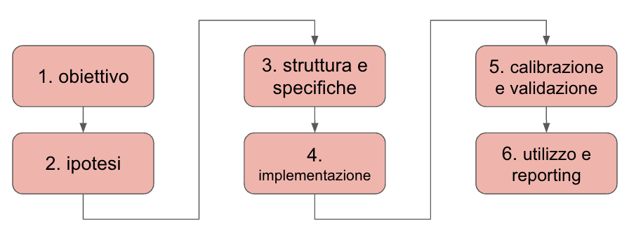
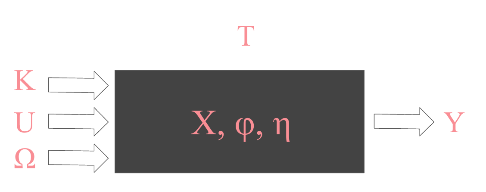
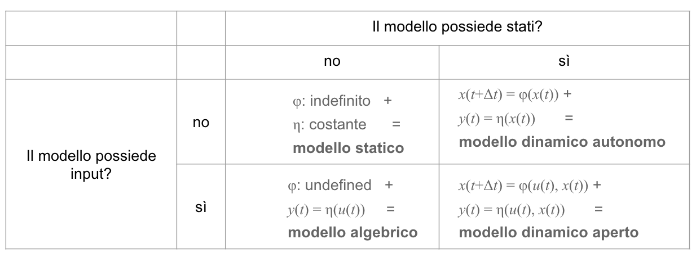

# Capitolo 4: linee guida per modellare sistemi dinamici {#capitolo-4-linee-guida-per-modellare-sistemi-dinamici}

## Modelli come strumenti di supporto decisionale {#modelli-come-strumenti-di-supporto-decisionale}

Come abbiamo visto nel primo capitolo, i **modelli** sono interpretazioni strutturate di sistemi reali. L\'idea è di creare strumenti che possano essere utilizzati per suggerire decisioni concrete nei vostri casi di studio, quelli che dovrete presentare all\'esame[^cap4-1].

Ricordiamo un concetto fondamentale: i modelli hanno uno **scopo** ben definito. Quando un gruppo propone un progetto, una domanda che può emergere è: \"Qual è il valore di Δt?\". Ad esempio, se state sviluppando un modello per un pronto soccorso e scegliete un Δt di 1 secondo, il vostro modello potrebbe essere più utile per un caposala piuttosto che per un direttore sanitario[^cap4-2]. Questo esempio aiuta a comprendere come la scelta del tempo di ricalcolo influenzi il destinatario del modello. Una decisione strategica può essere supportata sia da un ∆t piccolo che da uno alto, ma è praticamente impossibile arrivare a scegliere un ∆t alto per una decisione operativa[^cap4-3].

Nel contesto della fisica, il fine dei modelli è descrivere il funzionamento del mondo. I fisici non progettano modelli per prendere decisioni[^cap4-4], ma per comprendere meglio le leggi naturali. Nel nostro caso, è invece cruciale chiarire l\'obiettivo del modello. Se avete un cliente, è fondamentale capire esattamente perché desidera quel modello; senza questa chiarezza, non ha senso iniziare[^cap4-5]. Nel corso cui questa dispensa fa riferimento, non ci sono \"modelli\" ma \"modelli di qualcosa\".

I sistemi di supporto decisionale sono strumenti che aiutano i decisori a prendere decisioni informate in contesti complessi. Questi sistemi utilizzano modelli matematici, algoritmi e dati per analizzare scenari e fornire raccomandazioni basate su simulazioni e analisi di sensibilità. Il loro scopo principale è facilitare il processo decisionale, riducendo l\'incertezza e fornendo una base quantitativa per valutare le alternative disponibili.

## Realizzare un modello {#realizzare-un-modello}

### Sviluppo di un modello {#sviluppo-di-un-modello}

{width="6.5in" height="2.4027777777777777in"}

Il processo di progettazione di un modello di un sistema dinamico può essere definito da sei fasi distinte.

1.  **Obiettivo e Campo di Applicazione**: La prima cosa da definire è lo scopo del modello e il suo campo di applicazione.

2.  **Ipotesi Modellistiche**: Quali sono le ipotesi di base? Vi interessa modellare i singoli pazienti o l\'aggregato? Dovete definire se l\'unità di analisi è individuale o collettiva.

3.  **Costruzione della Struttura**: Dopo aver definito le ipotesi, si inizia a costruire la struttura del modello, ad esempio disegnando un primo grafo delle dipendenze funzionali[^cap4-6]. Questo grafo può essere mostrato al decisore finale per verificare che il modello sia adeguato alle sue esigenze.

4.  **Implementazione**[^cap4-7]: Se il decisore approva, si passa all\'implementazione del modello.

5.  **Calibrazione e Validazione**: Una volta implementato, il modello deve essere calibrato e validato per assicurarsi che rappresenti correttamente il sistema reale[^cap4-8].

6.  **Utilizzo e Reporting dei Risultati**: Infine, si utilizza il modello per generare risultati -- questo processo in gergo si chiama "esplorazione del comportamento del modello" -- e si presentano questi dati al decisore finale[^cap4-9].

Questo processo è iterativo e prevede continui feedback per migliorare il modello. Ad esempio, se durante l\'implementazione ci accorgiamo che qualcosa non funziona come previsto, possiamo tornare alla fase di costruzione della struttura per modificarla e adattarla. Se il modello non è ben calibrato e il comportamento osservato non è quello desiderato, si torna indietro all\'implementazione per rivedere i parametri. Inoltre, se durante l\'utilizzo del modello emergono nuove idee o necessità, si può ripartire dall\'inizio, modificando anche l\'obiettivo iniziale del modello per adattarlo meglio alle nuove esigenze.

### Ipotesi modellistiche {#ipotesi-modellistiche}

Un\'**ipotesi modellistica** è una supposizione o una semplificazione fatta per definire i limiti e il comportamento del sistema da modellare. Le ipotesi servono a ridurre la complessità del sistema, rendendolo più gestibile e permettendo di focalizzarsi sugli aspetti più rilevanti per gli obiettivi del modello. Di fatto, quindi, le ipotesi modellistiche sono un passaggio necessario nell'interpretazione del comportamento di un sistema al fine di poter utilizzare un metodo che supporti nel prendere decisioni. Secondo me, vale la seguente regola empirica: un modello tendenzialmente è sempre buono al massimo quanto lo sono le ipotesi modellistiche su cui poggia[^cap4-10].

Un modello senza semplificazioni è essenzialmente una copia del sistema reale, cosa che per definizione non può essere implementato, e anche se lo fosse sarebbe poco utile perché avrebbe più obiettivi. Per essere utile, il modello deve essere semplice e consentire di fare analisi di scenario. Le ipotesi tendenzialmente non sono mai sbagliate ma possono essere inadeguate all'obiettivo che vi siete posti, oppure presentate poco chiaramente, oppure poco precise.

+-------------------------------------------------------------------------------------------------------------------------------------------------------------------------------------------------------------------------------------------------------------------------------------------------------------------------------------------------------------------------------------------------------------------------------------------------------------------------------------------------------------------------------------------------------------------------------------------------------------------------------------------------------------------------------------------------------------------------------+
| **Approfondimento 4.1 - tre esempi diversi di ipotesi modellistiche**                                                                                                                                                                                                                                                                                                                                                                                                                                                                                                                                                                                                                                                         |
|                                                                                                                                                                                                                                                                                                                                                                                                                                                                                                                                                                                                                                                                                                                               |
| Vediamo in questo approfondimento tre casi ipotetici in cui un modello è stato realizzato rispettivamente con ipotesi troppo lasse, troppo stringenti, oppure corrette.                                                                                                                                                                                                                                                                                                                                                                                                                                                                                                                                                       |
|                                                                                                                                                                                                                                                                                                                                                                                                                                                                                                                                                                                                                                                                                                                               |
| **Ipotesi Troppo Lasse**. Consideriamo un modello per simulare il traffico in una città. Se le ipotesi modellistiche sono troppo lasse, ad esempio includendo ogni possibile variabile influenzante (come le condizioni meteorologiche, il comportamento di ogni singolo guidatore, le dinamiche pedonali dettagliate, ecc.), il modello diventa inutilmente complesso e ingestibile. Il risultato sarà un modello che richiede un\'enorme quantità di dati e risorse computazionali, rendendolo difficile da implementare e utilizzare per prendere decisioni pratiche. In questo caso, il modello risulterà sovraccaricato di dettagli non necessari rispetto all\'obiettivo di migliorare la gestione del traffico urbano. |
|                                                                                                                                                                                                                                                                                                                                                                                                                                                                                                                                                                                                                                                                                                                               |
| **Ipotesi Troppo Stringenti**. D\'altro canto, immaginiamo un modello per prevedere la domanda energetica di una regione. Se le ipotesi sono troppo stringenti, ad esempio ignorando completamente le variazioni stagionali e le fluttuazioni nei consumi dovute a eventi speciali, il modello diventa troppo semplicistico e non rappresenta adeguatamente la realtà. Questo tipo di modello potrebbe portare a risultati inaccurati, rendendolo inutilizzabile nel mondo reale per pianificare la distribuzione dell\'energia o per prendere decisioni strategiche. Le ipotesi eccessivamente restrittive limitano la capacità del modello di catturare le dinamiche reali del sistema, compromettendo la sua utilità.      |
|                                                                                                                                                                                                                                                                                                                                                                                                                                                                                                                                                                                                                                                                                                                               |
| **Ipotesi Ben Poste**. Immaginiamo un modello per ottimizzare la gestione delle risorse idriche in una città. Le ipotesi ben poste potrebbero includere la considerazione delle variazioni stagionali e la domanda media giornaliera, senza entrare troppo nel dettaglio del comportamento individuale di ogni cittadino. In questo caso, il modello semplifica le dinamiche ignorando fluttuazioni minori, ma considera comunque gli elementi critici per fornire una visione utile per la gestione delle risorse. Questo equilibrio tra semplificazione e dettaglio rende il modello gestibile, realistico e utilizzabile per decisioni pratiche, senza diventare né troppo complesso né eccessivamente limitato.           |
+-------------------------------------------------------------------------------------------------------------------------------------------------------------------------------------------------------------------------------------------------------------------------------------------------------------------------------------------------------------------------------------------------------------------------------------------------------------------------------------------------------------------------------------------------------------------------------------------------------------------------------------------------------------------------------------------------------------------------------+

Le ipotesi alla base del vostro modello possono essere pensate come i confini che definiscono il sistema da modellare:

-   **Ampiezza**: cosa può essere escluso dal modello perché non sufficientemente rilevante rispetto allo scopo?

-   **Profondità**: cosa può essere escluso dal modello perché troppo dettagliato rispetto allo scopo?

L\'analisi delle ipotesi riguarda quindi sia cosa tralasciare per non complicare inutilmente il modello, sia cosa includere per mantenerlo utile e comprensibile in relazione agli obiettivi da raggiungere.

### Presentazione di un progetto {#presentazione-di-un-progetto}

Durante la presentazione di un progetto, sarebbe importante considerare i seguenti punti:

1.  **Chiarire l'obiettivo e l'ambito di applicazione**: Definire chiaramente lo scopo del modello e il contesto in cui verrà utilizzato. Questo aiuta a stabilire le aspettative del cliente[^cap4-11] e a orientare lo sviluppo del modello.

2.  **Definire le ipotesi modellistiche e presentare il modello black-box del modello realizzato**: Esplicitare le ipotesi di base del modello e presentare inizialmente il modello come una \"black box\". Questo permette di chiarire quali sono gli input, gli output[^cap4-12] e gli elementi principali senza entrare nei dettagli tecnici.

3.  **Struttura del modello**: Presentare la struttura del modello, ad esempio mostrando il grafo delle dipendenze funzionali. Se il modello è complesso, potrebbe essere utile organizzarlo in sottomodelli. Inoltre, analizzare gli elementi più interessanti del modello, come i cicli di feedback, può aiutare a comprendere meglio la dinamica del sistema. Non è necessario scendere nei dettagli di tutto, anche se è utile averli dentro la presentazione e a portata di mano in caso di domande specifiche.

4.  **Presentazione delle specifiche**: Definire formalmente il modello attraverso un\'8-tupla[^cap4-13], un modo strutturato per descrivere le componenti principali del sistema o del sottomodello più significativo.

5.  **Principali risultati**: Discutere i principali risultati qualitativi e quantitativi ottenuti dalla simulazione, come l\'analisi degli scenari e/o l\'analisi di sensibilità[^cap4-14]. Questo aiuta a valutare la robustezza e la validità del modello.

6.  **Possibili estensioni e miglioramenti futuri**: Identificare possibili estensioni e miglioramenti futuri del modello, che potrebbero essere sviluppati in una fase successiva per soddisfare nuove esigenze del decisore[^cap4-15].

7.  **Note sulla gestione del progetto**: Aggiungere alcune note sulla gestione del progetto, come l\'organizzazione del lavoro in team e l\'uso di strumenti come diagrammi di Gantt per pianificare e monitorare le attività.

Non è necessario che il vostro modello faccia riferimento a situazioni concrete, ma è certamente utile. Alcuni gruppi scelgono di sfruttare il progetto d\'esame per approfondire argomenti di loro interesse[^cap4-16]. Ad ogni modo, nella definizione dell\'obiettivo e dell\'ambito applicativo, è importante indicare chi potrebbe utilizzare il modello. Inoltre, è essenziale specificare la base temporale del modello, poiché per esempio indicare come meta-ipotesi temporale \"anno di inizio 2019\" implica che il modello potrebbe non essere utilizzabile nel 2022. Quindi, questo è un elemento da considerare attentamente.

### Ruoli nella creazione di modelli {#ruoli-nella-creazione-di-modelli}

Specificare un modello significa descrivere in modo chiaro e dettagliato come un sistema debba essere rappresentato e come le sue componenti debbano interagire. Questo approccio simula quello che accade nel mondo reale, dove chi sviluppa modelli, o chi fa decision-making in modo ingegneristico, deve ricoprire diversi ruoli.

In generale, abbiamo già visto che il processo di decision-making ingegneristico si differenzia da quello artigianale, poiché coinvolge una struttura più organizzata e formalizzata. Tutti noi prendiamo decisioni, ma non tutti adottiamo un approccio professionale e strutturato come richiesto dall\'ingegneria. Nel contesto della modellazione, possiamo identificare diversi ruoli principali:

-   **Analista**: è colui che comprende le esigenze del problema e conduce l\'analisi preliminare per definire ciò che è necessario modellare[^cap4-17].

-   **Specificatore**[^cap4-18]: questa figura collega l\'analista e lo sviluppatore. È responsabile della conversione delle esigenze del cliente, raccolte dall\'analista, in specifiche dettagliate che descrivono come costruire il modello. Queste specifiche possono includere diagrammi, grafi delle dipendenze funzionali, e le prime equazioni matematiche. Lo specificatore interagisce con l\'analista per comprendere le necessità del cliente e le traduce in un linguaggio che lo sviluppatore può comprendere e implementare.

-   **Sviluppatore**: è colui che implementa il modello, scrivendo il codice e realizzando l\'implementazione pratica. Nel corso cui fa riferimento questa dispensa, tutti questi ruoli sono svolti dallo stesso studente, grazie all\'uso di uno strumento di alto livello come STGraph. Tuttavia, se si lavorasse con linguaggi di programmazione come Java o Python, la separazione dei ruoli diventerebbe più evidente.

In una società di consulenza strutturata, ogni ruolo ha un\'importanza specifica. Se il team è composto da poche persone, è possibile che tutti svolgano tutti i ruoli[^cap4-19]. Ma in contesti più organizzati, è essenziale avere una persona che capisca come costruire il modello e che lavori con l\'analista per convertire le esigenze in specifiche comprensibili per lo sviluppatore. Questa fase, che inizia con la definizione del modello black box, poi prosegue con la creazione del grafo delle dipendenze funzionali e l\'introduzione delle prime equazioni, è essenziale per assicurare che il modello finale sia coerente con le aspettative del cliente.

## Scrivere le specifiche di un modello {#scrivere-le-specifiche-di-un-modello}

Le specifiche rappresentano il collegamento tra l\'analisi e l\'implementazione del modello. Nel corso di Sistemi Informativi, potreste[^cap4-20] imparare a utilizzare un linguaggio chiamato UML (Unified Modeling Language), che è uno strumento per fornire specifiche riguardo alla costruzione di database e altri sistemi informativi. Gli strumenti formali come UML servono a strutturare l\'informazione e a rendere comprensibili le relazioni tra le diverse componenti del sistema.

Nella modellazione di sistemi dinamici, invece, non vogliamo solo strutturare informazioni ma descrivere il comportamento di sistemi complessi. Per questo, lo strumento principale per specificare i sistemi dinamici è l\'8-tupla[^cap4-21]. Come i diagrammi ER sono utilizzati per specificare i database, la 8-tupla è utilizzata per specificare il comportamento di un sistema dinamico.

In contesti non strutturati, i ruoli di \"analista\", \"specificatore\" e \"implementatore\" possono essere ricoperti dalla stessa persona, specialmente quando si utilizza uno strumento di alto livello come STGraph. In questi casi, le specifiche formali potrebbero non essere necessarie poiché tutte le informazioni sono nella mente dello sviluppatore. Tuttavia, sviluppare specifiche rimane utile, anche solo come strumento di autocontrollo.

A questo riguardo, le specifiche non devono necessariamente essere completamente implementabili. L\'aspetto importante è identificare chiaramente eventuali limitazioni e descrivere quali parti non siano state implementate pienamente. Questo aiuta non solo a comunicare in modo trasparente con il cliente, ma anche a definire i limiti del modello per evitare fraintendimenti[^cap4-22].

Le specifiche servono come strumento di controllo e comunicazione tra i vari attori coinvolti nel processo di modellazione, assicurando che tutti abbiano una comprensione chiara di ciò che il modello rappresenta e di come deve funzionare.

## La ottupla {#la-ottupla}

La 8-tupla[^cap4-23] è uno strumento formale utilizzato per specificare in modo dettagliato il comportamento di un sistema dinamico. Questo approccio è simile all\'uso dei diagrammi ER per specificare i database, ma è applicato al contesto della modellazione dinamica. La costruzione della 8-tupla permette di verificare la correttezza del modello[^cap4-24]: se la 8-tupla risulta coerente, è probabile che anche il modello sia corretto. La 8-tupla è composta da otto elementi, rappresentati come:

[⟨]{.mark}T, K, U, Ω, Y, X, ϕ, η [⟩]{.mark}

[Dove:]{.mark}

-   [**T** è la base dei tempi, che specifica il tempo in cui opera il modello.]{.mark}

-   [**K** è l\'insieme dei parametri, rappresentato da costanti che caratterizzano il modello.]{.mark}

-   [**U** è l\'insieme dei valori di input.]{.mark}

-   [**Ω** è l\'insieme delle funzioni di input ammissibili, ovvero delle condizioni che determinano l\'ammissibilità degli input.]{.mark}

-   [**X** è l\'insieme dei valori delle funzioni di stato.]{.mark}

-   [**Y** è l\'insieme dei valori di output.]{.mark}

-   [**ϕ** è l\'insieme delle funzioni di transizione di stato, che descrivono come il sistema evolve da uno stato all\'altro.]{.mark}

-   [**η** è l\'insieme delle funzioni di comportamento, che collegano lo stato e l\'input del sistema all\'output.]{.mark}

[Questi otto elementi costituiscono gli \"attori\" del sistema dinamico, ciascuno con un ruolo specifico e interconnesso per definire il comportamento del modello. La 8-tupla rappresenta la metastruttura principale di un modello, dove ogni elemento ha un ruolo critico nella rappresentazione del sistema.]{.mark}

{width="5.3815791776027995in" height="2.1302088801399823in"}

[Gli elementi della 8-tupla possono essere suddivisi in termini di rappresentazione black-box del sistema:]{.mark}

-   [T: rappresenta la dimensione temporale del sistema.]{.mark}

-   [K, U, Ω: rappresentano gli input del sistema.]{.mark}

-   [Y: rappresenta gli output del sistema.]{.mark}

-   [X, ϕ, η: rappresentano le dinamiche interne del sistema, ovvero ciò che avviene all\'interno della \"scatola\".]{.mark}

[L\'obiettivo è descrivere il comportamento del sistema dinamico in modo rigoroso, indicando chiaramente quali siano i dati in ingresso, le trasformazioni interne e i risultati in uscita.]{.mark}

### La base dei tempi T {#la-base-dei-tempi-t}

La base dei tempi (T) è cruciale nella definizione di un modello dinamico, poiché stabilisce la dimensione temporale in cui si svolge la simulazione. La scelta di una base dei tempi può influenzare notevolmente la complessità e la precisione del modello. Ad esempio:

-   Se la base dei tempi è un secondo o un minuto, si devono modellare dettagli come il comportamento degli operatori che prelevano singoli articoli da un magazzino.

-   Se la base dei tempi è un giorno, non è necessario includere il dettaglio del picking degli articoli, poiché il modello descrive semplicemente il cambiamento tra un giorno e l\'altro.

La base dei tempi può essere specificata in modo continuo o discreto. In alcuni casi, il tempo è legato ad eventi, piuttosto che al passare del tempo stesso. Ad esempio, in un modello di gestione della produzione, la base dei tempi può essere un evento di produzione invece che una misura temporale fissa[^cap4-25].

### L'insieme degli input che variano (U) e che non variano (K) {#linsieme-degli-input-che-variano-u-e-che-non-variano-k}

Quando si specificano i parametri (**K**) del modello, è importante trovare un equilibrio tra essere troppo specifici e troppo poco specifici. Una specifica eccessiva può limitare inutilmente l\'applicabilità del modello, mentre una specifica insufficiente può renderlo impreciso o ambiguo.

Ad esempio, per un magazzino, specificare che la capacità è \"100 articoli\" e che la giacenza iniziale (γ_0) è \"10 articoli\" potrebbe portare il cliente a pensare che il modello sia valido solo per quella configurazione specifica. Una migliore specifica potrebbe essere, per esempio:

**Capacità**: {10, 11, \..., 200} articoli (valore predefinito: 100)

In questo modo, si garantisce la validità del modello per un intervallo di valori, lasciando al cliente la flessibilità di adattarlo alle proprie esigenze.

### L'insieme delle funzioni di input ammissibili Ω[^cap4-26] {#linsieme-delle-funzioni-di-input-ammissibili-ω}

L\'insieme delle funzioni di input ammissibili (Ω) rappresenta le condizioni aggiuntive che un input deve soddisfare per essere considerato valido. Ad esempio, se il modello riguarda gli investimenti, si potrebbe stabilire che il budget disponibile sia di 10.000 euro, e che non sia possibile investire più di questa cifra in un mese, ma anche che la somma degli investimenti in più mesi non superi il budget complessivo disponibile.

Un esempio matematico potrebbe essere:

-   **Ω** = {u: T → U \| ∀t, c(t) + c(t+1) + c(t+2) ≤ capacità}

Nei sistemi di simulazione come STGraph, questo tipo di vincolo non è tipicamente impostabile automaticamente, quindi può essere necessario implementare controlli aggiuntivi manualmente[^cap4-27].

### L'insieme delle funzioni di transizioni di stato [ϕ]{.mark} {#linsieme-delle-funzioni-di-transizioni-di-stato-ϕ}

[La funzione di transizione di stato (ϕ) descrive come il sistema evolve nel tempo, considerando sia gli input che lo stato attuale del sistema. Formalmente, si può rappresentare come:]{.mark}

[ϕ: U × X → X]{.mark}

[Questa funzione determina il nuovo stato del sistema in base agli input ricevuti e allo stato corrente. A differenza della cinematica, che descrive direttamente le soluzioni del sistema, la dinamica -- e quindi la funzione di transizione di stato -- è utilizzata per costruire e comprendere l\'evoluzione del sistema stesso.]{.mark}

### L'insieme delle funzioni di comportamento {#linsieme-delle-funzioni-di-comportamento}

[Analogamente, la funzione di comportamento (η) collega lo stato del sistema e gli input agli output generati:]{.mark}

[η: U × X → Y]{.mark}

[Questa funzione è sincronica, il che significa che considera solo l\'input e lo stato attuali per determinare l\'output in un dato momento.]{.mark}

## Classificare i sistemi con la ottupla {#classificare-i-sistemi-con-la-ottupla}

Gli stati e le uscite di un modello sono quindi calcolate in funzione di altri elementi della ottupla. In particolare:

-   y(t) = η(u(t), x(t)). L\'uscita y(t) dipende dalla funzione di comportamento η, che è funzione degli ingressi u(t) e degli stati x(t). Ciò implica che l\'uscita è determinata dalla combinazione delle variabili di ingresso e di stato.

-   x(t+Δt) = φ(u(t), x(t)). Lo stato successivo x(t+∆t) dipende dallo stato precedente x(t) e dalla funzione di transizione φ, che tiene conto sia degli ingressi u(t) che dello stato corrente. Questo significa che l\'evoluzione del sistema nel tempo è guidata dalla funzione di transizione applicata agli stati precedenti e agli ingressi.

{width="6.5in" height="2.4027777777777777in"}

La tabella mostra una classificazione dei modelli in base alla presenza o meno di ingressi e stati del sistema. I modelli statici e dinamici sono distinti in quattro categorie:

1.  **Modello statico**: Nessun ingresso e nessuno stato. Il modello ϕ risulta indefinito e l\'uscita η è costante. *Esempi*:

    -   Un oggetto fermo, la cui posizione non cambia nel tempo.

    -   Un foglio excel in cui non ci sono formule

2.  **Modello algebrico:** Il sistema ha ingressi ma non stati. Il modello ϕ è ancora indefinito, mentre l\'uscita η dipende direttamente dagli ingressi, indicando una relazione algebrica. *Esempi*:

    -   Un resistore elettrico in cui la corrente dipende direttamente dalla tensione applicata (legge di Ohm)

    -   Un foglio Excel i cui conti non sono eseguiti da uno script.

3.  **Modello dinamico chiuso (o autonomo)**: Il sistema ha stati ma nessun ingresso. Il comportamento è determinato esclusivamente dalla sua dinamica interna, modellata da φ, con l\'uscita che dipende dallo stato. *Esempio*:

    -   Un pendolo che oscilla senza attrito, in cui la posizione e la velocità dipendono esclusivamente dalle condizioni iniziali.

    -   Un sistema epidemiologico in cui non ci sono attori esterni (mutazioni, policy-making, adattamento del comportamento della popolazione, ecc) che ne influenzano il comportamento.

4.  **Modello dinamico aperto**: Il sistema ha sia ingressi che stati. Il modello φ descrive l\'evoluzione degli stati in funzione degli ingressi, e l\'uscita dipende sia dallo stato che dagli ingressi *Esempi*:

    -   Un\'auto in movimento, in cui la velocità dipende sia dall\'accelerazione (ingresso) che dalla velocità attuale (stato)

    -   Un magazzino, il cui stock dipende dal proprio stato precedente e da quanti colli entrano ed escono in ciascun time-step

Questa classificazione è utile[^cap4-28] per comprendere le differenze tra i vari tipi di modelli e le loro caratteristiche, in particolare in termini di dipendenze dagli ingressi e dagli stati, che influenzano il comportamento del sistema nel tempo.

## Pattern dinamici notevoli {#pattern-dinamici-notevoli}

Nella progettazione di sistemi dinamici, un\'importante componente è la funzione di transizione di stato, che spesso si definisce come φ in una struttura a ottupla. Questa funzione descrive come lo stato del sistema cambia nel tempo, in funzione dello stato attuale e degli input. All\'interno di phi, possiamo identificare diversi pattern di aggiornamento dello stato che svolgono ruoli specifici. Questi pattern possono essere implementati e combinati per rappresentare varie dinamiche di memoria e accumulazione, utili nella modellazione di sistemi complessi.

#### **Pattern di Accumulatore** {#pattern-di-accumulatore}

Il pattern di accumulatore è rappresentato dalla formula: $x(t\  + \mathrm{\Delta}t)\  = \ x(t)\  + \ f(t)\ \mathrm{\Delta}t$

In questo caso, lo stato x viene aggiornato aggiungendo un incremento, che dipende sia dal valore corrente di x che da una funzione f(t) scalata temporalmente tramite delta_t. Questo pattern è utilizzato per rappresentare l\'accumulo progressivo di una quantità, come avviene in molti processi fisici o economici in cui un sistema incrementa il proprio stato in base a un valore variabile nel tempo. Nella funzione di transizione phi, questo pattern può essere applicato per modellare accumulazioni come energia, risorse o altre grandezze cumulative.

#### **Pattern di Storage o Delay** {#pattern-di-storage-o-delay}

Un altro pattern comune è quello di \"∆t storage\" o delay, rappresentato dalla formula:$x(t\  + \mathrm{\Delta}t)\  = \ u(t)\ \ $

Qui, lo stato x viene aggiornato impostandolo uguale al valore di una funzione f(t). Questo pattern è utile per rappresentare un ritardo temporale in cui x memorizza semplicemente il valore di u(t) ad ogni passo temporale. Tale approccio è tipico nei sistemi dove lo stato non deve essere incrementato, ma semplicemente aggiornato con una nuova misura o input esterno. Ad esempio, in un sistema di controllo, x potrebbe rappresentare la lettura corrente di un sensore che cambia istantaneamente in base all\'input, senza un accumulo.

#### **Pattern di Memoria Persistente** {#pattern-di-memoria-persistente}

Il pattern di memoria persistente è rappresentato da: $x(t\  + \mathrm{\Delta}t)\  = \ x(t)\ $

Questo pattern indica che lo stato rimane invariato nel tempo, conservando quindi la memoria di un valore precedente. È utile nei casi in cui una certa condizione non attiva un aggiornamento dello stato, permettendo al sistema di mantenere la memoria di uno stato per più istanti temporali. Tale pattern è comune nelle situazioni in cui si richiede che una condizione esterna o un trigger avviino il cambiamento di stato.

#### **Combinazione dei Pattern** {#combinazione-dei-pattern}

Questi pattern possono essere combinati per ottenere dinamiche più complesse. Ad esempio, è possibile definire: $x(t\  + \mathrm{\Delta}t)\  = if(condizione,x(t)\  + \ f(t)\ \mathrm{\Delta}t,x(t))$

In questa espressione, x viene aggiornato tramite un accumulo condizionato. Se una certa condizione è soddisfatta, x viene incrementato secondo il pattern dell\'accumulatore; altrimenti, lo stato resta invariato, seguendo il pattern di memoria persistente. Questa combinazione consente di rappresentare comportamenti in cui il sistema accumula valori solo in determinate circostanze, come ad esempio quando una soglia è superata.

#### **Implementazione come Vettori** {#implementazione-come-vettori}

I pattern sopra descritti possono essere implementati in forma vettoriale, particolarmente utile per sistemi che richiedono ritardi multipli, ad esempio con n moltiplicato per ∆t. L\'implementazione vettoriale permette di modellare serie temporali di stati passati, fornendo una rappresentazione accurata di ritardi distribuiti o effetti cumulativi su scale temporali diverse.

[^cap4-1]: E che verosimilmente dovrete affrontare quando andrete fuori nel mondo vero e dovrete prendere decisioni difficili che magari hanno conseguenze su altri esseri umani. Avere un metodo è un ottimo modo anche per non sentirsi in colpa quando si prende una decisione che comporta un danno collaterale per una terza parte, e per non avere rimpianti quando si sbaglia una decisione riguardante la propria carriera. Se l'abbiamo presa con metodo, se anche va male non diventa un rimpianto quanto piuttosto una causalità e un inciampo.

[^cap4-2]: Peraltro, nella mia esperienza, nei modelli di ospedali o sistemi sanitari localizzati il ∆t ideale è quasi sempre 10 minuti.

[^cap4-3]: Se pensate che questo concetto sia ovvio e banale, conosco professori ordinari che non riescono ad afferrare il concetto di ∆t di ampiezze diverse.

[^cap4-4]: Anzi, i fisici che lavorano come fisici trattando sistemi fisici. La maggior parte dei fisici che conosco studiano sistemi sociali o biologici, oppure sono finiti a fare i data scientist in qualche azienda.

[^cap4-5]: Anche perché alla fine finisce per non pagarvi o farvi rifare il modello, e avrebbe ragione lui,

[^cap4-6]: Poi lo vediamo meglio dopo, ma lo rimarco: cominciate piccoli. Se fate un grafo di 20 nodi -- quindi, comunque ancora piccolo -- vuoto, e solo dopo iniziare a riempirlo, scoprirete di avere bug quasi irrisolvibili, perché sarà molto più difficile individuare l'origine dell'errore. Quindi, partite sempre piccoli, ma davvero molto piccoli. Non più di 10 nodi, e poi ampliate man mano.

[^cap4-7]: Il modello può essere realizzato in qualsiasi software, ma consiglio di usare STGraph. Alcuni studenti hanno implementato modelli complessi, come un pendolo inverso, in linguaggi come C o Python; questo è piuttosto ambizioso, ma non necessario per ottenere un buon risultato. Poi, usare Python ha degli indubbi vantaggi dal punto di vista dell'implementazione e soprattutto della validazione e dell'esplorazione del comportamento del modello, ma da un punto di vista didattico rende al sottoscritto molto più complesso valutare la vostra effettiva preparazione, quindi nel caso avvisatemi.

[^cap4-8]: Se fate un modello di un automobile per modellare una Ferrari e poi usate i parametri di una Fiat Punto chiaramente non funzionerà nel modo desiderato.

[^cap4-9]: In contesti professionali, è una saggia idea tenere il decisore finale nel loop mentre lo si sviluppa, se no alla fine ti chiederà di cambiare qualcosa e ti costerà un sacco di soldi.

[^cap4-10]: Questa è una delle ragioni per cui i modelli economici forniscono delle previsioni che si discostano dal comportamento dell'economia modellata: perché si basano su ipotesi modellistiche necessarie per formalizzare i problemi ma lontane dalla realtà.

[^cap4-11]: Un po' manipolatoria come cosa, ma *business is business*

[^cap4-12]: Pensate agli output come ai KPI del sistema che volete osservare.

[^cap4-13]: Le formalizzazione matematica di un sistema di un sistema dinamico, in certe condizioni, può essere fatta attraverso la ottupla. Sarà in ogni caso discussa in seguito.

[^cap4-14]: Come la ottupla, sarà discussa in seguito.

[^cap4-15]: Una buona idea è sempre pensare di stare realizzando un progetto di consulenza. In questo scenario, preparare non "un progetto" ma "il progetto" per il vostro esame diventa anche un possibile addestramento per una vostra possibile futura carriera. In questo scenario, potreste pensare che il docente sia il cliente e voi dei consulenti, e che al termine dell'esame verrete poi remunerati, non in denaro ma con un voto.

[^cap4-16]: In questi casi, sono felice di supportare questa curiosità e volontà di apprendimento.

[^cap4-17]: Nonostante nelle società di consulenza tipicamente "analyst" sia sinonimo di "schiavo", questo ruolo è cruciale nella gestione dei progetti, e un buon analyst di solito ha le capacità per fare bene quasi qualunque lavoro.

[^cap4-18]: Notate che questo termine è stato inventato per questo corso. Se a un colloquio di lavoro dite che volete fare gli "specificatori" nessuno sa di cosa si stia parlando, ma nella mia esperienza di colloqui da neo-laureato, quasi nessuno dei selezionatori aveva idea di cosa chiedere a un ingegnere gestionale, quindi potete anche inserire [[termini catchy]{.underline}](https://www.youtube.com/watch?v=GRw-kSsoPhM) e metterci attorno una storia che possa convincere la controparte a darvi un lavoro.

[^cap4-19]: Per quello che ho visto, in team piccoli ci sono spesso 4 analyst e un singolo specificatore/programmatore iper-staffato che cerca di sopravvivere alle richieste che gli arrivano senza fare troppi errori. Non ho dati, ma non credo che succeda perché la gente è pazza: in Italia ci sono pochissime persone con un background tecnico rispetto alla domanda, e ancora meno che al background tecnico affiancano la capacità di interpretazione della realtà.

[^cap4-20]: Visto che poi passerete un esame e vi saranno assegnati dei crediti, credo che il termine giusto sia "dovreste".

[^cap4-21]: In alcuni ambiti, non sempre. Non ho mai letto un articolo scientifico con una ottupla dentro definita in modo esplicito.

[^cap4-22]: Dove "fraintendimenti" è un modo elegante per dire "cause legali". Scrivete delle buone specifiche e chiarite in modo chiaro le ipotesi modellistiche nel contratto che fate firmare ai vostri clienti, tenetevi in contatto con loro mentre lavorate e alla fine non dovreste avere problemi seri. Poi magari capita comunque, ma perlomeno è molto più improbabile.

[^cap4-23]: Nella teoria generale dei sistemi si parla di settupla e non di ottupla, poiché parametri e input sono considerati assieme. Per un riferimento, si legga "Foundations of system theory" di Michael A. Arbib e Louis Padulo.

[^cap4-24]: Se fatto con un minimo di raziocinio, e non incollando formule in una slide sperando che vada tutto bene.

[^cap4-25]: La tecnica di modellizzazione di sistemi dinamici in cui la base dei tempi è un evento è chiamata Discrete Event Simulation. È abbastanza una tecnica del passato, che deriva da momenti in cui per modellare un sistema reale la capacità computazionale era troppo limitata per simulare sistemi troppo complessi a tempo globale, ma in alcuni contesti ha ancora una sua rilevanza.

[^cap4-26]: Probabilmente sbaglierete la Omega. Praticamente tutti i gruppi sbagliano la Omega. Ci sono due tipi di errori. Il primo, più grave, è capire male come funziona, e quindi mettere un vincolo che non lo è. Il secondo, meno grave, è avere una Omega incompleta.

[^cap4-27]: Anche per questo viene sbagliata così frequentemente.

[^cap4-28]: Quando la inserite nella presentazione del vostro modello, infatti, sono contento, perché se la spiegate in modo chiaro è un modo per farmi capire che avete effettivamente capito e che non siete dei [[pappagalli stocastici]{.underline}](https://en.wikipedia.org/wiki/Stochastic_parrot).
