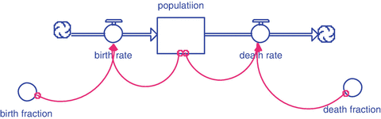
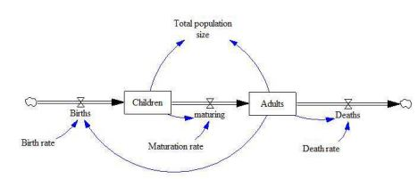
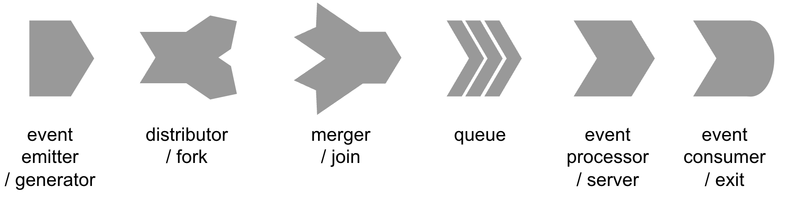
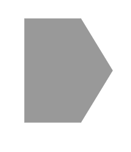
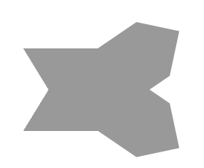
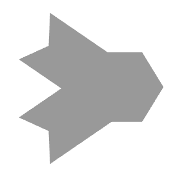

# Capitolo 5: Sotto-teorie {#capitolo-5-sotto-teorie}

La General Systems Theory (Teoria Generale dei Sistemi) si occupa di ciò che si può modellare attraverso una ottupla. Nel contesto di questa teoria, è stato definito un insieme di sistemi caratterizzati da una matrice con quattro opzioni, che descrivono sistemi dinamici, algebrici e statici. La General Systems Theory non si limita a un contesto applicativo specifico; il suo ambito è metodologico[^cap5-1] e fornisce un quadro di riferimento per sviluppare competenze di pensiero strutturato.

La Teoria Generale dei Sistemi può essere però divisa in diverse sotto-teorie, o metodologie di modellizzazione, che non possono essere definite vere e proprie teorie[^cap5-2], ma piuttosto metodologie[^cap5-3] o tecniche di modellizzazione. Tra queste tecniche si annoverano la System Dynamics, la Teoria delle Code, la Teoria degli Automi e l\'Agent-based Modelling.

## System Dynamics {#system-dynamics}

La storia della Teoria Generale dei Sistemi ha origini che risalgono a circa un secolo fa, sebbene già dai tempi di Newton si sarebbe potuto avviare un percorso sistematico di studio delle dinamiche complesse[^cap5-4]. Questa teoria non appartiene a una disciplina specifica, ma offre uno strumento metodologico per apprendere a ragionare in modo strutturato. Isaac Newton, lavorando sulla dinamica, si occupò principalmente di fisica. Solo alla fine del XIX secolo, circa due secoli dopo la sua morte, si iniziò a riflettere sulla possibilità di estendere la dinamica newtoniana verso un approccio più generale.

Il fondatore della Teoria Generale dei Sistemi è considerato Ludwig Von Bertalanffy. Tuttavia, gli anni \'30 del Novecento non furono un periodo florido per la scienza europea a causa del clima politico caratterizzato da regimi autoritari. Fino a quel momento, gli Stati Uniti non erano ancora una potenza scientifica e tecnologica significativa. Negli anni \'30 molti scienziati europei emigrarono negli Stati Uniti per sfuggire alle persecuzioni politiche, come Enrico Fermi, che lasciò l\'Europa dopo aver ricevuto il Premio Nobel a Stoccolma. Gli Stati Uniti accolsero questi scienziati[^cap5-5]. Poi, durante la Seconda Guerra Mondiale, investirono ingenti risorse nella ricerca. Di conseguenza, negli anni \'40 e \'50 nacquero nuove discipline, tra cui la teoria dei giochi, la cibernetica, l\'automatica, la ricerca operativa, l\'informatica, la teoria dell\'informazione, l\'intelligenza artificiale e la teoria dell\'utilità attesa[^cap5-6].

Le idee europee sulla dinamica dei sistemi furono integrate e rimodellate da Jay Forrester, che riprese le teorie di Von Bertalanffy e le applicò alla System Dynamics. Per capire i diversi ambiti di applicazione, Forrester, al Massachusetts Institute of Technology (MIT), collaborò con il sindaco di Boston per modellare il comportamento di un sistema urbano, cercando di comprendere come migliorare i processi decisionali nella gestione della città. Il MIT divenne così un centro di eccellenza per lo studio della teoria dei sistemi, in particolare della System Dynamics, che rappresenta solo un sottoinsieme di ciò che può essere modellato attraverso la ottupla.

+----------------------------------------------------------------------------------------------------------------------------------------------------------------------------------------------------------------------------------------------------------------------------------------------------------------------------------------------------------------------------------------------------------------------------------------------------------------------------------------------------------------------------------------------------------------------------------------------------------------------------------------------------------------------+
| **Approfondimento 5.1 - Urban Dynamics**                                                                                                                                                                                                                                                                                                                                                                                                                                                                                                                                                                                                                             |
|                                                                                                                                                                                                                                                                                                                                                                                                                                                                                                                                                                                                                                                                      |
| Negli anni \'60, Boston stava attraversando una fase di forte cambiamento urbano, con la necessità di affrontare una serie di problematiche legate allo sviluppo economico, alla povertà urbana e alla pianificazione. John F. Collins, sindaco della città dal 1960 al 1968, si trovava di fronte a sfide significative nel gestire il rapido cambiamento e la complessità delle dinamiche cittadine, in un periodo in cui questi temi iniziavano ad essere davvero tema di discussione anche da un punto di vista dei sistemi dinamici[^cap5-7].                                                                                                                        |
|                                                                                                                                                                                                                                                                                                                                                                                                                                                                                                                                                                                                                                                                      |
| Jay Forrester, nel frattempo, stava sviluppando il campo della dinamica dei sistemi al MIT. Forrester aveva inizialmente applicato i suoi modelli di simulazione a problemi industriali, in particolare legati alle catene di approvvigionamento, ma ben presto si rese conto che gli stessi principi potevano essere utilizzati per comprendere i sistemi urbani. I sistemi sociali ed economici, come le città, sono caratterizzati da interazioni complesse tra diverse variabili: economia, occupazione, infrastrutture, servizi pubblici, e così via. Ogni decisione politica o economica può avere effetti non lineari e a lungo termine, spesso non previsti. |
|                                                                                                                                                                                                                                                                                                                                                                                                                                                                                                                                                                                                                                                                      |
| Forrester iniziò a lavorare con il sindaco Collins per sviluppare un modello dinamico della città di Boston, utilizzando la dinamica dei sistemi per simulare gli effetti di diverse politiche urbane. Questo modello, chiamato Urban Dynamics, cercava di rappresentare le relazioni tra la popolazione, l\'economia, gli alloggi e altre variabili chiave che influenzano la vita urbana.                                                                                                                                                                                                                                                                          |
|                                                                                                                                                                                                                                                                                                                                                                                                                                                                                                                                                                                                                                                                      |
| Forrester e Collins cercarono di rispondere a domande critiche, come:                                                                                                                                                                                                                                                                                                                                                                                                                                                                                                                                                                                                |
|                                                                                                                                                                                                                                                                                                                                                                                                                                                                                                                                                                                                                                                                      |
| -   Come le politiche abitative influenzano la crescita economica e lo sviluppo urbano?                                                                                                                                                                                                                                                                                                                                                                                                                                                                                                                                                                              |
|                                                                                                                                                                                                                                                                                                                                                                                                                                                                                                                                                                                                                                                                      |
| -   Qual è l\'impatto a lungo termine della costruzione di nuovi alloggi per le classi a basso reddito?                                                                                                                                                                                                                                                                                                                                                                                                                                                                                                                                                              |
|                                                                                                                                                                                                                                                                                                                                                                                                                                                                                                                                                                                                                                                                      |
| -   Come migliorare le condizioni di vita senza innescare fenomeni di ghettizzazione o impoverimento urbano?                                                                                                                                                                                                                                                                                                                                                                                                                                                                                                                                                         |
|                                                                                                                                                                                                                                                                                                                                                                                                                                                                                                                                                                                                                                                                      |
| Il modello evidenziava che alcune politiche, sebbene ben intenzionate, potevano avere effetti controproducenti e mostrava l\'importanza di considerare le dinamiche di retroazione e gli effetti a lungo termine delle decisioni politiche, spesso trascurati nelle analisi a breve termine.                                                                                                                                                                                                                                                                                                                                                                         |
|                                                                                                                                                                                                                                                                                                                                                                                                                                                                                                                                                                                                                                                                      |
| Uno dei risultati più controversi e al tempo stesso illuminanti del modello di Forrester fu l\'idea che le politiche di rinnovamento urbano basate solo sulla costruzione di alloggi popolari o sul sostegno diretto ai più poveri potessero paradossalmente peggiorare le condizioni economiche generali della città. Il modello suggeriva che un\'attenzione troppo focalizzata su interventi a breve termine, come la costruzione di abitazioni, avrebbe potuto portare a una riduzione degli incentivi per l\'industria e per la creazione di posti di lavoro, danneggiando la crescita a lungo termine[^cap5-8].\                                                    |
| \                                                                                                                                                                                                                                                                                                                                                                                                                                                                                                                                                                                                                                                                    |
| Queste scoperte furono accolte con scetticismo e persino ostilità da alcune parti della comunità politica e sociale, poiché sembravano contrastare con l\'approccio tradizionale di assistenza diretta e di intervento immediato per i problemi urbani. Tuttavia, il lavoro di Forrester e Collins dimostrava l\'importanza di adottare una visione sistemica e di lungo termine nella pianificazione delle politiche urbane.                                                                                                                                                                                                                                        |
|                                                                                                                                                                                                                                                                                                                                                                                                                                                                                                                                                                                                                                                                      |
| Sebbene il lavoro di Forrester con Collins non abbia portato immediatamente a un cambiamento radicale delle politiche urbane di Boston, ha gettato le basi per un modo nuovo di pensare alla gestione delle città e delle loro dinamiche complesse. L\'approccio sistemico alla pianificazione urbana ha trovato applicazione in molti altri contesti, influenzando studi successivi e portando allo sviluppo di modelli simili in altre città e regioni del mondo.                                                                                                                                                                                                  |
|                                                                                                                                                                                                                                                                                                                                                                                                                                                                                                                                                                                                                                                                      |
| L\'opera di Forrester ha avuto un impatto duraturo anche oltre l\'urbanistica, poiché il suo approccio alla dinamica dei sistemi è stato applicato a problemi globali, come la sostenibilità ambientale e lo sviluppo economico. Il suo libro \"Urban Dynamics\"[^cap5-9] è ancora oggi un testo di riferimento per chi si occupa di modellizzazione di sistemi complessi in contesti urbani.                                                                                                                                                                                                                                                                             |
+----------------------------------------------------------------------------------------------------------------------------------------------------------------------------------------------------------------------------------------------------------------------------------------------------------------------------------------------------------------------------------------------------------------------------------------------------------------------------------------------------------------------------------------------------------------------------------------------------------------------------------------------------------------------+

### La metafora della vasca {#la-metafora-della-vasca}

Si può ora considerare se la rappresentazione canonica possa essere interpretata in qualche modo. Ponendosi nei panni di Von Bertalanffy, non sarebbe stato possibile presentare la rappresentazione canonica[^cap5-10] al sindaco. Discutere di variazioni istantanee e derivate sarebbe stato eccessivamente complesso. Di conseguenza, Forrester ha seguito un approccio opposto a quello adottato da noi in precedenza, considerando che, all\'epoca, esistevano solo pochi computer digitali, caratterizzati da prestazioni limitate, rendendo difficile l\'uso del tempo continuo. Forrester ha quindi effettuato il passaggio da tempo continuo a tempo discreto.

Quest\'ultimo passaggio ha permesso a Forrester di individuare un\'interpretazione semplice e accessibile, che poteva essere illustrata anche a un pubblico non tecnico, come un sindaco. Quando si descrive il comportamento di un sistema dinamico, si può immaginare la presenza di accumulatori, serbatoi o **stock**, che possono riempirsi o svuotarsi. Il riempimento deriva da alcuni flussi (**flow**). Pertanto, discretizzando l\'equazione, si ottiene una rappresentazione metaforica molto efficace: un contenitore con tubi di ingresso e di uscita, simile a una vasca, in cui la quantità di acqua nel contenitore a ogni istante di tempo dipende da quanto entra e da quanto esce.

Questa rappresentazione permette diverse possibili interpretazioni. È possibile modellare in questo modo, per esempio:

-   La cassa di un\'azienda

-   Le auto in un parcheggio

-   I pallet in un magazzino

-   La popolazione, considerando nascite e decessi

Questa è chiaramente una metafora: non esiste un tubo che faccia nascere o morire le persone, ma è possibile pensare al sistema in questi termini. Si tratta di un modello interpretativo[^cap5-11], simile a come si potrebbe esplorare il corpo umano. Grazie a questa interpretazione, la teoria dei sistemi è diventata più popolare. Invece di concentrarsi su variabili di stato e derivate delle stesse, si adotta una rappresentazione basata su concetti concreti come serbatoi e flussi.

### Formalizzazione grafica {#formalizzazione-grafica}

Proseguiamo ora con un ulteriore approfondimento: consideriamo la rappresentazione tramite diagramma stock-flow della system dynamics.

Gli stock sono rappresentati da rettangoli (analogamente agli stati in STGraph, anch\'essi rappresentati da rettangoli). I flussi sono raffigurati come tubi che collegano gli stock. I tubi non iniziano né terminano mai nel nulla; quando una parte del sistema non ci interessa, si utilizzano delle \"nuvolette\" per indicarla. Inoltre, il tubo non deve essere inclinato. Le componenti algebriche, come in STGraph, sono rappresentate da cerchi.

Il vantaggio di questo approccio consiste nel fatto che, se si utilizza un software che genera automaticamente questo tipo di diagrammi, non è necessario scrivere manualmente l\'equazione che descrive la popolazione: essa è già implicita nella rappresentazione grafica. L\'equazione rimane la stessa di quella vista in precedenza, ovvero , ma più specificamente si può esprimere come . Per definizione, tutti gli stock funzionano in questo modo. In quest\'ottica, Forrester ha interpretato questa rappresentazione come una metafora del pensiero originale di Von Bertalanffy. Questa affermazione è almeno discutibile[^cap5-12]: non tutto ciò che è rappresentabile tramite una ottupla rientra nella System Dynamics[^cap5-13].

Facciamo un esempio di sistema dinamico utilizzando un semaforo. È possibile rappresentare un semaforo come un contenitore che si riempie e si svuota? Tecnicamente è possibile, ma non è una buona metafora[^cap5-14]. Se desiderate sperimentare, potete scaricare Vensim, un software basato sulla rappresentazione stock-flow. Se cliccate sulla popolazione, dovrete solamente specificare il valore iniziale della popolazione, poiché la funzione di transizione è già predefinita. Questo approccio è vantaggioso poiché non è necessario occuparsi direttamente della dinamica; tuttavia, presenta il limite di una metafora unica, che risulta spesso forzata in molti contesti.

{width="6.452865266841645in" height="2.0165201224846894in"}

*Una rappresentazione grafica di un modello di System Dynamics della dinamica di una popolazione.*

+------------------------------------------------------------------------------------------------------------------------------------------------------------------------------------------------------------------------------------------------------------------------------------------------------------------------------------------------------------------------------------------------------------------------------------------------------------------------------------------------------------------------------------------------------------------------------------------------------------------------------------------------+
| **Approfondimento 5.2 - Un limite della System Dynamics: il caso del semaforo**                                                                                                                                                                                                                                                                                                                                                                                                                                                                                                                                                                |
|                                                                                                                                                                                                                                                                                                                                                                                                                                                                                                                                                                                                                                                |
| Consideriamo un esempio di sistema dinamico utilizzando un semaforo. È possibile modellare un semaforo come un contenitore che si riempie e si svuota? Tecnicamente è fattibile, ma non rappresenta una buona metafora. Mentre posso immaginare il livello di una popolazione o del numero di infetti in una popolazione come il livello di una vasca, diventa veramente difficile capire in che modo una vasca dovrebbe modellare i colori verde, giallo e rosso. Questo perché non si tratta di variabili numeriche o categoriche, ma soprattutto perché la transizione tra i diversi stati del semaforo segue delle condizioni ben precise. |
+------------------------------------------------------------------------------------------------------------------------------------------------------------------------------------------------------------------------------------------------------------------------------------------------------------------------------------------------------------------------------------------------------------------------------------------------------------------------------------------------------------------------------------------------------------------------------------------------------------------------------------------------+

Osserviamo l\'interpretazione di una popolazione segmentata in due diverse categorie, mostrata nell\'immagine sottostante. Si tratta di un modello leggermente più sofisticato rispetto a quanto analizzato in precedenza. Anche in questo caso, vi sono flussi che collegano diversi stock tra loro. La rappresentazione grafica cambia leggermente, ma questo riguarda solo la forma, mentre la sostanza del modello rimane invariata.

{width="6.5in" height="2.7916666666666665in"}

*Una rappresentazione grafica di un modello di System Dynamics della dinamica di una popolazione segmentata in due distinte fasce d'età.*

In riferimento alla modellizzazione quantitativa di un sistema, questo è un sistema di secondo ordine, poiché contiene due stati, e pertanto può essere rappresentato come un sistema di due equazioni differenziali del primo ordine. Le variabili di stato presenti in questo modello hanno sia inflow che outflow. Ad esempio, il numero di bambini aumenta grazie alle nascite, mentre la categoria dei giovani aumenta sempre grazie alle nascite. Il numero di nascite dipende dal numero di adulti presenti e dal tasso di natalità. Nel modello, i giovani hanno anche un flusso di uscita (outflow), rappresentando la crescita dei bambini verso la categoria successiva; di conseguenza, i bambini si riducono solo perché maturano (assumendo, come ipotesi modellistica, che i bambini non muoiano).

Da un punto di vista implementativo, è possibile utilizzare l\'integrale nel tempo della differenza tra le nascite e le uscite (nati - cresciuti), ottenendo comunque lo stesso risultato. In STGraph, ciò si implementa utilizzando la funzione "integral\". In un certo senso, questo rappresenta il metodo più semplice per applicare la System Dynamics in STGraph[^cap5-15].

In questo caso, le variabili algebriche non sono rappresentate da ellissi come abbiamo visto in precedenza (e come rappresentato in STGraph), ma da etichette testuali prive di rettangoli. Ovviamente, è possibile aggiungere componenti algebriche al modello; ad esempio, la somma tra le categorie dei bambini e degli adulti.

### Un esempio notevole: le equazioni di Lotka-Volterra {#un-esempio-notevole-le-equazioni-di-lotka-volterra}

Quando si parte da una rappresentazione canonica a tempo continuo, è possibile utilizzare modelli stock and flow. Proviamo a generalizzare il concetto. Approfittiamo per analizzare un sistema notevole in cui due variabili di stato si influenzano reciprocamente, e in cui è presente una relazione di competizione. La domanda centrale di questa parte della lezione è: esiste un metodo generale per descrivere la competizione? La risposta è sì. Non possiamo esplorare il quadro completo per ovvie ragioni di tempo, ma possiamo analizzarne un sottoinsieme.

Questo modello descrive un sistema composto da due popolazioni che interagiscono in una condizione asimmetrica. Non si tratta di una competizione come quella tra Apple e Samsung. In questo caso, una popolazione si nutre dell\'altra, mentre la prima si nutre dell\'ambiente circostante. Questo modello offre una prima idea di nuove possibili modalità di interazione, simili a quelle viste in precedenza con giovani e adulti.

Consideriamo ora l\'esempio, mutuato dalla biologia. Abbiamo due popolazioni: prede e predatori. Manteniamo per ora l\'immagine biologica, ad esempio lepri e volpi, o gazzelle e leoni. Tuttavia, è importante capire ciò che stiamo facendo va oltre la semplice metafora biologica. Potrebbe anche rappresentare, ad esempio, due aziende che interagiscono in questo modo. Ma di quale tipo di interazione stiamo parlando? Ci sono due componenti fondamentali nella dinamica delle due equazioni di transizione di stato. Inserendole in una dinamica, possiamo rappresentarle come segue:

Prede: $x(t):\ \frac{dx(t)}{dt\ } = \ ax(t)$

Predatori: $y(t):\ \frac{dy(t)}{dt\ }\  = \  - cy(t)$

Questa dinamica, relativa alle prede, viene definita \"crescita malthusiana\", dal nome di Robert Malthus[^cap5-16]. Secondo Malthus, fintanto che le risorse ambientali non limitano la crescita, la popolazione cresce in modo proporzionale alla sua numerosità[^cap5-17]. Perché c\'è un segno negativo nell\'equazione dei predatori? Perché, se i predatori sono isolati, muoiono di fame.

L\'intuizione di Vito Volterra[^cap5-18] e Alfred Lotka[^cap5-19] è stata quella di descrivere l\'interazione tra le due popolazioni come una probabilità di incontro, rappresentata attraverso un prodotto. Cosa descrive il prodotto? Il rischio di essere predati, e quindi, a causa dell\'incontro, il numero di prede si riduce.

Prede: $\frac{dx(t)}{dt\ } = \ ax(t) - bx(t)y(t)$

Predatori: $\frac{dy(t)}{dt\ }\  = \  - cy(t) + bx(t)y(t)$

+--------------------------------------------------------------------------------------------------------------------------------------------------------------------------------------------------------------------------------------------------------------------------------------------------------------------------------------------------------------------------------------------------------------------------------------------------------------------------------------------------------------------------------------------------------------------------------------------------------------------------------------------------------------------------------------------------------------------------------------------------------------+
| **Approfondimento 5.3 - la scoperta della dinamica preda-predatore**                                                                                                                                                                                                                                                                                                                                                                                                                                                                                                                                                                                                                                                                                         |
|                                                                                                                                                                                                                                                                                                                                                                                                                                                                                                                                                                                                                                                                                                                                                              |
| Il modello di Lotka-Volterra è stato sviluppato indipendentemente da Alfred Lotka e Vito Volterra all\'inizio del XX secolo, con lo scopo di descrivere le dinamiche di interazione preda-predatore attraverso un approccio matematico. Alfred Lotka si avvicinò al problema studiando la dinamica delle popolazioni nel contesto delle leggi della termodinamica[^cap5-20]. Egli osservò che i processi biologici potevano essere descritti attraverso equazioni differenziali che rappresentavano le relazioni energetiche all\'interno di un sistema ecologico. Nel 1910, Lotka formulò un modello che mostrava come la crescita di una popolazione fosse influenzata dalle interazioni con altre specie, sottolineando la natura ciclica di queste dinamiche. |
|                                                                                                                                                                                                                                                                                                                                                                                                                                                                                                                                                                                                                                                                                                                                                              |
| Parallelamente, il matematico italiano Vito Volterra sviluppò il suo modello negli anni \'20, in risposta a un\'osservazione empirica legata alla pesca nel mare Adriatico durante la Prima Guerra Mondiale. Notò, su suggerimento di sua moglie Elena, che la diminuzione della pesca aveva causato un aumento delle specie predatrici, suggerendo una relazione diretta tra la presenza di prede e predatori. Volterra tradusse questa osservazione in un insieme di equazioni differenziali che modellavano le variazioni delle popolazioni in funzione delle loro interazioni.                                                                                                                                                                           |
|                                                                                                                                                                                                                                                                                                                                                                                                                                                                                                                                                                                                                                                                                                                                                              |
| Sebbene Lotka e Volterra siano arrivati alle loro conclusioni in modo indipendente, i loro modelli convergono nella rappresentazione matematica delle relazioni trofiche tra specie.                                                                                                                                                                                                                                                                                                                                                                                                                                                                                                                                                                         |
+--------------------------------------------------------------------------------------------------------------------------------------------------------------------------------------------------------------------------------------------------------------------------------------------------------------------------------------------------------------------------------------------------------------------------------------------------------------------------------------------------------------------------------------------------------------------------------------------------------------------------------------------------------------------------------------------------------------------------------------------------------------+

Il modello definito da queste equazioni si chiama modello di Lotka-Volterra. Fermiamoci un momento per studiarne la struttura e interpretarne il significato. La dinamica del sistema dipende interamente da quattro costanti. Variando queste costanti si modifica sia l\'intensità sia, eventualmente, la struttura del modello. Ad esempio, si potrebbe variare la costante c da negativa a positiva: in questo caso, la popolazione y crescerebbe da sola (e in questo senso non si comporterebbero come veri predatori).

Se tutte e quattro le costanti fossero positive, il sistema rappresenterebbe una situazione in cui ciascuna popolazione cresce per conto proprio e, allo stesso tempo, grazie alla presenza dell\'altra. Questo rappresenta un sistema di cooperazione.

+---------------------------------------------------------------------------------------------------------------------------------------------------------------------------------------------------------------------------------------------------------------------------------------------------------------------------------------------------------------------------------------------------------------------------------------------------------------------------------------------------------------------------------------------------------------------------------------------------------------------------------------------------------------------------------------------------------+
| **Approfondimento 5.4 - varianti e interpretazioni aziendali del modello di Lotka-Volterra**                                                                                                                                                                                                                                                                                                                                                                                                                                                                                                                                                                                                            |
|                                                                                                                                                                                                                                                                                                                                                                                                                                                                                                                                                                                                                                                                                                         |
| Nel contesto dei sistemi dinamici, il modello di Lotka-Volterra rappresenta uno dei principali esempi di dinamica predatore-preda. Tuttavia, variando i segni dei parametri del modello, possiamo ottenere interpretazioni molto diverse della relazione tra le specie coinvolte. In questa sezione, esamineremo quattro scenari distinti, basati sulla variazione dei parametri, per illustrare le diverse dinamiche di interazione tra due popolazioni.                                                                                                                                                                                                                                               |
|                                                                                                                                                                                                                                                                                                                                                                                                                                                                                                                                                                                                                                                                                                         |
| *Cooperazione (tutti i parametri positivi)*                                                                                                                                                                                                                                                                                                                                                                                                                                                                                                                                                                                                                                                             |
|                                                                                                                                                                                                                                                                                                                                                                                                                                                                                                                                                                                                                                                                                                         |
| Se tutti i parametri del modello di Lotka-Volterra sono positivi, abbiamo una situazione di cooperazione. In questo scenario, entrambe le specie beneficiano dell\'interazione reciproca e ciascuna contribuisce alla crescita dell\'altra. I termini di interazione indicano che entrambe le specie ottengono un vantaggio dall\'esistenza dell\'altra, portando a una crescita sinergica. Questo tipo di modello potrebbe essere utilizzato per descrivere una relazione mutualistica, come quella tra insetti impollinatori e piante.                                                                                                                                                                |
|                                                                                                                                                                                                                                                                                                                                                                                                                                                                                                                                                                                                                                                                                                         |
| Esempio fra aziende: Un esempio reale di cooperazione tra aziende potrebbe essere la collaborazione tra Spotify e Uber. Spotify fornisce l\'integrazione musicale durante le corse Uber, migliorando l\'esperienza dei clienti di Uber, mentre Uber aumenta la visibilità e il valore del servizio Spotify. In questo modo, entrambe le aziende traggono vantaggio dalla collaborazione, con una crescita sinergica dei loro rispettivi servizi.                                                                                                                                                                                                                                                        |
|                                                                                                                                                                                                                                                                                                                                                                                                                                                                                                                                                                                                                                                                                                         |
| *Cooperazione per la sopravvivenza (a, c negativi; b, d positivi)*                                                                                                                                                                                                                                                                                                                                                                                                                                                                                                                                                                                                                                      |
|                                                                                                                                                                                                                                                                                                                                                                                                                                                                                                                                                                                                                                                                                                         |
| Quando i parametri e sono negativi, mentre e sono positivi, si ottiene uno scenario di cooperazione per la sopravvivenza. In questo contesto, le popolazioni possono sopravvivere solo in presenza dell\'altra, ma ciascuna non riesce a crescere da sola. La sopravvivenza dipende quindi dalla coesistenza: senza l\'altra specie, entrambe tenderebbero a estinguersi. Questo scenario può essere paragonato a due specie che, pur non avendo una relazione diretta di beneficio, necessitano l\'una dell\'altra per ottenere risorse o difendersi dai predatori.                                                                                                                                    |
|                                                                                                                                                                                                                                                                                                                                                                                                                                                                                                                                                                                                                                                                                                         |
| Un esempio aziendale potrebbe essere la relazione tra Intel e Microsoft. Intel produce processori che sono essenziali per i computer, mentre Microsoft fornisce il sistema operativo Windows che funziona ottimamente sui processori Intel. Entrambe le aziende dipendono l\'una dall\'altra per avere successo nel mercato, in quanto i computer dotati dei loro prodotti funzionano meglio se integrati. Senza l\'altra, ognuna avrebbe maggiori difficoltà a raggiungere il successo e a garantire la soddisfazione del cliente.                                                                                                                                                                     |
|                                                                                                                                                                                                                                                                                                                                                                                                                                                                                                                                                                                                                                                                                                         |
| *Scenario di Guerra (a, c positivi; b, d negativi)*                                                                                                                                                                                                                                                                                                                                                                                                                                                                                                                                                                                                                                                     |
|                                                                                                                                                                                                                                                                                                                                                                                                                                                                                                                                                                                                                                                                                                         |
| Se i parametri e sono positivi, mentre e sono negativi, siamo di fronte a uno scenario di guerra. In questa situazione, ciascuna popolazione cresce autonomamente, ma l\'interazione reciproca ha un effetto dannoso. Più intensa è l\'interazione, maggiori sono i danni subiti da entrambe le specie. Questo tipo di modello è tipico di un contesto di competizione estrema, in cui ogni specie trae svantaggio dalla presenza dell\'altra. Può rappresentare, ad esempio, due specie invasive che competono per la stessa risorsa limitata, riducendo la crescita di entrambe.                                                                                                                      |
|                                                                                                                                                                                                                                                                                                                                                                                                                                                                                                                                                                                                                                                                                                         |
| Un esempio aziendale potrebbe essere la rivalità tra Coca-Cola e Pepsi. Entrambe le aziende competono aggressivamente per la stessa quota di mercato, e ciascuna cresce autonomamente. Tuttavia, l\'intensa competizione tra loro tende a ridurre i profitti di entrambe, specialmente quando si impegnano in campagne pubblicitarie costose per guadagnare vantaggio sull\'altra, facendo pubblicità negative. La loro interazione rappresenta un contesto di guerra commerciale, in cui ogni azienda cerca di prevalere sull\'altra, ma ne deriva anche un aumento dei costi e delle risorse impiegate.                                                                                               |
|                                                                                                                                                                                                                                                                                                                                                                                                                                                                                                                                                                                                                                                                                                         |
| *Modello Predatore-Preda (a, d positivi; b, d negativi)*                                                                                                                                                                                                                                                                                                                                                                                                                                                                                                                                                                                                                                                |
|                                                                                                                                                                                                                                                                                                                                                                                                                                                                                                                                                                                                                                                                                                         |
| Nel modello classico di Lotka-Volterra, i parametri e sono positivi, mentre e sono negativi. In questo scenario, le prede diminuiscono con l\'interazione con i predatori, mentre i predatori, in assenza di prede, tendono a ridursi a causa della competizione intraspecifica. Tuttavia, i predatori beneficiano dell\'interazione con le prede e ne dipendono per la loro crescita. Questo modello è l\'archetipo della relazione predatore-preda, dove le due popolazioni mostrano dinamiche cicliche: quando le prede sono abbondanti, la popolazione dei predatori cresce, ma una popolazione elevata di predatori riduce le prede, portando successivamente a una riduzione anche dei predatori. |
|                                                                                                                                                                                                                                                                                                                                                                                                                                                                                                                                                                                                                                                                                                         |
| Consideriamo una coppia di aziende che interagiscono nel mercato attraverso un modello di competizione non simmetrica, descritto dalle equazioni di Lotka-Volterra. In questo scenario, identifichiamo:                                                                                                                                                                                                                                                                                                                                                                                                                                                                                                 |
|                                                                                                                                                                                                                                                                                                                                                                                                                                                                                                                                                                                                                                                                                                         |
| -   Azienda A come un produttore di prodotti originali di alta qualità e valore (ad esempio, un marchio di lusso).                                                                                                                                                                                                                                                                                                                                                                                                                                                                                                                                                                                      |
|                                                                                                                                                                                                                                                                                                                                                                                                                                                                                                                                                                                                                                                                                                         |
| -   Azienda B come un rivenditore di imitazioni a basso costo.                                                                                                                                                                                                                                                                                                                                                                                                                                                                                                                                                                                                                                          |
|                                                                                                                                                                                                                                                                                                                                                                                                                                                                                                                                                                                                                                                                                                         |
| L'Azienda A rappresenta un attore dominante nel mercato, che opera in modo indipendente e possiede un'elevata capacità di crescita autonoma. Tale azienda realizza prodotti con caratteristiche uniche, spesso legate a standard qualitativi elevati, che rafforzano la sua reputazione e ne accrescono il valore percepito. In assenza di interferenze esterne, l'Azienda A sarebbe in grado di sostenere una crescita costante, grazie alla combinazione di esclusività e domanda di mercato.\                                                                                                                                                                                                        |
| Tuttavia, l'intervento di un \"parassita\", rappresentato da imitazioni e prodotti falsi, introduce una componente negativa nella dinamica di crescita. I prodotti contraffatti, venduti a un prezzo inferiore, attraggono parte della domanda, causando un effetto di erosione del valore percepito del marchio e una riduzione dell'esclusività dell'offerta. Questo si traduce in una diminuzione del tasso di crescita dell'Azienda A.                                                                                                                                                                                                                                                              |
|                                                                                                                                                                                                                                                                                                                                                                                                                                                                                                                                                                                                                                                                                                         |
| L'Azienda B invece è un attore di mercato la cui esistenza dipende interamente dalla presenza dell'Azienda A. Essa non è in grado di operare autonomamente poiché basa il proprio successo commerciale sull'impatto e sul prestigio del marchio originale. La strategia di B si fonda sulla produzione e vendita di imitazioni che emulano le caratteristiche estetiche o funzionali dei prodotti dell'Azienda A, ma a un prezzo significativamente inferiore. Tale scelta permette a B di attrarre una porzione di clientela interessata al marchio ma non disposta a sostenere il costo dei prodotti originali.\                                                                                      |
| L'Azienda B sopravvive quindi grazie al valore associato al marchio A: senza di esso, i suoi prodotti non avrebbero attrattiva né rilevanza sul mercato. Sebbene l'azione di B danneggi la crescita e la reputazione di A, essa dipende strutturalmente dalla presenza di quest\'ultima per il proprio sostentamento.                                                                                                                                                                                                                                                                                                                                                                                   |
+---------------------------------------------------------------------------------------------------------------------------------------------------------------------------------------------------------------------------------------------------------------------------------------------------------------------------------------------------------------------------------------------------------------------------------------------------------------------------------------------------------------------------------------------------------------------------------------------------------------------------------------------------------------------------------------------------------+

### La mappa logistica {#la-mappa-logistica}

Come si può modellare la competizione, ad esempio tra due aziende? E anche la cooperazione, o magari il parassitismo? In generale, stiamo parlando dell\'interazione tra due entità. Il modello di Lotka-Volterra ci offre delle buone soluzioni, ma non sono le uniche possibili.

Per rappresentare una situazione con due aziende, un approccio è considerare il mercato come una terza entità. In precedenza, abbiamo modellato un sistema a risorse infinite, dal punto di vista degli erbivori, dove c\'era erba infinita. Ad esempio, il numero di potenziali clienti si riduce in base all\'efficacia delle aziende che vendono. Supponiamo che ci sia un mercato di 1000 acquirenti; se 800 clienti hanno già acquistato un telefono, il mercato potenziale si riduce a 200. Se il mese successivo Apple ottiene 50 nuovi clienti, il mercato potenziale sarà di 150 (ovvero 200 meno 50). Questa è una dinamica ragionevole, ma che non rientra nel modello di Lotka-Volterra.

Si può aggiungere ulteriore complessità al modello considerando la capacità di carico, ovvero quanto il mercato è in grado di fornire. Anche senza predatori, i conigli non si moltiplicano in maniera esponenziale, ma seguono una crescita logistica. In questo caso, l\'ipotesi di Malthus non è completamente accurata: esiste una capacità di carico dell\'ambiente. Oltre quel limite, non ci sono più risorse disponibili. Allo stesso modo, oltre una certa soglia, non ci sono più persone disponibili ad acquistare telefoni. Malthus elaborò la sua teoria nel 1790, ma Pierre François Verhulst[^cap5-21] nel 1838[^cap5-22] la integrò con il concetto di capacità di carico, noto anche come mappa logistica o sigmoide. La capacità di carico è il limite massimo di risorse che un ambiente o un mercato può sostenere per una popolazione o un numero di entità economiche. Essa rappresenta il punto oltre il quale non è possibile supportare ulteriori aumenti, sia in termini di popolazione biologica sia in termini di risorse disponibili. Quindi, dal punto di vista dinamico, si tratta di una versione modificata dell\'equazione di Malthus.

Analizziamo ora la mappa logistica, la cui equazione è: $\frac{dx(t)}{dt\ } = \ ax(t)\lbrack 1\  - \ (x(t)/k)\rbrack$

Se x(t) è molto minore di k, la crescita è esponenziale. Quando x(t) aumenta, il rapporto si avvicina a 1 e la crescita tende a zero. In questo caso particolare, la portanza del sistema è quindi k.

## Teoria delle code {#teoria-delle-code}

La teoria delle code[^cap5-23] è un insieme di conoscenze ben strutturato, trattabile come un sottoinsieme della teoria dei sistemi. Partiamo da una domanda: è sufficiente applicare una forza a un oggetto per determinarne la posizione finale? Analogamente, è possibile conoscere il numero di persone in coda o la posizione di un corpo semplicemente conoscendo quante persone entrano in coda o la forza applicata? La risposta è no. Non è possibile determinare lo stato finale senza conoscere la variabile di stato, indicata come \"x\". In altre parole, è necessario considerare lo stato del sistema: se non si dispone di questa informazione, non si può determinare la posizione finale. Quindi, i problemi legati alle code sono problemi dinamici.

Così come una vasca rappresenta un accumulatore, anche una coda può essere considerata un accumulatore, sebbene in un senso leggermente diverso. La formulazione x(t+Δt) = x(t) + f(t)Δt può essere utilizzata per modellare una coda. Tuttavia, una domanda potrebbe mettere in crisi questo modello: è possibile determinare il tempo medio di attesa in coda? Se la coda viene modellata in modo isomorfo a una vasca, il tempo medio di attesa non può essere ottenuto direttamente.

Conoscere la teoria delle code è particolarmente utile per la modellizzazione di sistemi gestionali, poiché le code sono fenomeni strutturalmente diffusi nei problemi manageriali. Alcuni esempi includono:

-   Code ai pronto soccorsi

-   Code nelle isole produttive

-   Code di aerei in attesa di decollare (taxiway)

### Componenti di base {#componenti-di-base}

Rispetto ad altri tipi di modelli, un modello di teoria delle code è facilmente templatetizzabile e presenta dei componenti di base (building blocks) che possono essere utilizzati direttamente. In modo analogo, è possibile considerare questi componenti come mattoncini di Lego che si possono prendere e adattare.

{width="6.5in" height="1.6944444444444444in"}

In questo contesto si adotta una logica bottom-up: si parte dai componenti prefabbricati per poi costruire il modello, senza partire dall\'obiettivo del modello per definire le sottocomponenti. Di seguito, una breve descrizione dei principali componenti di base di un modello di teoria delle code.

#### **Event Emitter** {#event-emitter}

{width="1.015625546806649in" height="1.175492125984252in"}

Gli eventi si generano costantemente e devono essere trattati. Un esempio è una persona che entra nel triage di un pronto soccorso. Questo processo viene definito \"emissione di un evento\". L\'evento più semplice può essere binario (0 o 1): in un modello di teoria delle code con Δt = 1, ogni minuto l\'emitter può generare un valore di 0 (nessun arrivo) o 1 (una persona arrivata). Se si desidera distinguere tra giovani e anziani, si potrebbe utilizzare una codifica come 0 = \"nessuno\", 1 = \"giovane\", 2 = \"anziano\". In situazioni in cui il passo temporale Δt è elevato, è possibile che vengano generati più eventi, e il valore risultante sarà un numero intero. Questa rappresentazione è strategica e dipende strettamente dal passo temporale della simulazione.

#### **Server** {#server}

{width="1.1302088801399826in" height="1.069815179352581in"}

Il server è l\'entità che gestisce gli eventi, come ad esempio il triage in un pronto soccorso. Il primo momento di gestione di un evento (nel caso del pronto soccorso, la valutazione di una persona con un bisogno medico) è il triage, che rappresenta un server. Il compito del server è quello di valutare la gravità della situazione. In generale, un server ha il compito di gestire l\'evento e decidere se farlo avanzare o meno; ad esempio, assegnare un codice di priorità a un paziente. Un server richiede un certo tempo per completare l\'elaborazione di un evento, pari a n Δt. Quando il server è libero, prende in carico un evento e lo elabora nel tempo di un Δt.

#### **Exit** {#exit}

{width="1.359375546806649in" height="1.21628280839895in"}

A volte è utile distinguere tra chi gestisce l\'evento in generale e chi gestisce l\'uscita dell\'evento dal sistema. Questa distinzione risulta particolarmente utile per effettuare analisi statistiche o per calcolare KPI (Key Performance Indicators). Ad esempio, se ci sono due triage e si vuole tenere traccia degli eventi respinti, si avranno due server e una singola uscita che tiene conto di questi eventi.

#### **Queue** {#queue}

{width="1.078125546806649in" height="1.1817913385826773in"}

Nel mondo reale, le code sono inevitabili. L\'unico modo per evitare le code sarebbe sovradimensionare il server, il che però comporterebbe costi eccessivi e non necessari. La presenza di una certa coda non è necessariamente un segno di inefficienza, ma piuttosto di una buona configurazione del sistema. Se non vi fosse mai una coda, probabilmente si starebbero spendendo risorse in eccesso. Ad esempio, potrebbe essere conveniente accettare un tempo medio di attesa di un minuto se questo consente di risparmiare 1000 euro al giorno. Le code non sono piacevoli per gli utenti, ma dal punto di vista strutturale rappresentano una componente cruciale per gli ingegneri gestionali.

Esistono diversi tipi di code, tra cui FIFO (First In, First Out) e LIFO (Last In, First Out). La differenza principale tra queste tipologie è la modalità di gestione degli elementi in coda. In un pronto soccorso, la struttura è generalmente FIFO, con eccezioni basate sulle priorità (ad esempio, i codici colore, che possono cambiare nel tempo). Si tratta di una sorta di \"conveyor\" (nastro trasportatore) visto in precedenza, con la differenza che qui la lunghezza non è fissa. È possibile costruire una coda di tipo vettoriale e, se non è necessario distinguere tra i singoli elementi, si può utilizzare un approccio \"stock and flow\" della system dynamics, considerando ogni coda come una vasca.

#### **Distributor** {#distributor}

{width="1.671875546806649in" height="1.379588801399825in"}

Il distributore è il primo elemento di servizio. Nella sua versione più semplice, il distributore può essere assente o essere puramente algebrico. Immaginando una singola porta d\'ingresso con due code disponibili, il distributore ha il compito di smistare gli eventi tra le due code. Questo può essere fatto in due modi:

-   In modo casuale (distributore \"stupido\")

-   In modo intelligente, distinguendo ad esempio per categoria (anziani a destra, giovani a sinistra) o per lunghezza della coda (indirizzando verso la coda meno affollata)

#### **Merger** {#merger}

{width="1.265625546806649in" height="1.2919925634295713in"}

Il \"merger\" è l\'elemento analogo al distributore, ma ha la funzione opposta: combina due code in una singola uscita. Ad esempio, si può utilizzare un merger per gestire l\'uscita da un pronto soccorso dopo che i pazienti sono stati valutati da due triage distinti (due server).

## Teoria degli automi {#teoria-degli-automi}

La teoria degli automi è un ramo della teoria della computazione che si occupa dello studio dei sistemi di automazione astratti, chiamati automi. Questi automi sono modelli matematici utilizzati per descrivere il comportamento di macchine che elaborano input e generano output, spesso in risposta a una sequenza di eventi o simboli. La teoria degli automi fornisce strumenti fondamentali per comprendere i sistemi discreti e costituisce la base teorica per la progettazione dei linguaggi di programmazione, dei compilatori, dei sistemi digitali e dei sistemi di controllo.

Un automa è un modello matematico che rappresenta una macchina ideale in grado di eseguire un insieme finito di operazioni. Formalmente, un automa può essere definito come una quintupla (X, U, φ, x0, F), dove:

-   X è l\'insieme degli stati ammissibili.

-   U è l\'insieme degli input.

-   φ è la funzione di transizione di stato che descrive il passaggio da uno stato all\'altro in risposta a un input. Formalmente, φ: X × U → X.

-   x0 è lo stato iniziale, ovvero lo stato da cui parte l\'automa, con x0 ∈ X.

-   F è un sottoinsieme di stati finali o stati di accettazione, F ⊆ X, che rappresentano gli stati in cui l\'automa accetta l\'input.

Esistono diversi tipi di automi, ognuno con caratteristiche e capacità specifiche.

**Automi a stati finiti\
**Gli automi a stati finiti sono tra i modelli più semplici e descrivono sistemi in grado di eseguire un numero limitato di operazioni. Esistono due tipi principali di automi a stati finiti:

-   Automi a stati finiti deterministici (Deterministic Finite Automata - DFA): in un DFA, per ogni stato e simbolo di input, esiste una sola transizione possibile. Questo implica che, dato un input, il comportamento dell\'automa è completamente determinato.

-   Automi a stati finiti non deterministici (Nondeterministic Finite Automata - NFA): in un NFA, per ogni stato e simbolo di input, possono esistere più transizioni possibili. Gli NFA sono utili per descrivere comportamenti complessi e, nonostante la loro non determinismo, si dimostra che sono equivalenti ai DFA in termini di potenza computazionale.

**Automi a pila**\
Gli automi a pila sono una generalizzazione degli automi a stati finiti, dotati di una memoria aggiuntiva sotto forma di una pila. In questo senso, gli automi a pila sono un'intersezione fra la teoria delle code e la teoria degli automi a stati finiti. Questi automi sono utilizzati per riconoscere i linguaggi context-free, come quelli necessari per descrivere la sintassi dei linguaggi di programmazione. La pila consente all\'automa di gestire una struttura di dati LIFO (Last In, First Out), permettendo così di riconoscere pattern più complessi rispetto agli automi a stati finiti.

+---------------------------------------------------------------------------------------------------------------------------------------------------------------------------------------------------------------------------------------------------------------------------------------------------------------------------------------------------------------------------------------------------------------------------------------------------------------------------------------------------------------------------------------------------------------------+
| **Approfondimento 5.4 - La macchina di Turing**                                                                                                                                                                                                                                                                                                                                                                                                                                                                                                                     |
|                                                                                                                                                                                                                                                                                                                                                                                                                                                                                                                                                                     |
| La macchina di Turing è un modello più potente rispetto agli automi a stati finiti e agli automi a pila. È in grado di simulare qualsiasi algoritmo e viene considerata il modello teorico per eccellenza della computazione. Una macchina di Turing è costituita da un nastro infinito su cui può leggere e scrivere simboli e da una testina di lettura/scrittura che si sposta lungo il nastro. Questo modello è in grado di riconoscere linguaggi ricorsivamente enumerabili e rappresenta il punto di riferimento per la definizione di ciò che è computabile. |
+---------------------------------------------------------------------------------------------------------------------------------------------------------------------------------------------------------------------------------------------------------------------------------------------------------------------------------------------------------------------------------------------------------------------------------------------------------------------------------------------------------------------------------------------------------------------+

[^cap5-1]: Una delle ragioni per cui è rilevante per un ingegnere gestionale conoscere questi temi è appunto la sua natura metodologica. Un ingegnere gestionale può fare lavori diversi. Potreste per esempio finire a lavorare in consulenza, in un impianto produttivo, in una società di software, in una squadra calcistica o, addirittura, decidere di insegnare Dynamical System Design. Avete quindi bisogno di alcune conoscenze specifiche caratterizzanti -- come gestire uno stock o trattare sistema informativo, per esempio -- ma anche di conoscenze che potresti rivendervi in qualunque altro contesto.

[^cap5-2]: Una teoria è un insieme coerente di concetti, ipotesi, e principi che cercano di spiegare fenomeni o osservazioni del mondo reale. Le teorie sono costruite attraverso l\'osservazione, l\'analisi e la verifica empirica e forniscono un quadro per comprendere, prevedere e talvolta manipolare ciò che accade in un dato contesto. Una teoria, quindi, risponde alla domanda \"perché\" qualcosa accade. Per esempio, la teoria della relatività di Einstein cerca di spiegare come la gravità funziona nello spazio-tempo, mentre la teoria dell\'evoluzione di Darwin spiega il processo di cambiamento e adattamento delle specie nel tempo. Purtroppo, la parola "teoria" è spesso usata a sproposito.

[^cap5-3]: Mentre una teoria cerca di spiegare un fenomeno, una metodologia è l\'insieme di principi e procedure attraverso i quali si sviluppano, testano e applicano le teorie. La metodologia è più pratica e operativa rispetto alla teoria, in quanto riguarda *come* si svolge la ricerca, come si raccolgono i dati e come si analizzano. È, in altre parole, il \"metodo\" utilizzato per verificare una teoria o esplorare nuovi fenomeni.

[^cap5-4]: Sotto l'assunto di avere una legione di scribani che calcolassero equazioni alle differenze finite cosa che poi, peraltro, a partire dall'inizio del '900 e fino all'invenzione e diffusione dei computer elettronici è stata effettivamente fatta. Quando servivano tabelle astronomiche, traiettorie balistiche, dati per per mandare un razzo in orbita, non c'era alternativa: si mettevano squadre di matematici -- spesso le rare donne laureate in matematica o fisica -- a eseguire a mano lunghe sequenze di operazioni secondo procedure standardizzate e solitamente rigidissime per evitare errori. Chiunque abbia fatto una verifica di matematica nella propria vita e sbagliato un conto può capire la fragilità di questo sistema.

[^cap5-5]: Ottant'anni dopo sta succedendo il contrario, seppur in dimensioni molto ridotte e per cause sostanzialmente diverse.

[^cap5-6]: In un universo in cui non ci fosse stata la seconda guerra mondiale (e prima ancora i totalitarismi europei) potrebbe non esistere un corso di laurea in ingegneria gestionale. Per un interessante esperimento mentale su ciò, si leggano Ucronia di Emmanuel Carrère e, soprattutto, Dalla Parte dell'Altro di Éric-Emmanuel Schmitt.

[^cap5-7]: È del 1961 "Vita e morte delle grandi città. Saggio sulle metropoli americane" di Jane Jacobs, dove per la prima volta le teorie urbanistiche astratte e guarda alle città come organismi vivi, fatti di quartieri misti, marciapiedi affollati e interazioni quotidiane. Il libro racconta come molte metropoli americane (e non solo: si veda questo [[video]{.underline}](https://youtu.be/JSa31h-v4d4?si=nNCFYRPZz-fP-Bkw) per qualche ulteriore esempio) sono state rovinate da piani top-down e zone monofunzionali e propone un ribaltamento dell'autorità: invece dei tecnocrati, mette al centro l'osservazione dal basso e il buon senso di chi la città la vive davvero.

[^cap5-8]: Anche se, guardando gli affitti di Boston in questo momento, forse avrebbe bisogno di qualche politica di mitigazione dei prezzi, quale che sia.

[^cap5-9]: [Forrester, Jay W. \"Urban dynamics.\" *IMR; Industrial Management Review (pre-1986)* 11.3 (1970): 67.]{.mark}

[^cap5-10]: Si veda al capitolo precedente di cosa si tratta.

[^cap5-11]: Parafrasando Tolkien, "Un Anello per domarli, un Anello per trovarli, Un Anello per ghermirli e nel buio incatenarli"

[^cap5-12]: Premettendo che Jay Forrester era un genio e solo il fatto di concepire e rendere utilizzabile questa interpretazione della Teoria dei Sistemi è un contributo straordinario. Senza il suo lavoro, oggi non saremmo qui. Se proprio dovete attribuire a qualcuno la colpa di stare studiando questa materia, lui è un ottimo candidato.\]

[^cap5-13]: Per esempio: nella Teoria Generale dei Sistemi

[^cap5-14]: Su che cosa è una metafora, e sull'incertezza di averne creata una buona, si può citare [[Samuele Bersani]{.underline}](https://open.spotify.com/intl-it/track/0GUJc5RLb5LAUMqh0nXwC2?si=a2920818aa1e4200).

[^cap5-15]: In alternativa ci si può scaricare Vensim, un softyware Freemium che vi permette di sperimentare con la System Dynamics in un ambiente nativo. Secondo me, dopo aver provato la flessibilità di STGraph o comunque di metodologie meno costringenti, è difficile tornare indietro.

[^cap5-16]: Thomas Robert Malthus (1766-1834) è stato un economista e demografo inglese, noto per il suo influente saggio \"Saggio sul principio della popolazione\" (1798), in cui teorizzava che la popolazione tendesse a crescere in modo esponenziale, mentre le risorse aumentano più lentamente, in modo lineare. Educato a Cambridge, Malthus divenne professore di economia politica, il primo nella storia, presso il college di Haileybury. Le sue idee, conosciute come \"malthusiane\", hanno avuto un impatto duraturo su economia, politica e scienze sociali, suscitando dibattiti sull\'equilibrio tra popolazione e risorse.

[^cap5-17]: Quando ci si riferisce a metodi maltusiani si parla di tecniche anticoncezionali, con il fine di limitare la crescita della popolazione.

[^cap5-18]: Vito Volterra (1860-1940) è stato un matematico e fisico italiano, celebre per i suoi contributi all\'analisi funzionale, alla biomatematica e alla fisica matematica. Professore a Pisa, Torino e Roma, introdusse metodi matematici innovativi applicati alla biologia e all\'ecologia, dando impulso alla moderna biomatematica. Volterra fu tra i fondatori del Consiglio Nazionale delle Ricerche (CNR) e un convinto oppositore del regime fascista; rifiutò di giurare fedeltà al fascismo, perdendo così la cattedra e subendo forti limitazioni alla sua carriera.

[^cap5-19]: Alfred James Lotka (1880-1949) è stato un matematico, chimico e demografo statunitense di origine austriaca, noto per i suoi contributi pionieristici alla biomatematica e alla demografia. Lavorando come ricercatore presso diverse istituzioni, tra cui il National Bureau of Standards e la compagnia assicurativa Metropolitan Life, Lotka sviluppò modelli matematici che hanno gettato le basi per la dinamica delle popolazioni e la teoria dei sistemi ecologici. Fu anche tra i primi a esplorare la biofisica e l\'ecologia quantitativa, e il suo lavoro ha influenzato profondamente le scienze sociali, economiche e biologiche.

[^cap5-20]: Un altro esempio notevole dell'importanza degli isomorfismi.

[^cap5-21]: Pierre François Verhulst (1804-1849) è stato un matematico e statistico belga noto per i suoi studi sulla crescita delle popolazioni. Formato all\'Università di Gand, Verhulst introdusse modelli matematici per descrivere come le popolazioni tendano a stabilizzarsi a un livello di equilibrio, anticipando approcci moderni alla demografia e all\'ecologia quantitativa. Fu membro della Reale Accademia delle Scienze del Belgio e contribuì in modo innovativo alla statistica applicata alla biologia, influenzando lo studio delle dinamiche di popolazione e della competizione per le risorse.

[^cap5-22]: L'idea venne a Verhulst dopo aver letto il libro "*An Essay on the Principle of Population*" di Malthus.

[^cap5-23]: Si noti che in italiano la parola \"coda\" ha due significati diversi: può indicare sia la \"coda\" di un animale (\"tail\"), sia una fila di persone, come quella che si forma ad esempio presso un ufficio postale (\"queue\"). Nel nostro caso, il significato è il secondo.
